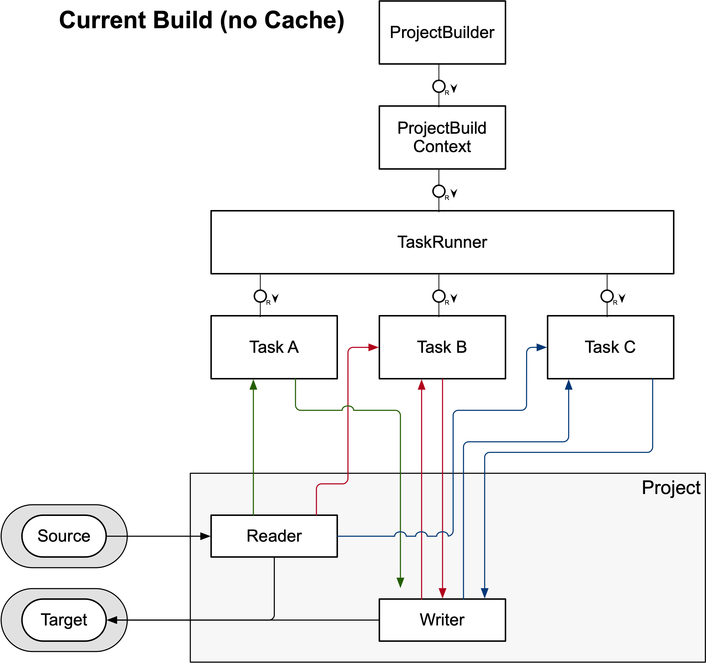
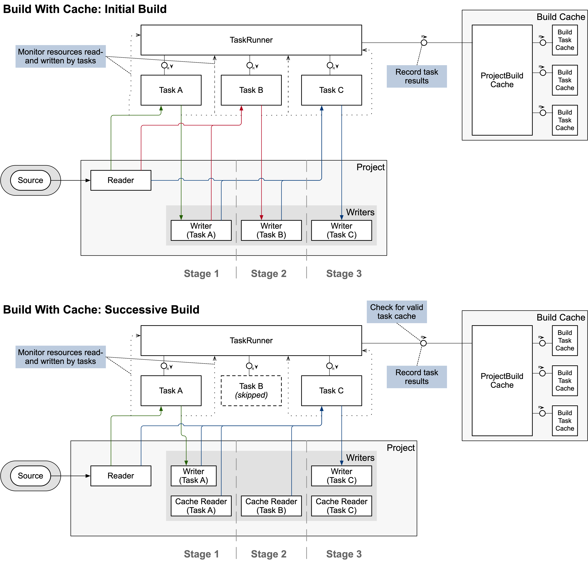
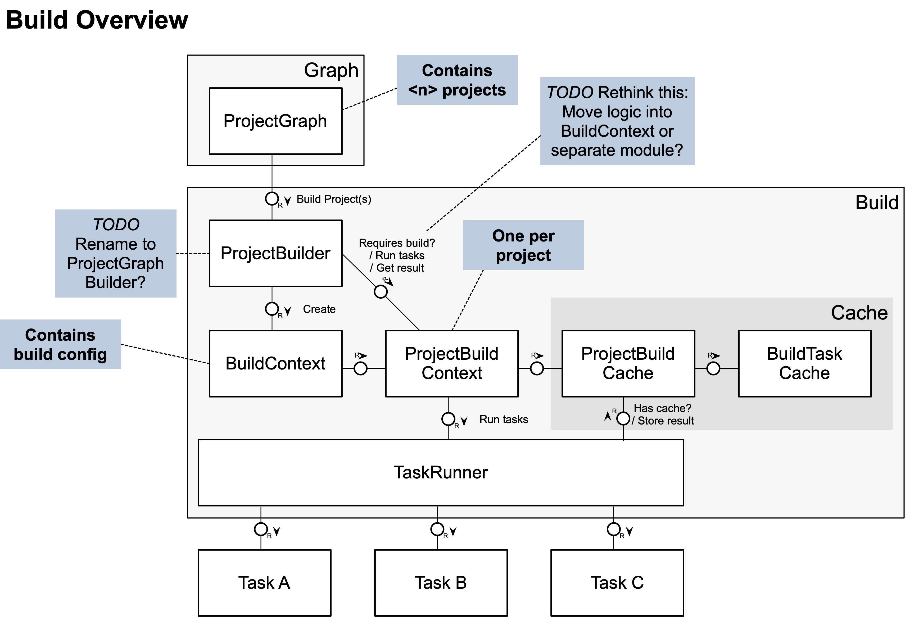
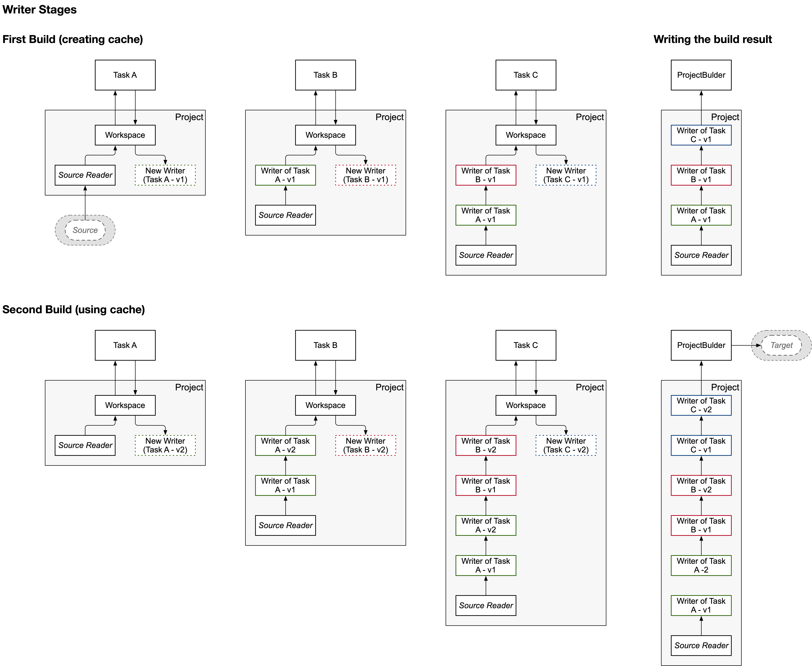
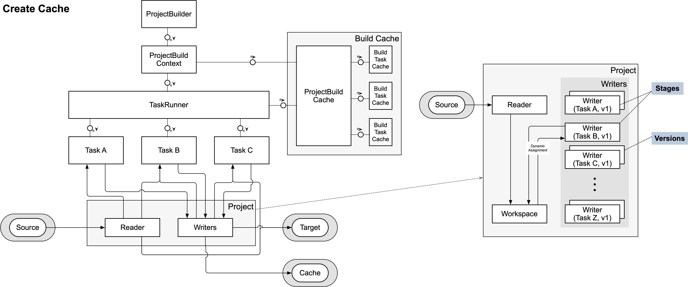
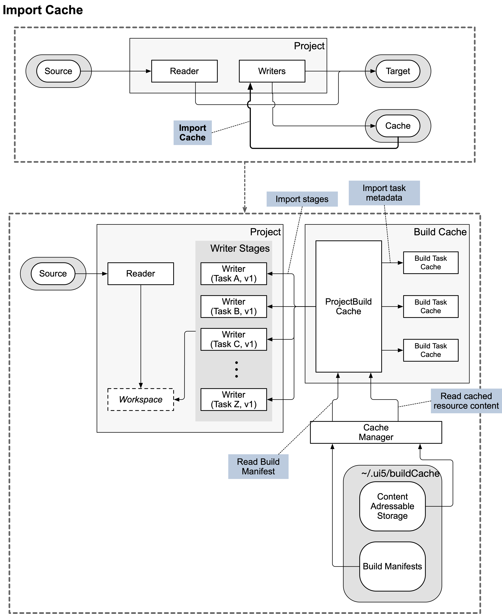
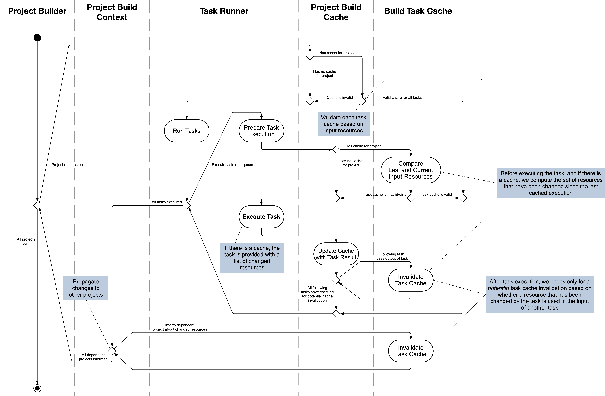

- Start Date: 2024-12-09
- RFC PR: [#1036](https://github.com/SAP/ui5-tooling/pull/1036)
- Issue: -
- Affected components <!-- Check affected components by writing an "X" into the brackets -->
	+ [x] [ui5-builder](https://github.com/UI5/cli/tree/main/packages/builder)
	+ [x] [ui5-server](https://github.com/UI5/cli/tree/main/packages/server)
	+ [x] [ui5-cli](https://github.com/UI5/cli/tree/main/packages/cli)
	+ [x] [ui5-fs](https://github.com/UI5/cli/tree/main/packages/fs)
	+ [x] [ui5-project](https://github.com/UI5/cli/tree/main/packages/project)
	+ [x] [ui5-logger](https://github.com/UI5/cli/tree/main/packages/logger)

# RFC 0017 Incremental Build

## Summary

This concept aims at adding incremental build support to UI5 CLI. It should be possible to execute a build where only a small set of modified resources is re-processed while the rest is reused from a previous build.

## Motivation

The current build process is slow, especially for large projects. This is because on every build all resources of a project need to be processed. However, this is often not necessary, since only few resources might have been changed between builds. An incremental build would detect those changes and only process resources where needed, reusing previous build results. This should speed up the build process significantly.

It has also become increasingly common for UI5 projects to use [custom build tasks](https://sap.github.io/ui5-tooling/stable/pages/extensibility/CustomTasks/). Examples include custom tasks for TypeScript compilation, or for consuming third-party libraries.

These tasks can greatly enhance the development experience with UI5. However, when working on projects that depend on projects using such custom tasks, it can become cumbersome to set up a good development environment. This is because the current UI5 CLI server does not execute custom tasks (or any tasks at all), and instead relies on [custom middleware](https://sap.github.io/ui5-tooling/stable/pages/extensibility/CustomServerMiddleware/) for things like the mentioned examples.

However, only custom middleware defined for the current root project is used by the server. This means that the root project often needs to configure custom middleware *for its dependencies*.

By enhancing the UI5 CLI server to execute build tasks before serving a project's resources, this problem can be solved. And by making use of an incremental build feature, the server can efficiently re-process resources when needed, hopefully preventing negative impacts on the server's performance.

## Detailed design

### Current Build

The current build process executes all build tasks for the required projects one by one. Tasks are reading and writing resources from- and to a `workspace` entity, which is a representation of the virtual file system of `@ui5/fs` for the current project. A `workspace` currently consists of a `reader` and a `writer`. The reader is usually connected to the sources of the project and the writer is an in-memory object, collecting the output of the build tasks before it is finally written to the target output directory.

This setup allows a build task to always access to the result of a previous task, which may have altered a source file or added additional resources.



### Incremental Build Cache

For the incremental build cache feature, a new entity `Build Task Cache` shall be created, which is managed by a `Project Build Cache`. In addition, the current concept of the project-`workspace` shall be extended to allow for `writer stages` (which can each have multiple `versions`). These stages build upon each other. Essentially, instead of one writer being shared across all tasks, each task is assigned it's own writer stage. And each task reads from the combined stages of the preceding tasks.

This shall enable the following workflow:

**1. Action: A project build is started**

1. Task A, Task B and Task C are executed in sequence, writing their results into individual writer stages.
1. _Task outputs are written to a content-addressable store and "stage cache" metadata is serialized to disk._
1. _After the last task executed, the project's "index" is serialized to disk along with a mapping to the output file metadata. All created or modified resources are written to the content-addressable store._
1. Build finishes and the resources of all writer stages are combined with the source reader and written into the target output directory.

_The project has been built and a cache has been stored._

**2. Action: A source file is modified, a new build is started**

1. _The cache metadata is read from disk, enabling the build to determine the relevant changes and access cached content from the content-addressable store._
	* Valid cached stages are imported into the `Project` as "stage readers"
1. The build determines which tasks need to be executed using the imported cache and information about the modified source files.
	* In this example, it is determined that Task A and Task C need to be executed since they requested the modified resource in their previous execution.
1. Task A is executed. The output is written into a **new writer** of the associated stage.
	* Since Task A communicated that it supports "differential builds", the task is provided with a list of changed resources, allowing it to determine which resources need to processed again, skipping stale resources.
	* In this example, Task A decided to only process the changed resources and ignores the others.
	* **Note: Task A can't access the cached stage reader.** It can only access the combined resources of all previous writer stages, just like in a regular build.
1. _New task outputs are combined with the cached outputs and the new stage metadata is serialized to disk_
1. The `Project Build Cache` determines whether the resources produced in this latest execution of Task A are relevant for Task B. If yes, the content of those resources is compared to the cached content of the resources Task B has received during its last execution. In this example, the output of Task A is not relevant for Task B and it is skipped.
1. Task C is executed (assuming that relevant resources have changed) and has access to the full stage (cache reader and new writer) of Task A, as well as the cached stage of Task B. This allows it to access all resources produced in all previous executions of Task A and Task B.
	* Task C does not support "differential builds". The output of Task C is written into a **new writer** of the associated stage.
1. _New task outputs are stored in the content-addressable store and stage metadata is serialized to disk_
1. The build finishes. The combined resources of all stages and the source reader are written to the target output directory.



#### Project Build Cache

The `Project Build Cache` is responsible for managing the build cache of a single project. It handles the import and export of the cache to and from disk, as well as determining whether a new build of the project is required (e.g. due to the lack of an existing cache or based on source- or dependency file changes).

#### Build Task Cache

The `Build Task Cache` is responsible for managing the cache information for a single build task within a project. It keeps track of which resources have been read and written by the task during previous executions.

Later during a re-build, it can use this information to determine whether the task needs to be re-executed based on changes to the relevant input resources.

The Project Build Cache uses this information to determine whether a changed resource _potentially_ affects a given task. This does not mean that the task must be re-executed right away, but only that it might need to be re-executed. The actual decision is deferred until the task is about to be executed. At that point, the task can compare the content of the relevant input resources to determine whether they have actually changed.

All necessary metadata stored in the `Build Task Cache` is serialized to disk as part of the [Build Task Cache](#build-task-cache).



#### Project

The existing `Project` super-class shall be extended to support the new concept of `stages`.

Already before, it was responsible for creating the `workspace` for a build, which consisted of a single `reader` (providing access to the project's sources) and a `writer` (storing all resources that have been newly produced or changed by the build in memory).

Now, it shall contain multiple `stages`, one for each task in the build process. Each stage may consist of a writer, and optionally a reader (if the stage has been imported from a previous build cache).

During the project build, and before executing a task, the Project Build Cache shall set the correct stage in the Project.
Whenever changing the stage, a new writer version for that stage shall be created. Once a `workspace` is requested from the project, it will provide a `reader` that combines the sources of the project with all resources from the preceding writer stages, and a `writer` that corresponds to the current stage's latest version.

Stages have an explicit order, based on the order they have been created/used. Stages shall be named using the following schema: `<type>/<name>`, where `<type>` is the type of the stage (e.g. `tasks`) and `<name>` is the name of the entity creating the stage (e.g. the task name).



#### Task Runner

The `Task Runner` shall be enhanced to:

1. Request the build signature of any tasks implementing the `determineBuildSignature` method at the beginning of the build process. These signatures are then incorporated into the overall build signature of the project (see [Cache Creation](#cache-creation)).
2. Before executing each task, allow the `Project Build Cache` to prepare the task execution and to determine whether the task needs to be executed or can be skipped based due to valid cache data.
3. _[TODO: Revisit this idea] Before executing a task, call the `determineExpectedOutput` method if provided. This allows the task to specify which resources it expects to write during its execution. The `Project Build Cache` can then use this information to detect and remove stale output resources that were produced in a previous execution of the task, but are no longer produced in the current execution._
4. Execute the task, optionally providing it with a list of changed resource paths since the last execution. This can be used by tasks supporting "differential builds", to only process changed resources (see [Build Task API Changes](#build-task-api-changes) below).
5. After a task has been executed, allow the `Project Build Cache` to update the cache using information on which resources have been read during the task's execution as well as the output resources. _(to be discussed: also the set of resources expected to be written (as provided by the `determineExpectedOutput` method?)._
	* The resources read by a task are determined by providing the task with instances of the `workspace`-reader/writer and `dependencies`-reader that have been wrapped in ["Monitored Reader"](#monitored-reader) instances. They are responsible for observing which resources are being accessed during the task's execution.
	* The `Project Build Cache` will then:
		* Update the metadata in the respective `Build Task Cache` with the set of resources read by the task ("resource requests")
		* Compile a new "signature" for the task's input resources and store this, along with the project's current stage instance, in the in-memory Stage Cache of the `Project Build Cache` (mapping a stage signature to an earlier cached stage instance).
		* _Delete or tag resources that have become stale_
		* Using the set of changed resource paths, check which downstream tasks need to be potentially invalidated (see [Cache Invalidation](#cache-invalidation))

##### Build Task API Changes

Build tasks can now optionally support "differential builds" by implementing the following new features.

* **supportsDifferentialUpdates()**: Returns `true` if the task supports differential builds, i.e. if it can process only a subset of changed resources instead of all resources. If this method is not implemented, it is assumed that the task does not support differential builds.
	* If a task supports differential builds, it will be provided with a list of changed resource paths since its last execution.
* **async determineBuildSignature({log, options})**
	* `log`: A logger instance scoped to the task
	* `options`: Same as for the main task function. `{projectName, projectNamespace, configuration, taskName}`
	* Returns: `undefined` or an arbitrary string representing the build signature for the task. This can be used to incorporate task-specific configuration files (e.g. tsconfig.json for a TypeScript compilation task) into the build signature of the project, causing the cache to be invalidated if those files change. The string shouldn't be a hash value (the build signature hash is calculated later on). If `undefined` is returned, or if the method is not implemented, it is assumed that the task's cache remains valid until relevant input-resources change.
	* This method is called once at the beginning of every build. The return value used to calculate a unique signature for the task based on its configuration. This signature is then incorporated into the overall build signature of the project (see [Cache Creation](#cache-creation) below).
	* Might return a list of file paths that shall be watched for changes (when running in watch mode). On change, the build signature is recalculated and the cache invalidated if it has changed.
* **async determineExpectedOutput({workspace, dependencies, cacheUtil, log, options})**: _TODO: revisit this concept_
	* `workspace`: Reader to access resources of the project's workspace (read only)
	* `dependencies`: Reader to access resources of the project's dependencies
	* `cacheUtil`: Same as above
	* `log`: A logger instance scoped to the task
	* `options`: Same as for the main task function. `{projectName, projectNamespace, configuration, taskName}`
	* Returns: A set of resource paths which the task anticipates to write (output) in a clean run. That is, without cache. In case the task ends up writing fewer resources or resources outside of this set, an error will be produced. In case of a cache hit, the task may write fewer resources than declared here. If `undefined` is returned, or if the method is not implemented, it is assumed that the task's output is always the same as in the previous execution. Therefore, no stale output detection will be performed.
	* This method is called right before the task is being executed. It is used to detect stale output resources that were produced in a previous execution of the task, but are no longer produced in the current execution. Such stale resources must be removed from the build output to avoid inconsistencies.

These methods took some inspiration from to the existing [`determineRequiredDependencies` method](https://github.com/UI5/cli/blob/main/rfcs/0012-UI5-Tooling-Extension-API-3.md#new-api-2) ([docs](https://ui5.github.io/cli/stable/pages/extensibility/CustomTasks/#required-dependencies)).

#### Monitored Reader

A `MonitoredReader` is a wrapper around a `Reader` or `Writer` instance that observes which resources are being accessed during its usage. It records the paths of resources that are read or written, along with the respective [`Resource`](https://ui5.github.io/cli/stable/api/@ui5_fs_Resource.html) instance. It also records which glob patterns have been used to request resources.

### Cache Creation

The build cache shall be serialized onto disk in order to use it in successive UI5 CLI executions. This will be done using a **Content-Addressable Store (CAS)** model, which separates file content from metadata. This ensures that each unique piece of content is stored only once on disk, greatly reducing disk space usage and improving I/O performance.

Every project has its own cache metadata. This allows for reuse of a project's cache across multiple consuming projects. For example, the `sap.ui.core` library could be built once and the build cache can then be reused in the build of multiple applications.

The cache consists of several components:
1. A global **object store (the CAS)** where all file contents are stored, named by a hash of their content.
2. Per-project metadata:
	* Build Manifest: Contains overall information about the build, it's unique [`build signature`](#build-signature) and the executed tasks
	* Index Cache: Stores metadata of **all** source files of the project, as well as the [`index signatures`](#index-signature) of relevant dependencies.
	* Build Task Caches: Stores all resource requests of a build task as well as the metadata of all relevant resources read during its last execution
	* Stage Caches: Maps a given [`index signature`](#index-signature) to a set of resource metadata. The metadata can be used to access resources from the content-addressable store.

### Build Manifest

````jsonc
{
	"project": {
		"specVersion": "5.0",
		"type": "application",
		"metadata": {
			"name": "project.namespace"
		}
	},
	"buildManifest": { // Build Manifest Configuration
		"manifestVersion": "1.0",
		"timestamp": "2025-11-24T13:43:24.612Z",
		"signature": "bb3a3262d893fcb9adf16bff63f", // <-- New "signature" attribute, uniquely identifying the build
		"versions": {
			"builderVersion": "5.0.0",
			"projectVersion": "5.0.0",
			"fsVersion": "5.0.0"
		},
		"buildConfig": {
			"selfContained": false,
			"cssVariables": false,
			"jsdoc": false,
			"createBuildManifest": false,
			"outputStyle": "Default",
			"includedTasks": [],
			"excludedTasks": []
		},
		"version": "1.0.0",
		"namespace": "project/namespace",
		"tags": {
			"/resources/project/namespace/Component-dbg.js": {
				"ui5:IsDebugVariant": true
			},
			"/resources/project/namespace/Component.js": {
				"ui5:HasDebugVariant": true
			}
		}
	}
}
````

The concept of a `build-manifest.json` has already been explored in [RFC 0011 Reuse Build Results](https://github.com/SAP/ui5-tooling/pull/612) and found an implementation for consumption of pre-built UI5 framework libraries in [UI5 3.0](https://github.com/UI5/cli/pull/612).

This concept reuses and extends the `build-manifest.json` idea to also include incremental build cache information. In addition to a new `signature` attribute, the `buildManifest` section now also defines version `1.0` and contains the list of executed tasks (in-order) in the `taskList` attribute.

#### Differentiation with Pre-Built Projects

To differentiate between a pre-built project (as introduced in RFC 0011) and a project with incremental build cache support, the presence of the `cache` section can be checked. Only if this section is present, the project can be used for incremental builds. Otherwise, it is "only" a pre-built project that can be used to speed up builds of dependent projects.

There are major differences in how those two types of build manifests are handled:

**1. Timing**

* For pre-built projects, the build manifest is taken into account immediately during the creation of the dependency graph and instantiation of the project class as it replaces the `ui5.yaml`.
* For projects with incremental build cache support, the build manifest is only retrieved during the build of a project. Changing build parameters may lead to a different cache and therefore a different build manifest being used.

**2. Content**

* Pre-built projects only contain information about the final build result (i.e. the resources produced by the build).
	* The original source files are not part of the pre-built project.
	* All required resources are included in the pre-built project itself.
* Projects with incremental build cache support contain detailed metadata about the build process itself, including information about source files, tasks, and intermediate build stages.
	* All resources referenced in build manifest (except for the project sources) need to be available in the local content-addressable store in order to use them during the build.

**3. Usage**

* Pre-built projects are primarily used to avoid rebuilding dependencies that have already been built. They can not be built again.
* Projects with incremental build cache support _can_ be rebuilt, if required.

#### Build Signature

The build signature is used to distinguish different builds of the same project. It is mainly calculated based on the **build configuration** of a project. But it also incorporates information that depends on the UI5 CLI version (specifically an internal `BUILD_SIG_VERSION` integer constant), as well as optional signatures provided by custom tasks.

This signature is used to easily tell whether an existing cache can be used in a given build execution or not. For example, a "jsdoc"-build leads to a different build signature than a regular project build. Therefore, two independent cache entries will be created on disk.

The signature is a simple hash (represented as a hexadecimal string, to allow usage in directory and file names).

A mechanism shall be created for custom tasks to provide a signature as well. This allows the incorporation of task-specific configuration files (e.g. tsconfig.json for a TypeScript compilation task) into the build signature.

### Index Cache

```jsonc
{
	"indexTimestamp": 1764688556165,
	"indexTree": { /* Serialized hash tree */ },
	"taskList": [ // <-- New "taskList" attribute, defining the order of executed tasks
		"replaceCopyright",
		"minify",
	]
}
```

The index provides metadata for all source files of the project. This allows the UI5 CLI to quickly determine whether source files have changed since the last build.

The metadata is represented as a **hash tree**, making updates efficient and allowing the generation a single "index signature" representing the current state of all indexed resources.

The integrity of a source file shall be calculated based on its raw content. A SHA256 hash should be used for this purpose. Internally, the hash shall be stored in Base64 format to reduce the size of stored metadata. A library like [ssri](https://github.com/npm/ssri) may be used for this purpose, allowing easy interoperability with [cacache](#cacache) (see below).

When comparing the stored metadata with a current source file, the following attributes should be considered before computing a resource's integrity hash:
* `lastModified`: Modification time
* `size`: File size
* `inode`: Inode number (to detect file replacements)

If **any** of these attributes differ, the file may be modified. Requiring the computation of the integrity hash to confirm a file change.

The index timestamp represents the last time the index has been updated. This allows quick invalidation if source files have a modification time later than this timestamp.

Additionally, it shall also be used to protect against race conditions such as those described in [Racy Git](https://git-scm.com/docs/racy-git), where a file could be modified so quickly (and in parallel to the creation of the index) that its timestamp doesn't change. In such cases, the modification timestamp would be equal to the index timestamp. Therefore, if a file has a modification time equal to the index timestamp, its integrity must be compared to the stored integrity to determine whether it has changed.

#### Index Signature

A unique hash, typically the root hash of a **hash tree**. It represents the current state of a given set of resources (e.g. all sources of a project, or the input resources of a build task). Any change to any of the resources will lead to a different index signature.

These signatures can be used to quickly check whether a cache exists by looking up a stage cache using the index signature as key.

### Build Task Cache

```jsonc
{
	"requestSetGraph": {
		"nodes": [{
			"id": 1,
			"parent": null,
			"addedRequests": [
				"patterns:[\"/resources/**/*.js\",\"!**/*.support.js\"]"
			]
		}],
		"nextId": 2
	},
	"rootIndices": [{
		"nodeId": 1,
		"resourceIndex": { 
			"indexTimestamp": 1764688556165,
			"indexTree": { /* Serialized hash tree */ }
		}
	}],
	"deltaIndices": []
}
```

```jsonc
{
	"requestSetGraph": {
		"nodes": [{
			"id": 1,
			"parent": null,
			"addedRequests": [
				"patterns:[\"/resources/**/*.js\",\"!**/*.support.js\"]"
			]
		}, {
			"id": 2,
			"parent": 1,
			"addedRequests": [
				"path:/resources/project/namespace/Component.js"
			]
		}],
		"nextId": 2
	},
	"rootIndices": [{
		"nodeId": 1,
		"resourceIndex": { 
			"indexTimestamp": 1764688556165,
			"indexTree": { /* Serialized hash tree */ }
		}
	}],
	"deltaIndices": [{
		"nodeId": 2,
		"addedResourceIndex": [{
			"path": "/resources/project/namespace/Component.js",
			"lastModified": 1764688556165,
			"size": 1234,
			"inode": 5678,
			"integrity": "sha256-R70pB1+LgBnwvuxthr7afJv2eq8FBT3L4LO8tjloUX8="
		}]
	}]
}
```

### Stage Cache

```jsonc
	"resourceMetadata": {
		// Virtual paths written by the task during execution, mapped to their cache metadata
		"/resources/project/namespace/Component.js": {
			"lastModified": 176468853453,
			"size": 4567,
			"integrity": "sha256-EvQbHDId8MgpzlgZllZv3lKvbK/h0qDHRmzeU+bxPMo="
		}
	}
```

Stores the metadata of all resources for a given "stage". This metadata can be used to access the resource content from the content-addressable store.

Stage cache metadata is keyed using the project's [build signature](#build-signature), the stage name, and the index signature of the input resources for that stage.

Each stage usually corresponds to the execution of a task. The contained metadata represents all resources **written** by that task during its execution.  The metadata includes the `lastModified`, `size` and `integrity` of each resource. This information is required for determining whether subsequent tasks need to be re-executed.

Stages can also be cached for other entities that tasks. Therefore, stage names for tasks must be prefixed with `task/`.

One such example is the "result" stage, which uses the index signature of a project (combined with the index signatures of relevant dependencies) as its key and stores the metadata for all resources produced by the project's build.

### Cache Directory Structure

The directory structure is flat and efficient. A global `cas` directory stores all unique file contents from all builds, while project-specific directories contain only their lightweight metadata.

```
~/.ui5/buildCache/
├── cas/  <-- Global Content-Addressable Store (shared across all projects) - actual representation might differ
│   ├── c1c77edc5c689a471b12fe8ba79c51d1  (Content of one file)
│   ├── d41d8cd98f00b204e9899998ecf8427e  (Content of another file)
│   └── ... (all other unique file contents)
│
└── buildManifests/
    ├── app-name
    │   ├── bb3a3262d893fcb9adf16bff63f.json
    │   └── gh3a4162d456fcbgrebsdf345df.json
    └── @openui5
        ├── sap.m
        │   ├── sfeg2g62d893fcb9adf16bfffex.json
        │   └── xy3a3262d893fc4gdfss6esfesw.json
        └── sap.ui.core
            └── fh3a3262d893fcb3adf16bff63f.json
├── index/
├── stageMetadata/
└── taskMetadata/
```

A new `buildCache` directory shall be added to the ~/.ui5/ directory. The location of this directory can be configured using the [`UI5_DATA_DIR` environment variable](https://ui5.github.io/cli/stable/pages/Troubleshooting/#environment-variable-ui5_data_dir).

The `cas` directory contains files named by their content hash. Each file contains the raw content of a resource produced during a build. Ideally a library like [`cacache`](#cacache) should be used to manage the content-addressable store. In this case, the actual directory structure might differ from what is depicted above.

The `buildManifests` directory contains one build manifest file per project build cache. The directory structure is derived from the project's package name (Project ID). The files are named by the [build signature](#build-signature).

Instead of storing the index cache, stage caches and build task caches as separate files on disk, they shall also be stored in a database such as LevelDB or SQLite. This allows for faster access and reduces the number of files on disk.



#### cacache

The [`cacache`](https://github.com/npm/cacache) library is a well-established content-addressable cache implementation developed and used by npm itself. It provides efficient storage and retrieval of file contents based on their content hash, along with built-in mechanisms for cache integrity verification and garbage collection.

It allows to store and retrieve files using a unique key. Files can also be retrieved directly by their content hash ("digest").

In this concept, cacache will be used to store the content of resources produced during the build. The content shall be **compressed** to reduce disk space usage. The key for each resources should follow this schema:

```
<build signature>|<stage name>|<virtual resource path>
```

The [build signature](#build-signature) binds the entry to the current project build cache. The stage name and resource path correspond to a task's **output** resource metadata as defined in the [`stages`](#stages) section of the `build-manifest.json`.

This naming schema should allow for easy retrieval of resources based on the metadata stored in the build manifest.

At the same time, this also enables the cacache-internal garbage collection to identify unused entries. If a task execution produces new content for a resource, the cacache entry will be updated to point to the new content hash. Eventually, the old content hash will no longer be referenced by any cache entry and can be cleaned up during [garbage collection](#garbage-collection).

### Cache Import

Before building a project, UI5 CLI shall check for an existing cache by calculating the [build signature](#build-signature) for the current build, and searching the [cache directory structure](#cache-directory-structure) for a matching build manifest.

If a build manifest is found it is imported by the `Project Build Cache`
1. Check the source files of the project against the `index` section of the build manifest to determine which files have changed since the last build
2. Create `Build Task Cache` instances using the metadata from the `tasks` section of the build manifest
3. Provide the `Project` with readers for the cached `writer stages` (i.e. tasks outputs)
	* When the build process needs to access a cached resource, it can access them using those readers. Internally, they will use the resource metadata from the build manifest to find the corresponding resource content hash, and then reads the file from the global `cas` store

This allows executing individual tasks and providing them with the results of all preceding tasks without the overhead of creating numerous file system readers or managing physical copies of files for each build stage.



### Cache Invalidation

The following diagram shows the process for determining whether a project needs to be (partially) rebuilt and if yes, which individual tasks need to be (re-)executed.

Note this important differentiation: A Build Task Cache can be *potentially* or *definitely* invalidated. It is *potentially* invalidated if the corresponding task read resources that have been modified since the last build. It is *definitely* invalidated if the content of those resources has actually changed. By only potentially invalidating a Build Task Cache the current process does not have to ensure that the resources actually changed at this point in time. Comparing the content of resources can be deferred until the task is actually executed. This can save time, especially since the resource in question might be modified again before the potentially invalidated task is executed.

If the task ends up being executed, it might produce new resources. After the execution has finished and the new resources have been written to the writer stage, it should be checked whether the content of those resources has actually changed right away. If not, they must not lead to the invalidation of any following tasks. If they have changed, the relevant Build Task Cache instances will be notified about the changed resources and might *potentially* invalidate themselves.

After a *project* has finished building, a list of all the modified resource is compiled and passed to the `Project Build Cache` instances of all depending projects (i.e. projects that depend on the current project and therefore might use the modified resources).



### Concurrency

Since the build manifest expects to find all resources of a build in the content-addressable store, it is important to ensure that concurrent builds of the same project do not interfere with each other.

Updating the build manifest and writing resources to the content-addressable store must be done atomically. This means that either all resources and the manifest are written successfully, or none at all. This prevents scenarios where a build is interrupted (e.g. due to a crash or user cancellation) and leaves the cache in an inconsistent state.

This can be achieved by creating a lock for the build signature. When starting the build, a shared or "read lock" should be acquired. This allows multiple builds of the same project to run concurrently, as long as they are only reading from the cache. Only when updating, i.e. writing new resources to the content-addressable store and updating the build manifest, an exclusive or "write lock" should be acquired. This prevents other builds from reading or writing to the cache while it is being updated.

### Garbage Collection

A mechanism to free unused cache resources on disk is required. The cache can potentially grow very large over time, and consume a lot of disk space.

This should probably use some sort of LRU-cache, in combination with the garbage collection mechanism integrated in [cacache](#cacache), to remove cache entries dynamically. The same mechanism could also be applied to the npm artifacts already downloaded by UI5 CLI today.

To avoid slowing down core commands, the garbage collection check should run as a non-blocking process after a successful `ui5 build` or `ui5 serve` command completes. This process may check if for example configured thresholds (age or size) have been exceeded. If so, it proceeds with removing unused cache entries.

A dedicated command, such as `ui5 cache clean`, should be introduced in addition. This command allows users to manually trigger a cache purge, providing options to specify criteria such as maximum age or size for cache entries to be removed. Similarly, a command `ui5 cache verify` could be provided to check the integrity of the cache.

### Watch Mode

The build API should provide a "watch" mode that will re-trigger the build when a source file is modified. The watch mode shall select the projects to watch based on which projects have been requested to be built. If a [UI5 CLI workspace](https://sap.github.io/ui5-tooling/stable/pages/Workspace/) is used, this can be fine-tuned in the workspace configuration.

The watch mode shall be used by the server to automatically rebuild projects when source files are modified and serve the updated resources. See below.

#### Cache Invalidation

**It is to be decided** whether, besides watching relevant source files, the watch mode shall also watch configuration files relevant for the build signature (e.g. ui5.yaml, package.json, tsconfig.json, etc.). If any of those files change, a different cache would have to be used. This might be unexpected behavior to some users, where launching a development tool only reads the relevant configuration once and then keeps using it even when the underlying files change.

#### Error Handling

If a task execution fails in watch mode, the error shall be logged but the watch mode shall stay active in anticipation of further changes. The process shall not crash or stop. This shall be a configuration option.

If some tasks have executed successfully before the error occurred, their results shall be kept in the cache and used for subsequent builds. Only the failed task and any downstream tasks shall be re-executed on the next build.

### Server Integration

The UI5 CLI server shall integrate the incremental build as a mean to pre-process projects before serving the build result. It shall use the watch mode to automatically rebuild the projects when source files are modified, so that always the latest resources are served.

Middleware like `serveThemes` (used for compiling LESS resources to CSS) would become obsolete with this, since the `buildThemes` task will be executed instead.

If any project (root or dependency) defines custom tasks, those tasks are executed in the server as well. This makes it possible to easily integrate projects with custom tasks as dependencies.

Since executing a full build requires more time than the on-the-fly processing of resources currently implemented in the UI5 CLI server, users shall be able to disable individual tasks that are not necessarily needed during development. This can be done using CLI parameters as well as ui5.yaml configuration.

While a build is running, the server shall pause responding to incoming requests for the duration of the build. This is necessary to ensure that the server does not serve outdated resources.

The server may implement "live-reload" functionality to inform client side code to refresh the page whenever changes have been detected and the build has finished.

#### Live Reload

The server may implement live-reload functionality to inform connected clients about changes in the build result. This can be achieved using WebSockets or Server-Sent Events (SSE).

This is an essential feature, since after saving an edited file, the user might not know when the build has finished and the changes are available in the browser. Although the server should also pause all incoming requests until the build has finished, an automatic refresh of the page improves the developer experience significantly.

For this purpose, a script is to be injected into the served HTML pages that establishes a connection to the server and listens for change notifications. Upon receiving a notification, the script should trigger a page reload to reflect the latest changes. The endpoint should be secured using a token-based mechanism to prevent unauthorized access.

## Integration in UI5 CLI

The following new arguments shall be added to the `ui5 build` and `ui5 serve` commands:

* `--cache-mode`: Disables the use of the build cache entirely. The project will be built from scratch without leveraging any cached results.
	* Possible modes:
		* Default: Use the cache if available
		* Force: Always use the cache. If it is incomplete or invalid, fail the build
		* Read-only: Do not create or update the cache but make use of any existing cache if available (useful for CI/CD)
		* Off: Do not use the cache at all
	* **To be discussed:** This clashes with the already existing [`--cache-mode` parameter](https://ui5.github.io/cli/stable/pages/CLI/#ui5-build). Should that one be renamed or repurposed?
* `--watch`: Enables watch mode, causing the build to be re-triggered whenever a source file or relevant configuration file changes.
	* This parameter is only relevant for the `ui5 build` command. The `ui5 serve` command shall always use the watch mode internally.

## How we teach this

This is a big change in the UI5 CLI architecture and especially impacts the way the UI5 CLI server works. By always building projects, developers might experience a slower startup time of the server. After modifying a file, it might also take longer until all processing is finished and the change is being served to the browser.

The incremental build hopefully mitigates this performance impact to some extend. The ability to disable individual tasks can further improve the performance again. However this needs to be taught to developers and sane defaults should be picked to make the experience as good as possible.

With the execution of tasks in the server, some (custom) middleware might become obsolete or even cause problems. This means that **projects might need to adapt their configuration**.

All of this should be communicated in the UI5 CLI documentation and in blog posts. A phase of pre-releases should be used to gather feedback from the community.

## Drawbacks

* For every file change, the server needs to execute a partial build. This can lead to a longer time between making a source file change and seeing the result in the browser.
	* This should be measured on different systems. The project size and the used tasks can have a big impact on the performance.
	* The ability to disable individual tasks for the server can help to mitigate this problem.
		* Would this create a distinction between tasks that are relevant for the production build only and those relevant to the server only?
* Projects might have to adapt their configurations
* Custom tasks might need to be adapted. Before they could only access the sources of a project. With this change, they will access the build result instead. Access to the sources is still possible but requires the use of a dedicated API
* UI5 CLI standard tasks need to be adapted to use the new cache API. Especially the bundling tasks currently have no concept for partially re-creating bundles. However, this is an essential requirement to achieve fast incremental builds.
* While the content-addressable cache is highly efficient at deduplication, the central cache can still grow very large over time. A robust [garbage collection](#garbage-collection) mechanism is critical for managing disk space.

## Alternatives

An alternative to using the incremental build in the UI5 CLI server would be to apply custom middleware of dependencies.

## Unresolved Questions and Bikeshedding

* ✅ How to distinguish projects with build cache from pre-built projects (with project manifest)
	* Check presence of "sourceMetadata" attribute. Only with "sourceMetadata", the cache can be used for incremental (re-)builds the project. Otherwise it is "only" a build *result* that can be used for building dependent projects.
* Cache related topics
	* Allow tasks to store additional information in the cache
* Some tasks might be relevant for the server only (e.g. code coverage), come up with a way to configure that
	* This will implicitly cause the creation of different caches for server and build. This might just be an acceptable and easy to understand trade-off.
* What if a task ceases to create a resource because of a change in another resource? The previously created version of the resource would still be used from the cache
* Measure performance in BAS. Find out whether this approach results in acceptable performance.
* Test with selected (community) custom tasks
