- Start Date: 2024-12-09
- RFC PR: [#1036](https://github.com/SAP/ui5-tooling/pull/1036)
- Issue: -
- Affected components <!-- Check affected components by writing an "X" into the brackets -->
	+ [x] [ui5-builder](https://github.com/UI5/cli/tree/main/packages/builder)
	+ [x] [ui5-server](https://github.com/UI5/cli/tree/main/packages/server)
	+ [x] [ui5-cli](https://github.com/UI5/cli/tree/main/packages/cli)
	+ [x] [ui5-fs](https://github.com/UI5/cli/tree/main/packages/fs)
	+ [x] [ui5-project](https://github.com/UI5/cli/tree/main/packages/project)
	+ [x] [ui5-logger](https://github.com/UI5/cli/tree/main/packages/logger)

# RFC 0017 Incremental Build

## Summary

This concept adds incremental build support to UI5 CLI. It enables executing a build where only a small set of modified resources is re-processed while the rest is reused from a previous build.

## Motivation

The current build process for UI5 projects can be rather slow. For a large project, like some of the framework-internal libraries, a full build can take several minutes. On every build, usually all projects need to be processed by executing a series of build tasks. Often however, only few resources have actually changed between builds. By adding advanced caching functionality to the build process, UI5 CLI would become capable of performing incremental builds, detecting which resources changed and only processing those changes, reusing previous build results whenever possible. This is expected to speed up the build process for UI5 projects significantly.

It has also become increasingly common for UI5 projects to use [custom build tasks](https://sap.github.io/ui5-tooling/stable/pages/extensibility/CustomTasks/). Popular examples include the community-maintained custom tasks for TypeScript compilation ([`ui5-tooling-transpile`](https://github.com/ui5-community/ui5-ecosystem-showcase/tree/main/packages/ui5-tooling-transpile)), or for consuming third-party libraries ([`ui5-tooling-modules`](https://github.com/ui5-community/ui5-ecosystem-showcase/tree/main/packages/ui5-tooling-modules)).

These tasks can greatly enhance the development experience with UI5. However, when working on projects that depend on projects using such custom tasks, it can become cumbersome to set up a good development environment. In part, this is because the current UI5 CLI development server does not execute build tasks, and instead relies on middleware (including [custom middleware](https://sap.github.io/ui5-tooling/stable/pages/extensibility/CustomServerMiddleware/)) to process resources during development. For this, only (custom) middleware defined on the current root project is used. This means that the root project often also needs to configure custom middleware *for its dependencies*, if those need any.

By enhancing the UI5 CLI server to **execute an incremental build** before starting the development server for a project, any custom tasks defined in dependencies are executed automatically, solving the above problem. The performance gain achieved through the incremental build feature enables us to replace most middleware with their task counterparts while maintaining a similar or even improved development experience.

This greatly simplifies the configuration of UI5 projects, especially when working with multiple interdependent projects. It also simplifies the development of UI5 CLI extensions, as custom tasks can now be used in more scenarios without requiring custom middleware implementations.

## Detailed design

### Sequence Diagram


### Current Build

The current build process executes all build tasks for the required projects one by one. Tasks read and write resources from and to a `workspace` entity, which is a representation of the virtual file system of `@ui5/fs` for the current project. A `workspace` currently consists of a single `reader` and a `writer`. While the reader is usually connected to the sources of the project, the writer is an in-memory object that collects the output of the build tasks before it is finally written to the target output directory.

With this setup, a build task can always access the result of the previous tasks, as well as the project's sources, through a single interface.

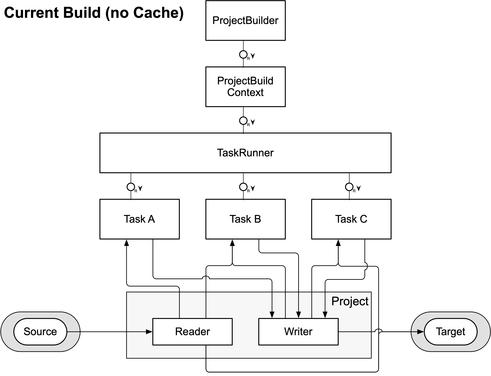

### Incremental Build Cache

For the incremental build cache, a new entity `Build Task Cache` shall be created, managed by a new entity `Project Build Cache`. In addition, the current concept of the project `workspace` shall be extended to allow for `stage writers`. These stages build upon each other. Essentially, instead of one writer being shared across all tasks, each task is assigned its own stage, and each task reads from the combined stages of the preceding tasks.

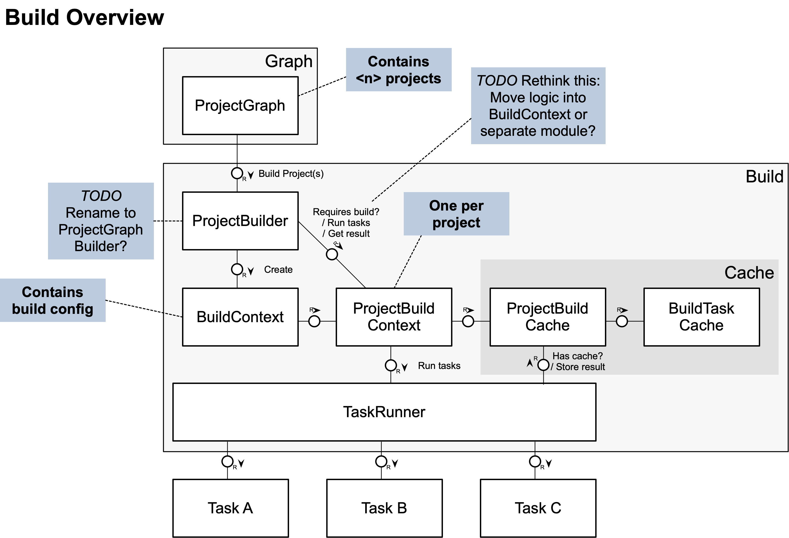

This shall enable the following workflow:

**1. Action: A project build is started**

*(see diagram below, "Initial Build")*

1. Task A, Task B and Task C are executed in sequence, writing their results into individual writer stages.
1. _Task outputs are written to a content-addressable store and "stage cache" metadata is serialized to disk._
1. _After the last task executed, the project's "index" is serialized to disk along with a mapping to the output file metadata. All created or modified resources are written to the content-addressable store._
1. Build finishes and the resources of all writer stages are combined with the source reader and written to the target output directory.

_The project has been built and a cache has been stored._

**2. Action: A source file is modified, a new build is started**

*(see diagram below, "Successive Build")*

1. _The cache metadata is read from disk, enabling the build to determine the relevant changes and access cached content from the content-addressable store._
	* Valid cached stages are imported into the `Project` as "stage readers"
1. The build determines which tasks need to be executed using the imported cache and information about the modified source files.
	* In this example, it is determined that Task A and Task C need to be executed since they requested the modified resource in their previous execution.
1. Task A is executed. The output is written into a **new writer** of the associated stage.
	* Since Task A communicated that it supports `differential builds`, the task is provided with a list of changed resources, allowing it to determine which resources need to be processed again, skipping stale resources.
	* In this example, Task A decided to only process the changed resources and ignores the others.
	* **Note: Task A can't access the cached stage reader.** It can only access the combined resources of all previous writer stages, just like in a regular build.
1. _New task outputs are combined with the cached outputs and the new stage metadata is serialized to disk_
1. The `Project Build Cache` determines whether the resources produced in this latest execution of Task A are relevant for Task B. If yes, the content of those resources is compared to the cached content of the resources Task B received during its last execution. In this example, the output of Task A is not relevant for Task B, so it is skipped.
1. Task C is executed (assuming that relevant resources have changed) and has access to the full stage (cache reader and new writer) of Task A, as well as the cached stage of Task B. This allows it to access all resources produced in all previous executions of Task A and Task B.
	* Task C does not support `differential builds`. The output of Task C is written into a **new writer** of the associated stage.
1. _New task outputs are stored in the content-addressable store and stage metadata is serialized to disk_
1. The build finishes. The combined resources of all stages and the source reader are written to the target output directory.

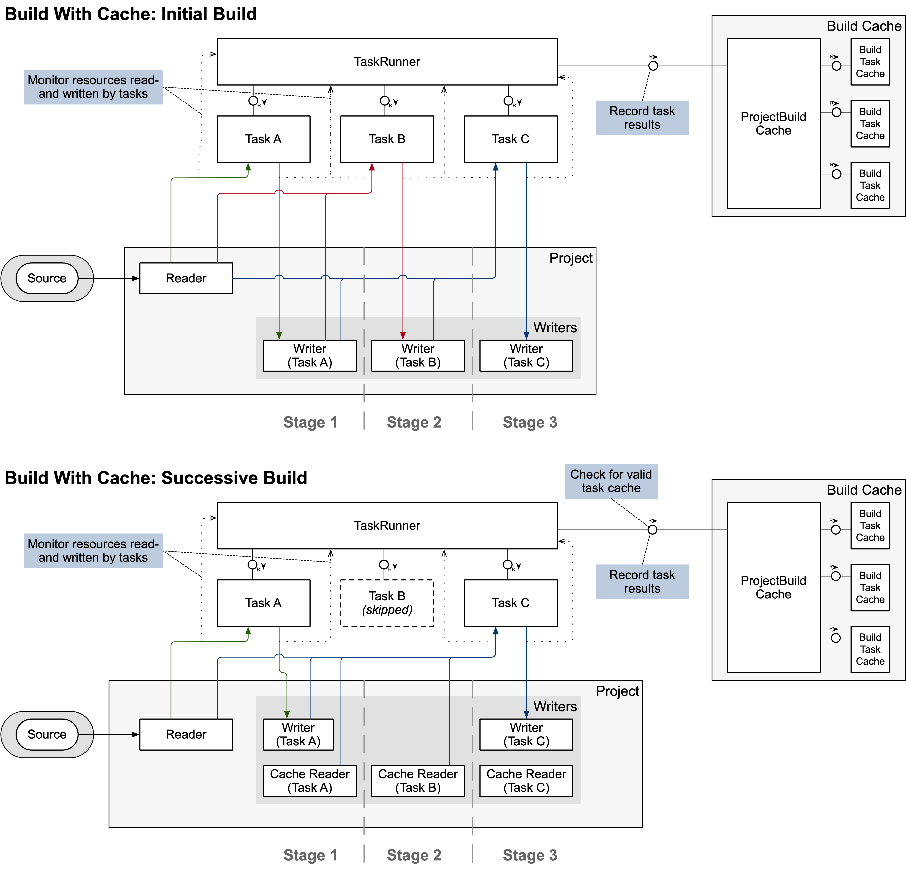

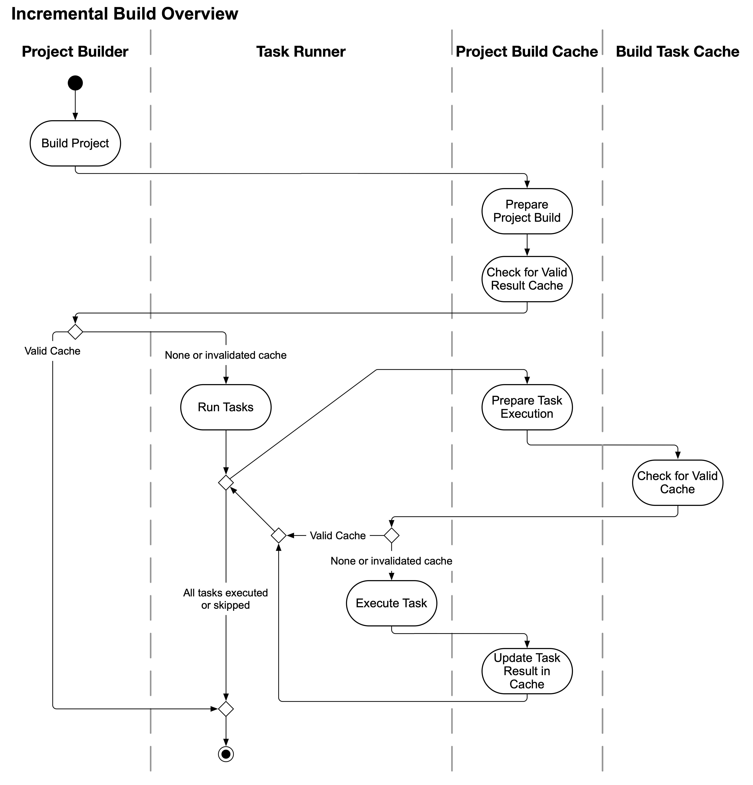

#### Project Build Cache

The `Project Build Cache` is responsible for managing the build cache of a single project. It handles the (de-)serialization of the cache to and from disk, as well as determining whether a new build of the project is required (e.g. due to the lack of an existing cache or based on source or dependency file changes).

It also manages the individual `Build Task Cache` instances for each task in the build process, allowing them to track which resources have been read and written during their execution.

In order to detect changes in a project's sources, a [Hash Tree](#hash-tree) is used to efficiently store and compare metadata of all source files. This allows quick detection of changed source files since the last build. The root hash of this tree is referred to as the project's `source-index signature`. Together with the signatures of all relevant dependency-indices, a cache key can be generated to look up an existing result cache for the project's current state. If found, it can be used to skip the build of the project altogether.

Similarly, each task's input resources are tracked using two hash trees (one for project-internal resources and one for dependency resources). These trees include resource tags in their leaf node hashes, ensuring that tag changes are detected alongside content changes. The root hashes of both trees can be combined to form a stage cache key.

See also: [Cache Creation](#cache-creation).

#### Build Task Cache

The `Build Task Cache` is responsible for managing the cache information for a single build task within a project. It keeps track of which resources have been read and written by the task during previous executions.

During a rebuild, it can use this information to determine whether the task needs to be re-executed based on changes to the relevant input resources.

The Project Build Cache uses this information to determine whether a changed resource _potentially_ affects a given task. This does not mean that the task must be re-executed right away, only that it might need to be. The actual decision is deferred until the task is about to be executed. Only at that point can the task compare the content of the relevant input resources with its cache and determine whether (and which) relevant resources have changed.

All necessary metadata stored in the `Build Task Cache` is serialized to disk as part of the [Build Task Metadata](#build-task-metadata).

### Enhancements in Existing Components

#### Project

The existing `Project` class shall be extended to support the new concept of `stage writers`. Specifically, resource handling shall be extracted into a new [`Project Resources`](#project-resources) class, responsible for managing the different resource readers and writers of a project. The `Project` class will delegate all resource-related operations to this new class, including the handling of [resource tags](#resource-tags).

Previously, the `Project` class was responsible for providing the project's `workspace`, to be used by build tasks. This `workspace` consisted of a single `reader` (providing access to the project's sources) and a `writer` for storing all resources that have been newly produced or changed by the build in memory.

#### Project Resources

A new `Project Resources` class shall be created to manage the access to a project's resources and decouple this responsibility from the `Project` class. This class will be responsible for managing the different resource readers and writers of a project, including the handling of resource tags.

In order to support the incremental build, the `Project Resources` class shall manage multiple resource `stages`, one for each task in the build process. Each stage holds either a `writer` or, in case the stage has been restored from cache, a `cached writer` (the latter being read-only). Additionally, each stage contains two `ResourceTagCollection` instances for managing resource tags (see [resource tags](#resource-tags)).

During the project build, and before executing a task, the `Project Build Cache` shall set the correct stage in the `Project Resources` instance. E.g. before executing the `replaceCopyright` task, the stage is set to `task/replaceCopyright`.

Whenever progressing to a new stage, the stage is initialized with an empty writer and resource tag collection. The `Project Build Cache` can replace the writer with a `cached writer`, in case a previous execution of the task has been cached and the cache is still valid. Similarly, the resource tag collection is updated based on cached tag operations for the stage. Note that this includes clearing tags.

Once a `workspace` is requested from the `Project Resources` instance, it will internally create a [DuplexCollection](https://ui5.github.io/cli/stable/api/@ui5_fs_DuplexCollection.html) using a `reader` that combines the writers of all previous stages (as well as the project's sources), and the writer of the current stage.

When requesting the `resourceTagCollection` for a stage, the `Project Resources` instance will return a `Monitored Tag Collection` wrapper around the actual `Resource Tag Collection` of the stage. This allows tracking all tag operations performed during a task's execution and storing them in the cache (see [Monitored Tag Collection](#monitored-tag-collection)). A notable difference to the handling of resources is that there is a single `Resource Tag Collection` per project, which is cleared at the beginning of every build and then populated with the tags of each stage as the build progresses.

Stages have an explicit order, defined during their initialization. Stages shall be named using the following schema: `<type>/<name>`, where `<type>` is the type of the stage (e.g. `task`) and `<name>` is the name of the entity creating the stage (e.g. the task name).

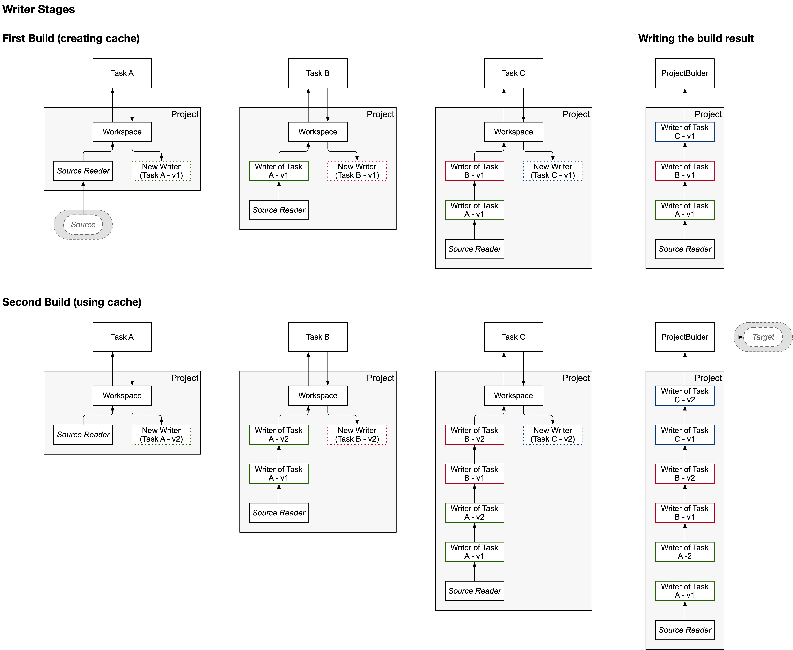

#### Monitored Reader

A `MonitoredReader` is a wrapper around a `Reader` or `Writer` instance that observes which resources are accessed during its usage. It records the requested paths as well as the glob patterns that have been used to request resources.

This information is used in the [`Resource Request Graph`](#resource-request-graph).

#### Monitored Tag Collection

During build task execution, tasks may associate resources with "tags" (key-value pairs). These tags are collected in shared `TagCollection` instances. Tags are differentiated between `build` tags and `project` tags. While `build` tags are only available during an individual project's build (i.e. they are not accessible to builds of dependent projects), `project` tags are shared across the entire build and can be accessed by all tasks of the project and its dependencies. This allows tasks to communicate information about resources to downstream tasks, even across project boundaries.

To support caching of resource tags, a `Monitored Tag Collection` wrapper is introduced, following the same pattern established by the `Monitored Reader` for tracking resource access.

It wraps a given `Resource Tag Collection` and intercepts all tag operations during a task's execution, recording which tags have been set or cleared. This allows the `Project Build Cache` to capture and persist the tags produced by each task.

Build tasks can access resource tags using the `Task Util` API, which internally retrieves the `Monitored Tag Collection` for the current stage from the current `Project` instance.

After the task completes, the `Project Build Cache` retrieves the recorded tags from the `Monitored Tag Collection` and stores them as part of the stage metadata.

Each `Project Resources` instance manages two `Resource Tag Collections`, one for `build` tags and one for `project` tags. The `build` tags collection is cleared at the end of each project build and is therefore not accessible to dependent projects.

#### Project Builder

The `Project Builder` shall be enhanced to:

1. Before building a project, allow the `Project Build Cache` to prepare the build by importing any existing cache from disk (see [Cache Import](#cache-import)) and comparing it with the current source files to determine which files have changed since the last build.
2. If a cache can be used, skip the build of a project
3. After building a project, allow the `Project Build Cache` to serialize the updated cache to disk (see [Cache Creation](#cache-creation)).

#### Task Runner

The `Task Runner` shall be enhanced to:

1. Request the build signature of any tasks implementing the `determineBuildSignature` method at the beginning of the build process (see [Build Task API Changes](#build-task-api-changes)). These signatures are then incorporated into the overall build signature of the project (see [Cache Creation](#cache-creation)).
2. Before executing each task, allow the `Project Build Cache` to prepare the task execution and determine whether the task needs to be executed or can be skipped based on valid cache data.
3. Before executing a task, call the `determineExpectedOutput` method if provided. This allows the task to specify which resources it expects to write during its execution. The `Project Build Cache` can then use this information to detect and remove stale output resources that were produced in a previous execution of the task, but are no longer produced in the current execution.
4. Execute the task, optionally providing it with a list of changed resource paths since the last execution. This can be used by tasks supporting `differential builds` to only process changed resources (see [Build Task API Changes](#build-task-api-changes) below).
5. After a task has been executed, allow the `Project Build Cache` to update the cache using information on which resources have been read during the task's execution as well as its output resources.
	* The resources read by a task are determined by providing the task with `workspace` and `dependencies` reader/writer instances that have been wrapped in ["Monitored Reader"](#monitored-reader) instances. They are responsible for observing which resources are accessed during the task's execution.
	* The `Project Build Cache` will then:
		* Update the metadata in the respective `Build Task Cache` with the set of resources read by the task ("resource requests")
		* Compile a new "signature" for the task's input resources and store this, along with the project's current stage instance, in the in-memory Stage Cache of the `Project Build Cache` (mapping a stage signature to an earlier cached stage instance).
		* _Delete or tag resources that have become stale_
		* Using the set of changed resource paths, check which downstream tasks need to be potentially invalidated (see [Cache Invalidation](#cache-invalidation))

##### Processor Return Value Convention

Resource processors invoked from a task may return `undefined` for an input resource in their result array to indicate that the resource was not modified. The task runner interprets this as "use the input resource as-is" and skips the corresponding write to the writer stage. This avoids redundant cache entries and unnecessary downstream invalidation when a processor inspects but does not change a resource.

##### Build Task API Changes

Build tasks can now optionally support "differential builds" by implementing the following new features.

**Important:** When a task supports differential builds, it is the task author's responsibility to ensure correctness. Specifically, if a task's output for resource A depends on the content of resource B, the task must account for this when processing only the changed resources. Tasks that cannot reliably determine such cross-resource dependencies should not enable differential build support. For example, bundling tasks — where the output depends on the content of many input resources — may not support differential builds until a more robust solution is available.

* **supportsDifferentialBuilds()**: Returns `true` if the task supports differential builds, i.e. if it can process only a subset of changed resources instead of all resources. If this method is not implemented, it is assumed that the task does not support differential builds.
	* If a task supports differential builds, it will be provided with a list of changed resource paths since its last execution.
* **async determineBuildSignature({log, options, taskUtil})**
	* `log`: A logger instance scoped to the task
	* `options`: Same as for the main task function. `{projectName, projectNamespace, configuration, taskName}`
	* `taskUtil`: A read-only variant of the `Task Util` API, allowing the task to inspect project state (e.g. read project configuration) before the task has run. Available to tasks with Specification Version 5.0 or higher.
	* Returns: `undefined` or an arbitrary string representing the build signature for the task. This can be used to incorporate task-specific configuration files (e.g. `tsconfig.json` for a TypeScript compilation task) into the build signature of the project, causing the cache to be invalidated if those files change. The string should not be a hash value (the build signature hash is calculated later). If `undefined` is returned, or if the method is not implemented, the task's build signature falls back to a hash of its configuration.
	* Custom tasks providing this callback must declare Specification Version 5.0 or higher.
	* This method is called once at the beginning of every build. The return value is used to calculate a unique signature for the task based on its configuration. This signature is then incorporated into the overall build signature of the project (see [Cache Creation](#cache-creation) below).
	* **To be discussed:** Whether the callback may also return a list of file paths to be watched for changes in watch mode. On change, the build signature would be recalculated and the cache invalidated if it has changed. Currently, configuration changes require a restart (see [Watch Mode: Cache Invalidation](#cache-invalidation-1)).
* **async determineExpectedOutput({workspace, dependencies, cacheUtil, log, options})**: Stale output detection is essential for cache correctness — without it, resources from a previous build that are no longer produced will persist in the cache. The exact shape of this API is still under discussion; alternatives such as inferring expected output from previous executions are also being considered.
	* `workspace`: Reader to access resources of the project's `workspace` (read only)
	* `dependencies`: Reader to access resources of the project's dependencies
	* `cacheUtil`: Same as above
	* `log`: A logger instance scoped to the task
	* `options`: Same as for the main task function. `{projectName, projectNamespace, configuration, taskName}`
	* Returns: A set of resource paths which the task anticipates writing (output) in a clean run, i.e. without cache. If the task ends up writing fewer resources or resources outside of this set, an error will be produced. In case of a cache hit, the task may write fewer resources than declared here. If `undefined` is returned, or if the method is not implemented, it is assumed that the task's output is always the same as in the previous execution. Therefore, no stale output detection will be performed.
	* This method is called right before the task is being executed. It is used to detect stale output resources that were produced in a previous execution of the task, but are no longer produced in the current execution. Such stale resources must be removed from the build output to avoid inconsistencies.

These methods took some inspiration from the existing [`determineRequiredDependencies` method](https://github.com/UI5/cli/blob/main/rfcs/0012-UI5-Tooling-Extension-API-3.md#new-api-2) ([docs](https://ui5.github.io/cli/stable/pages/extensibility/CustomTasks/#required-dependencies)).

#### Resource Request Graph

A graph recording the request sets of a build task across multiple executions.

It optimizes storage of multiple related request sets by storing deltas rather than full copies of each unique request set. Each node stores only the requests added relative to its parent.

This is particularly efficient when request sets have significant overlap. The graph automatically finds the best parent for a new request set in order to minimize the delta size.

At runtime, each unique (materialized) request set references a [`Shared Hash Tree`](#shared-hash-tree) representing the resources currently matching the request set.

#### Hash Tree

By using hash trees, it is possible to efficiently store and compare metadata of a large number of resources. This is particularly useful for tracking changes in source files or task input resources.

A hash tree is a tree data structure where each leaf node represents a resource and contains its metadata (e.g. path, size, last modified time, integrity hash, and resource tags). Each non-leaf node contains a hash that is derived from the hashes of its child nodes. The root node's hash represents the overall state of all resources in the tree.

Resource tags associated with a resource are included in the leaf node's hash calculation. This ensures that any change to a resource's tags — even without a change to its content — results in a different node hash, propagating up to a different root hash. This is important because tasks may depend not only on a resource's content, but also on its tags (e.g. `ui5:HasDebugVariant` or `ui5:IsBundle`). By incorporating tags into the hash, the index signature accurately reflects the full state of the resource set, including tag information, and correctly triggers cache invalidation when tags change.

When a resource changes, only the hashes along the path from the changed leaf node to the root need to be updated. This makes it efficient to update the tree and compute a new root hash.

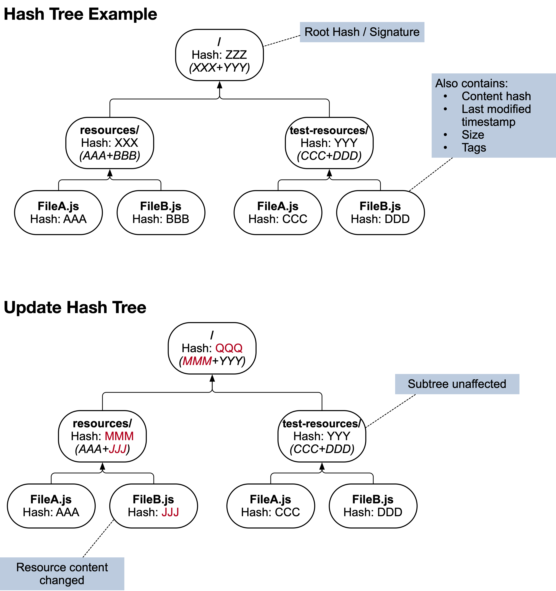

The integrity hash of a source file shall be calculated based on its raw content. A SHA256 hash shall be used for this purpose. Internally, the hash shall be stored in Sub-Resource Integrity (SRI) format (`sha256-<base64>`) to allow direct use as CAS keys.

When comparing the stored metadata with a current source file, the following attributes shall be considered before computing a resource's integrity hash:
* `lastModified`: Modification time
* `size`: File size
* `inode`: Inode number (stored for future use, but currently not used in comparisons)

If **any** of these attributes differ, the file may be modified, and its integrity hash shall be computed to confirm the change.

Each hash tree also contains an "index timestamp", representing the last time the index has been updated from disk. This allows quick invalidation if source files have a modification time later than this timestamp.

Additionally, this timestamp shall be used to protect against race conditions such as those described in [Racy Git](https://git-scm.com/docs/racy-git), where a file could be modified so quickly (and in parallel to the creation of the index) that its timestamp doesn't change. In such cases, the modification timestamp would be equal to the index timestamp. Therefore, if a file has a modification time equal to the index timestamp, its integrity must be compared to the stored integrity to determine whether it has changed.

#### Shared Hash Tree

A `Shared Hash Tree` is a specialized form of a hash tree that allows multiple entities (e.g. different request sets) to share common subtrees. This reduces redundancy and saves storage space when many request sets have overlapping resources.

Shared Hash Trees are managed by a `Tree Registry`. Changes made to any Shared Hash Tree are queued in the Tree Registry and applied in batch when requested. This ensures consistency across all trees and optimizes performance by minimizing redundant hash calculations.

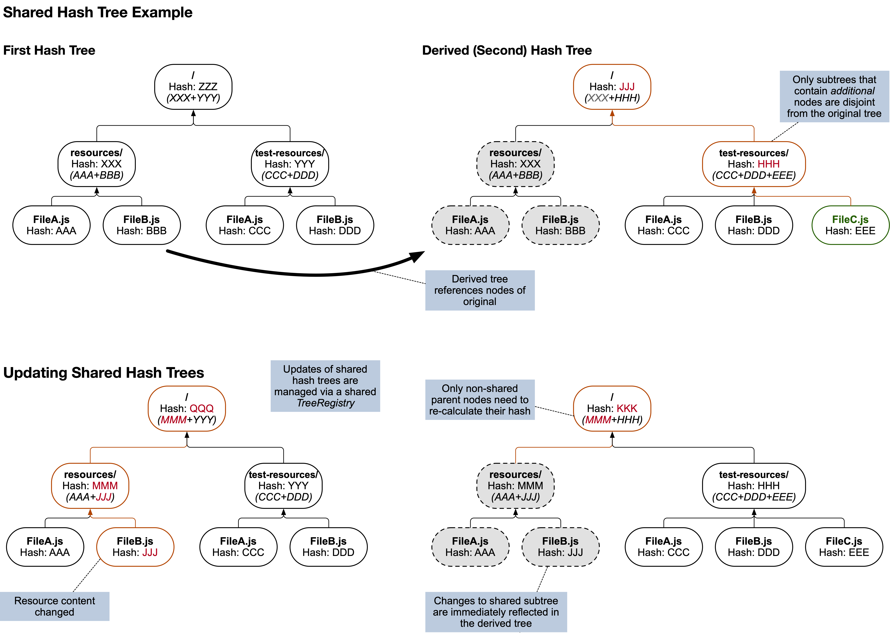

### Cache Creation

The build cache shall be serialized to disk in order to reuse it in successive UI5 CLI executions. This is done using a single **SQLite database** (WAL mode) that stores both content-addressable resource BLOBs and all metadata in dedicated tables. The CAS table ensures that each unique file content is stored only once, greatly reducing disk space usage and improving I/O performance. Using a single database eliminates the overhead of managing thousands of small files on disk and provides transactional consistency for cache writes.

Each project build has its own global metadata cache. This allows reuse of a project's cache across multiple consuming projects. For example, the `sap.ui.core` library could be built once and the build cache can then be reused in the build of multiple applications that reference the project. A "project build" is defined by its [`build signature`](#build-signature).

#### Source File Storage in CAS

In addition to task-produced resources, **source files that are not overlayed by any build task** are also stored in the CAS when a project's build completes. These are the project's original source files that pass through the build unchanged — i.e. resources that were not written to any task's writer stage.

This is necessary because dependent projects need access to the full set of a dependency's resources (both task outputs and unmodified sources). Storing source files in the CAS ensures that dependent projects can read them from the CAS-backed readers rather than from the filesystem, guaranteeing consistency even if the original files are modified between builds (see [Race Condition Handling](#race-condition-handling)).

This specifically applies to source files that are accessible to dependent projects — i.e. resources that would be served to downstream consumers. No new storage mechanism is needed; source files are simply additional entries in the existing CAS, keyed by their content-integrity hash.

The CAS-stored source files are tracked using a flat index of resource paths mapped to their CAS metadata (integrity hash, size, etc.), similar to the [Stage Metadata](#stage-metadata) of task outputs. This source stage index is stored as part of the [Result Metadata](#result-metadata) under the project's source-index signature. This is important because in subsequent builds where the dependency project has not been modified, the build can skip rebuilding the dependency entirely and still reference its source files from the CAS via the stored index — again eliminating the risk of race conditions without requiring a rebuild.

The cache consists of the following components:
1. A `content` table acting as the global CAS, storing resource BLOBs keyed by their SRI integrity hash.
2. Metadata tables per project build (identified by its build signature):
	* `index_cache`: Serialized [Hash Tree](#hash-tree) of all **source** files of the project, as well as a list of all build task names executed during the build.
	* `task_metadata`: Stores all resource requests of a build task, as well as serialized [Shared Hash Trees](#shared-hash-tree) representing the input resources of the task during its last execution.
	* `stage_metadata`: Contains the resource metadata for a given stage. The metadata can be used to access the resource content from the `content` table, allowing restoration of the output of a task or the final build result of a project (by combining multiple stages).
	* `result_metadata`: Maps a set of stage metadata that produced a final build result for a given project state (represented by the project's source index signature and the signatures of relevant dependencies).

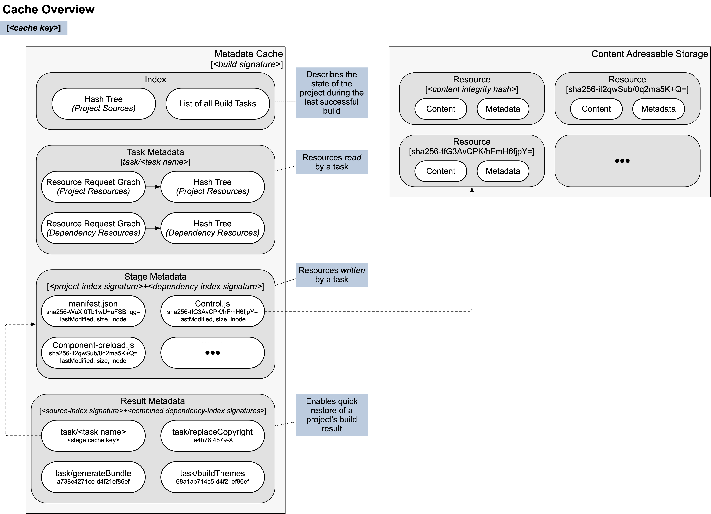

#### Differentiation with Pre-Built Projects

A project with an incremental build cache can be seen as similar to "pre-built projects" (as introduced in RFC 0011).

However, there are major differences in how those two types of project states are handled:

**1. Timing**

* For pre-built projects, the provided build manifest is taken into account immediately during the creation of the dependency graph and instantiation of the `Project` class (since it replaces the `ui5.yaml`).
* For projects with incremental build cache support, no build manifest exists. The presence and validity of a cache can only be validated at a later time during the build process, potentially only after dependencies have already been processed.

**2. Content**

* Pre-built projects only contain information about the final build result (i.e. the resources produced by the build).
	* The original source files are not part of the pre-built project.
	* All required resources are included in the pre-built project itself.
* Projects with incremental build cache support contain detailed metadata about the build process itself, including information about source files, tasks, and intermediate build stages.

**3. Usage**

* Pre-built projects are primarily used to distribute an already built state of a project, allowing consumers to skip rebuilding the project altogether. They cannot be built again. A prime example is the future distribution of pre-built UI5 framework libraries via npm packages.
* Projects with incremental build cache support are designed to improve the build time during a rebuild of the project. The potentially large cache is not intended to be distributed alongside the project, but rather stored locally on the developer's machine or build server.

#### Build Signature

The build signature is used to distinguish different builds of the same project. It is calculated from an internal version constant (bumped whenever the cache format changes), the **build configuration**, the project's identity and configuration, the effective versions of `@ui5/builder` and `@ui5/fs` (so that a package upgrade whose task output shape changed does not silently reuse an incompatible cache), and the aggregated `determineBuildSignature` contributions of all tasks in the build.

This signature is used to determine whether an existing cache can be used in a given build execution. For example, a "jsdoc" build leads to a different build signature than a regular project build, so two independent cache entries will be created in the database.

The signature is a hash represented as a hexadecimal string.

A mechanism for custom tasks to contribute to the build signature via `determineBuildSignature()` is defined in the Task API.

### Index Cache

```jsonc
{
	"indexTimestamp": 1764688556165,
	"indexTree": { /* Serialized hash tree */ },
	"taskList": [ // <-- Task list, defining the order of executed tasks and whether they support differential builds or not (1 or 0)
		["replaceCopyright", 1],
		["minify", 1],
		["generateComponentPreload", 0],
	]
}
```

The index provides metadata for all **source** files of the project. This allows the UI5 CLI to quickly determine whether source files have changed since the last build. Its key is simply the current [build signature](#build-signature) of the project build.

The metadata is represented as a [`Hash Tree`](#hash-tree), making updates efficient and allowing the generation of a single "project-index signature" representing the current state of all indexed resources.

The index cache also contains a list of tasks executed during the build, along with information on whether they support `differential builds`. This is used to efficiently deserialize cached [Build Task Metadata](#build-task-metadata).

#### Index Signature

An index signature (e.g. the "source-index signature") refers to the unique root hash of one of the (shared) hash trees. It represents the current state of a given set of resources (e.g. all sources of a project, or the input resources of a build task), including their associated resource tags. Any change to any of the resources or their tags will result in a different index signature.

These signatures are used to quickly check whether a cache exists by using them as cache keys.

### Build Task Metadata

**Example 1**

```jsonc
{
	"requestSetGraph": {
		"nodes": [{
			"id": 1,
			"parent": null,
			"addedRequests": [
				"patterns:[\"/resources/**/*.js\",\"!**/*.support.js\"]"
			]
		}],
		"nextId": 2
	},
	"rootIndices": [{
		"nodeId": 1,
		"resourceIndex": { 
			"indexTimestamp": 1764688556165,
			"indexTree": { /* Serialized hash tree */ }
		}
	}],
	"deltaIndices": []
}
```

**Example 2 (with deltas)**

```jsonc
{
	"requestSetGraph": {
		"nodes": [{
			"id": 1,
			"parent": null,
			"addedRequests": [
				"patterns:[\"/resources/**/*.js\",\"!**/*.support.js\"]"
			]
		}, {
			"id": 2,
			"parent": 1,
			"addedRequests": [
				"path:/resources/project/namespace/Component.js"
			]
		}],
		"nextId": 2
	},
	"rootIndices": [{
		"nodeId": 1,
		"resourceIndex": { 
			"indexTimestamp": 1764688556165,
			"indexTree": { /* Serialized hash tree */ }
		}
	}],
	"deltaIndices": [{
		"nodeId": 2,
		"addedResourceIndex": [{
			"path": "/resources/project/namespace/Component.js",
			"lastModified": 1764688556165,
			"size": 1234,
			"inode": 5678,
			"integrity": "sha256-R70pB1+LgBnwvuxthr7afJv2eq8FBT3L4LO8tjloUX8="
		}]
	}]
}
```

Stores the resource request information of a build task, along with serialized [Shared Hash Trees](#shared-hash-tree) representing the input resources of the task during its last execution.

The resource requests are stored in a serialized [`Resource Request Graph`](#resource-request-graph). For Shared Hash Trees, only the root tree is serialized. The additions of the derived trees are stored as "delta indices". Later, this can be used to reconstruct (and correctly derive) all Shared Hash Trees in memory.

### Stage Metadata

```jsonc
	"resourceMapping": {
		"/resources/project/namespace/": 0,
		"/test-resources/project/namespace/": 0,
		"/": 1
	},
	"resourceMetadata": [
		{
			// Virtual paths written by the task during execution, mapped to their cache metadata
			"/resources/project/namespace/Component.js": {
				"lastModified": 176468853453,
				"size": 4567,
				"integrity": "sha256-EvQbHDId8MgpzlgZllZv3lKvbK/h0qDHRmzeU+bxPMo="
			}
			// Virtual paths written by the task during execution, mapped to their cache metadata
			"/resources/project/namespace/Helper.js": {
				"lastModified": 1770643600860,
				"size": 473,
				"integrity": "sha256-gd33pMM2gCTxqoYxZyUYSsCKLhO+lZfFXT7MKUl7DSM="
			}
		},
		{
			// Virtual paths written by the task during execution, mapped to their cache metadata
			"/index.html": {
				"lastModified": 176468853453,
				"size": 124,
				"integrity": "sha256-R70pB1+LgBnwvuxthr7afJv2eq8FBT3L4LO8tjloUX8="
			}
		}
	],
	"projectTagOperations": {
		"/resources/project/namespace/Component.js": {
			"ui5:HasDebugVariant": true, // Set tag
		}
	},
	"buildTagOperations": {
		"/resources/project/namespace/Component.js": {
			"ui5:IsBundle": undefined, // Cleared tag
		}
	}
```

Stores the metadata of all resources for a given "stage" (i.e. all resources written by a single build task). This metadata can be used to access the resource content from the content-addressable store and to restore resource tag information.

The `resourceMapping` maps virtual path prefixes to indices in the `resourceMetadata` array. This is necessary for certain UI5 project types where multiple virtual paths map to the same physical path. For example, for a project of type `application`, the root path `/` maps to the sources (i.e. the `webapp` directory), just like the namespaced path `/resources/my/app/`. Both prefixes therefore reference the same `resourceMetadata` entry (index `0` in the example above). A different prefix, such as `/` for generated root-level resources, may reference a separate entry (index `1`).

For build tasks, the stage metadata is keyed using the signature of the project-index and the dependency-index that produced the output. Both signatures are combined using a `-` separator, i.e. `<project-index-signature>-<dependency-index-signature>`. If a task did not consume any project or dependency resources, that index signature is replaced with an `X` placeholder.

The contained metadata represents all resources **written** by that task during its execution. It includes the `lastModified`, `size` and `integrity` of each resource. This information is required for determining whether subsequent tasks need to be re-executed. It also contains information on resource tag operations, such as setting a tag to a value or clearing a tag. These tag operations are applied when restoring a cached stage and are incorporated into the hash tree leaf nodes of downstream tasks' input resources, ensuring that tag changes are reflected in the index signatures used for cache invalidation.

**Simplified Stage Metadata**

For some project types where no path mapping is done (e.g. type `module`), the stage metadata can be simplified to just store a single `resourceMetadata` object, mapping virtual paths directly to their cache metadata, without the need for an additional `resourceMapping`:

```jsonc
	"resourceMetadata": {
		// Virtual paths written by the task during execution, mapped to their cache metadata
		"/resource/path/Example.js": {
			"lastModified": 176468853453,
			"size": 4567,
			"integrity": "sha256-EvQbHDId8MgpzlgZllZv3lKvbK/h0qDHRmzeU+bxPMo="
		}
	}
```

### Result Metadata

```jsonc
{
	"stageSignatures": {
		"task/escapeNonAsciiCharacters": "614d99a15456009ffcaf88a2e22d4dfedc516eded4ebdcdcf3aeee9e724e6ec7-X",
		"task/replaceCopyright": "e1e95e8939eda1c44075578e0c434b82b747b56220a58cc86f6db2c808c1c1f8-X",
		"task/replaceVersion": "564593c13f783c6d27fb24739b63bd79115f719b4fa4e54a3ca7a0c47ac4c9f6-X",
		"task/replaceBuildtime": "d4f21ef86ef20170714457fbcbce6acaa7e2092d54be4f7298e404f30499d7ce-X",
		"task/generateLibraryManifest": "5b04940ceb72b0e739e291550129671b4d7a97a843cf04d7678d8f489344e944-X",
		"task/enhanceManifest": "cf1c319946bf577df0450cdb9662a5c216c231164ce3a814dea0a50291266eca-X",
		"task/generateLibraryPreload": "dea7afdd9c4bcfd0cb0aa905764046cdcae7e20c39261b0d8da11cb2a8acfd5a-X",
		"task/generateBundle": "9817778bd77caa6ed268e65d8ea2268251b607d34cefa3e1d3665bd5148c0af6-82a660a818563004b4ba5dbcfe49a57407eb096b31ac414b8e5fd32dc9cd5376",
		"task/buildThemes": "c027e3e5bcb1577c3d0d3c5004d3821a0c948903d6032be2c1508542719cf023-66198298279add82baab3a781dfbf1dde8e87605fb19d9c2982770c8f7a11f3c"
	}
}
```

Result metadata is stored by forming a key using the current source-index signature, combined with the signatures of the dependency-indices of all the project's stages. The dependency signatures are concatenated and a hash is calculated over the resulting string. The final key is then formed as `<source-index-signature>-<dependency-signature-hash>`.

The metadata then maps this key to the [Stage Metadata](#stage-metadata) of all stages that produced the final build result for this project state. This ultimately allows recreating the full build output of the project by combining those stages with the current sources. Additionally, the result metadata includes the index of [source files stored in the CAS](#source-file-storage-in-cas), enabling dependent projects to resolve these resources from the CAS even when the dependency's build is skipped entirely in subsequent builds.

### Cache Directory Structure

All cache data is stored in a single SQLite database file per cache version:

```
~/.ui5/buildCache/v0_<N>/
└── cache.db          # Single SQLite database (WAL mode)
    Tables:
    - content          # CAS: resource BLOBs keyed by integrity hash
    - index_cache      # Source/result index trees
    - stage_metadata   # Per-task stage results
    - task_metadata    # Resource request graphs
    - result_metadata  # Build result mappings
```

A new `buildCache` directory shall be added to the ~/.ui5/ directory. The location of this directory can be configured using the [`UI5_DATA_DIR` environment variable](https://ui5.github.io/cli/stable/pages/Troubleshooting/#environment-variable-ui5_data_dir).

Tables are configured for primary-key lookups only, and SQLite pragmas are tuned for cache-style workloads (WAL journaling, increased page size, memory-mapped reads, and a busy timeout to tolerate concurrent openers).

Content and large metadata BLOBs are gzip-compressed before storage; tiny resources are stored uncompressed since the gzip overhead would exceed the saving.

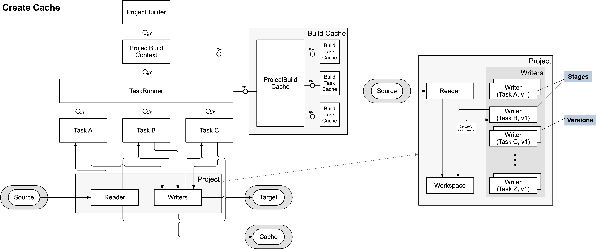

### Cache Import

Before building a project, UI5 CLI shall check for an existing index cache by calculating the [build signature](#build-signature) for the current build and searching the [cache directory structure](#cache-directory-structure) for a matching index cache.

The cache is then used to:
1. Check the source files of the project against the deserialized hash tree to determine which files have changed since the last build
2. Restore `Build Task Cache` instances using the respective [Build Task Metadata](#build-task-metadata) Cache
3. Provide the `Project` with readers for the cached `writer stages` (i.e. task outputs)
	* When the build process needs to access a cached resource, it can do so using those readers. Internally, resources are provided by first looking up their metadata in the corresponding [Stage Metadata](#stage-metadata) cache to find the resource content hash. Using this hash, the resource content is read from the `content` table in the database.
4. Provide dependency resource readers backed by the CAS
	* When a dependent project's build needs to access resources of a dependency, it reads from CAS-backed readers instead of filesystem readers. This includes both task outputs and unmodified source files stored in the CAS during the dependency's build (see [Source File Storage in CAS](#source-file-storage-in-cas)). This is transparent to build tasks — the reader abstraction hides whether the content comes from CAS or the filesystem.

This allows executing individual tasks and providing them with the results of all preceding tasks without the overhead of creating numerous file system readers or managing physical copies of files for each build stage.

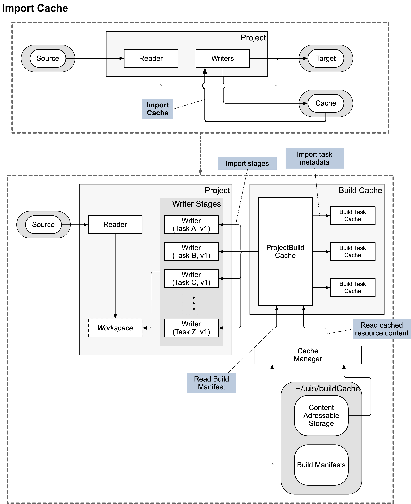

### Cache Invalidation

The following diagram shows the process for determining whether a project needs to be (partially) rebuilt and if yes, which individual tasks need to be (re-)executed.

Note this important differentiation: A Build Task Cache can be *potentially* or *definitely* invalidated. It is *potentially* invalidated if the corresponding task read resources that have been modified since the last build. It is *definitely* invalidated if the content of those resources has actually changed. By only potentially invalidating a Build Task Cache, the current process does not have to ensure that the resources actually changed at this point in time. Comparing the content of resources can be deferred until the task is actually executed. This can save time, especially since the resource in question might be modified again before the potentially invalidated task is executed.

If the task ends up being executed, it might produce new resources. After the execution has finished and the new resources have been written to the writer stage, it shall be checked whether the content of those resources has actually changed. If not, they must not lead to the invalidation of any following tasks. If they have changed, the relevant Build Task Cache instances will be notified about the changed resources and might *potentially* invalidate themselves.

After a *project* has finished building, a list of all modified resources is compiled and passed to the `Project Build Cache` instances of all dependent projects (i.e. projects that depend on the current project and therefore might use the modified resources).

### Concurrency

Parallel builds of the same project are not supported. SQLite's WAL mode provides the necessary concurrency control at the database level: multiple readers can operate concurrently, and a single writer is serialized automatically by SQLite. No external lock files are needed for raw database I/O.

Within a single UI5 CLI process, the cache manager that owns the SQLite connection is a singleton per cache directory and shared across all consumers (e.g. multiple builds triggered by the server all use the same cache manager). The underlying database is closed only when the last consumer releases it, so that one consumer cannot prematurely close handles that another still depends on.

#### Cross-Process Build Coordination

SQLite's database-level concurrency does not, on its own, coordinate higher-level build activity across processes. Consider this scenario:

* Process 1 is building projects `a` and `b`, where `a` depends on `b`.
* Process 2 starts a build for project `c`, which also depends on `b`.

Process 2 must wait until Process 1 has finished building `b` before reading `b`'s cache. Once `b` is built, however, Process 2 should be free to read `b`'s cache and proceed with building `c` immediately — even while Process 1 is still building `a`.

To achieve this, a shared/exclusive (read/write) lock shall be acquired per **build signature**:

* A process building a project takes an **exclusive lock** on that project's build signature for the duration of the build.
* A process reading a project's cache (e.g. as a dependency, or to skip rebuilding entirely) takes a **shared lock** on the build signature for the duration of the read.

Multiple shared locks may coexist; an exclusive lock is incompatible with any other lock. In the scenario above, Process 1 releases its exclusive lock on `sig(b)` as soon as `b`'s build commits — Process 2's pending shared-lock acquisition on `sig(b)` then succeeds even though Process 1 still holds an exclusive lock on `sig(a)`.

The locks shall be implemented as **filesystem-based locks** stored alongside the cache database (e.g. in a `locks/` subdirectory keyed by build signature), rather than as rows inside the SQLite database.

#### Determining Whether the Cache Can Be Used

When a process needs a project's cache, it follows an optimistic acquisition pattern: it first tries to take a **shared lock** and read the cache. If no valid cache entry exists under that lock, it releases the shared lock, acquires an **exclusive lock**, re-checks (another process may have built it in the meantime), and either builds the project or, if the cache now exists, downgrades to a shared lock and reads it.

### Race Condition Handling

In a multi-project build, projects are built sequentially based on their dependency order. This introduces a potential race condition: after project A finishes building, a user (or an editor's auto-save in watch mode) may modify a source file in project A before dependent project B starts or finishes building. If B were to read A's source files directly from the filesystem, it would see the modified — and therefore inconsistent — version, leading to incorrect build results.

This is resolved by storing A's source files in the CAS at the end of A's build (see [Source File Storage in CAS](#source-file-storage-in-cas)). Dependent project B reads A's resources from the CAS using the integrity hashes recorded during A's build. This guarantees that B sees exactly the state of A's sources as they were when A was built, regardless of subsequent filesystem modifications.

**Source index validation:** As an additional safeguard, a validation step is performed at the end of each project's build. The project's source index — as recorded at the start of the build — is compared against the current state of the source files on disk. If any source file has been modified during the build, the validation fails and an error is thrown. This prevents the resulting (potentially corrupt) cache from being stored and the build result from being used. In watch mode, the build server treats this error as a signal to reset the affected project's source-index state and re-enqueue it for rebuild.

**Scope:** This protection applies to **dependency resources only**. The root project's own source files are always read from the filesystem, as they represent the current input to the build. Modifications to the root project's sources during a build are handled by the [watch mode](#watch-mode), which detects the change and schedules a new build.

**Interaction with watch mode:** If a source file change in a dependency is detected during or after the current build, the watch mode will schedule a new build. The current build continues using the CAS-snapshotted version of the dependency's resources, ensuring consistency. The subsequent build will then pick up the changes and rebuild the affected projects.

### Garbage Collection

A mechanism to free unused cache resources is required. The SQLite database can grow over time as new project versions and build configurations accumulate entries.

The eviction strategy is still open. A reasonable starting point is some form of LRU eviction based on last-access timestamps or entry age, run as a non-blocking step after a successful `ui5 build` or `ui5 serve` once configured thresholds (age or size) are exceeded.

Additionally, a dedicated command, such as `ui5 cache clean`, shall be introduced. This command allows users to manually trigger a cache purge, providing options to specify criteria such as maximum age or size. Similarly, a command `ui5 cache verify` may be provided to check the integrity of the cache. As a fallback, users can simply delete the `~/.ui5/buildCache/` directory to clear all caches.

### Watch Mode

The build API shall provide a "watch" mode that will re-trigger the build when a source file is modified. The filesystem watch operation shall use debouncing to batch rapid successive file changes (e.g. from editor auto-save or format-on-save) and avoid triggering multiple builds. The watch mode shall select the projects to watch based on which projects have been requested to be built. If a [UI5 CLI workspace](https://sap.github.io/ui5-tooling/stable/pages/Workspace/) is used, this can be fine-tuned in the workspace configuration.

The watch mode shall be used by the server to automatically rebuild projects when source files are modified and serve the updated resources. See below.

#### Cache Invalidation

**It is to be decided** whether, besides watching relevant source files, the watch mode shall also watch configuration files relevant for the build signature (e.g. ui5.yaml, package.json, tsconfig.json, etc.). If any of those files change, a different cache would have to be used. Currently, only source files are watched; configuration changes require a restart.

#### Error Handling

If a task execution fails in watch mode, the error shall be logged but the watch mode shall remain active in anticipation of further changes. The process shall not crash or stop. This shall be a configuration option.

If some tasks have executed successfully before the error occurred, their results shall be kept in the cache and used for subsequent builds. Only the failed task and any downstream tasks shall be re-executed on the next build.

### Server Integration

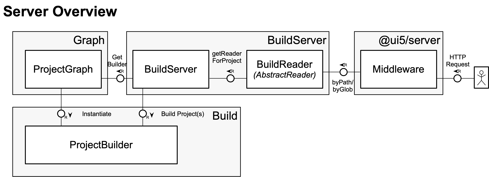

The UI5 CLI server integrates the incremental build via `BuildServer`, which pre-builds projects before serving and watches for source changes, automatically rebuilding affected projects and their dependents.

Middleware like `serveThemes` (used for compiling LESS resources to CSS) becomes obsolete, since the `buildThemes` task is executed instead.

If any project (root or dependency) defines custom tasks, those tasks are executed in the server as well. This makes it possible to easily integrate projects with custom tasks as dependencies.

Since executing a full build requires more time than the on-the-fly processing of resources currently implemented in the UI5 CLI server, expensive tasks that are not strictly required during development (e.g. minification and bundle/preload generation) are excluded by default in serve mode. Users can further customize which tasks are disabled using CLI parameters or ui5.yaml configuration.

While a build is running, the server pauses responding to incoming requests for resources of projects that are currently being rebuilt. This ensures that the server does not serve outdated or partially built resources. Requests for resources of other projects that are not affected by the current build continue to be served normally.

The server emits events (`buildFinished`, `sourcesChanged`, `error`) that can be consumed by middleware or future live-reload implementations.

#### Background Cache Validation

For a project that has not yet been built in the current session, the server initially only knows the build signature — not whether a cache exists on disk, and if so, whether it is still valid against the current source state. Deferring this check until the first request against the project's readers would make the *first* request pay for cold-cache I/O, and would leave the server unable to distinguish "cache present and valid, no rebuild needed" from "cache stale, rebuild imminent" until a request happens to hit that project.

To decouple this from the request path, the `BuildServer` runs an explicit **background cache validation** pass between build cycles: after each build cycle drains, any project whose cache status is still unknown (or was invalidated during the last cycle) is walked in dependency-first order. Each project's `Project Build Cache` is asked to validate its cache against the current source state; if valid, the project is marked as up-to-date, if stale, it is queued for rebuild.

The server state machine therefore distinguishes four operational states:

* `IDLE` — no pending changes, no pending build, all reachable caches confirmed fresh.
* `BUILDING` — a build cycle is in flight.
* `VALIDATING` — a background validation pass is in flight; no build is currently scheduled.
* `STALE` — pending changes or a known-stale cache, queued for the next cycle.

A source change during a validation pass surfaces immediately as `STALE`, and any reader request against a not-yet-validated project joins the current pass instead of triggering an ad-hoc rebuild. When `--cache=Force` is set, a stale cache surfaced by the pass is treated as an error, since Force forbids any rebuild.

#### Live Reload

The server provides live-reload functionality to inform connected browsers about changes in the build result and trigger an automatic page reload. This shortens the edit/test cycle: after saving a source file, the user does not need to manually refresh the browser to see the result.

It is implemented as follows:

* The `BuildServer` emits a debounced `sourcesChanged` event whenever watched source files change. A burst of file changes (e.g. from saving multiple files at once or from editor format-on-save) results in a single notification.
* A `liveReloadClient` middleware serves a client script at `/.ui5/liveReload/client.js`.
* The `serveResources` middleware injects a `<script>` tag referencing this client into the `<head>` of HTML responses. Injection happens as early as possible in the document so the WebSocket connection is established before any application script runs.
* A WebSocket server is attached to the HTTP server at `/.ui5/liveReload/ws`. On `sourcesChanged`, it broadcasts a `{type: "reload"}` message to all connected clients, which then reload the page.
* To prevent intermediate proxies from idle-closing the WebSocket, the client sends a `{type: "ping"}` message every 30 seconds while the connection is open. The server echoes the same message back.
* When the WebSocket connection is lost (e.g. because the server was restarted), the client polls the WebSocket endpoint every second and reloads the page once the server accepts connections again. While the browser tab is hidden, polling pauses until it becomes visible.

##### Authorization

Browser-originated upgrades (i.e. requests that carry an `Origin` header) are gated by a per-process token to mitigate Cross-site WebSocket Hijacking. The token is generated on server startup (72 random bits, base64url-encoded) and is substituted into the served client script template. Clients pass the token as a `?token=` query parameter; the server compares it using a constant-time comparison.

Upgrades without an `Origin` header are not gated, since they cannot originate from a browser context where the Same-Origin Policy applies — they would already have full unauthenticated HTTP access to the dev server.

Reconnect probes from stale clients (whose page was loaded before the server was restarted, and which therefore can't know the new token) use the `ui5-ping` WebSocket subprotocol. The server accepts such handshakes without a token check and immediately closes the connection without enrolling the socket — confirming "server is up" without exchanging any data.

Live reload is enabled by default for `ui5 serve`. It can be controlled via:

* The CLI flag `--live-reload` / `--no-live-reload` for `ui5 serve`.
* The project configuration setting `server.settings.liveReload` in `ui5.yaml`. This setting requires Specification Version 5.0 or higher.

The CLI flag overrides the project configuration. When neither is set, live reload defaults to `true`.

## Integration in UI5 CLI

The `ui5 serve` command integrates the incremental build via `BuildServer`. On startup, it builds the configured projects and watches for file changes, automatically rebuilding affected projects.

The following new arguments shall be added to the `ui5 build` and `ui5 serve` commands:

* `--cache`: Controls how the build cache is used.
	* Possible modes:
		* `Default`: Use the cache if available
		* `Force`: Use the cache only. If it is incomplete or invalid, fail the build
		* `ReadOnly`: Do not create or update the cache but make use of any existing cache if available (useful for CI/CD)
		* `Off`: Do not use the cache at all
	* The previous `--cache-mode` argument, which controlled framework dependency resolution caching, has been renamed to `--snapshot-cache` to avoid the naming collision with the build cache.
* `--watch`: Enables watch mode, causing the build to be re-triggered whenever a source file or relevant configuration file changes.
	* This parameter is only relevant for the `ui5 build` command. The `ui5 serve` command always uses watch mode internally.

The following new argument shall be added to the `ui5 serve` command:

* `--live-reload` / `--no-live-reload`: Controls whether the browser automatically reloads when project sources change. Defaults to `true`. Overrides the `server.settings.liveReload` setting in the project's server configuration.

A new project configuration setting `server.settings.liveReload` is introduced for Specification Version 5.0 and higher, controlling the same behavior at the project level.

## How we teach this

This is a big change in the UI5 CLI architecture and especially impacts the way the UI5 CLI server works. By always building projects, developers might experience a slower startup time of the server. After modifying a file, it might also take longer until all processing is finished and the change is being served to the browser.

The incremental build hopefully mitigates this performance impact to some extent. The ability to disable individual tasks can further improve the performance. However, this needs to be taught to developers and sane defaults should be picked to make the experience as good as possible.

With the execution of tasks in the server, some (custom) middleware might become obsolete or even cause problems. This means that **projects might need to adapt their configuration**.

All of this should be communicated in the UI5 CLI documentation and in blog posts. A phase of pre-releases should be used to gather feedback from the community.

## Drawbacks

* For every file change, the server needs to execute a partial build. This can lead to a longer time between making a source file change and seeing the result in the browser.
	* This should be measured on different systems. The project size and the tasks involved can have a big impact on the performance.
	* The ability to disable individual tasks for the server can help to mitigate this problem.
		* Would this create a distinction between tasks that are relevant for the production build only and those relevant to the server only?
* Projects might have to adapt their configurations.
* Custom tasks might need to be adapted. Previously, they could only access the sources of a project. With this change, they will access the build result instead. Access to the sources is still possible but requires the use of a dedicated API.
* UI5 CLI standard tasks need to be adapted to use the new cache API. Especially the bundling tasks currently have no concept for partially re-creating bundles. However, this is an essential requirement to achieve fast incremental builds.
* The SQLite database can grow over time. A [garbage collection](#garbage-collection) mechanism is needed for managing disk space (not yet implemented).

## Alternatives

An alternative to using the incremental build in the UI5 CLI server would be to apply custom middleware of dependencies.

### Server-Sent Events (SSE) instead of WebSockets for Live Reload

Server-Sent Events were considered as an alternative transport. When not used over HTTP/2, SSE is subject to a [per-browser limit of 6 open connections](https://developer.mozilla.org/en-US/docs/Web/API/Server-sent_events/Using_server-sent_events) that applies across all tabs to the same server. Since the UI5 server still defaults to HTTP/1.1 (HTTP/2 is opt-in via `--h2`), this limit is the common case. With live reload enabled, one of the 6 connections is permanently occupied by the SSE channel, leaving only 5 for resource loading and impacting performance. In the worst case, this leads to a dead-lock where SSE connections block any further requests — for example, opening the `test.html` page in OpenUI5, which resolves all QUnit testsuites via iframes, could hit this limit. WebSockets are not subject to this limit and were therefore chosen as the transport.

## Unresolved Questions and Bikeshedding

* ✅ How to distinguish projects with build cache from pre-built projects (with project manifest)
	* Check presence of "sourceMetadata" attribute. Only with "sourceMetadata" can the cache be used for incremental (re-)builds of the project. Otherwise it is "only" a build *result* that can be used for building dependent projects.
* ✅ Storage format: SQLite with unified content + metadata tables was chosen over cacache + file-based metadata or LevelDB.
* ✅ `--cache` option for the build cache, separate from the framework dependency snapshot cache (renamed to `--snapshot-cache`).
* Allow tasks to store additional information in the cache.
* Some tasks might be relevant for the server only (e.g. code coverage); come up with a way to configure that. This will implicitly cause the creation of different caches for server and build, which might just be an acceptable and easy to understand trade-off.
* The exact shape of `determineExpectedOutput` (or an alternative mechanism) for detecting stale outputs when a task ceases to produce a previously cached resource. Without this, the cached version of the now-removed resource would still be served from the cache.
* Whether watch mode shall also watch configuration files relevant for the build signature (e.g. `ui5.yaml`, `package.json`, `tsconfig.json`). If any of those files change, a different cache would have to be used.
* Garbage collection strategy: LRU vs. age-based vs. size-based eviction, and whether the check runs implicitly after a build/serve or only on explicit `ui5 cache clean`.
* Cross-process build coordination: SQLite's database-level concurrency does not coordinate higher-level build activity. Whether to add filesystem-based shared/exclusive locks per build signature (as proposed in [Concurrency](#concurrency)) depends on how often parallel builds of the same project occur in practice.
* Cache corruption and crash recovery: how to handle cases where a cache write was interrupted (verification command, automatic detection, or rebuild on read failure).
* Measure performance in BAS. Find out whether this approach results in acceptable performance.
* Test with selected (community) custom tasks.
* Add a debug command (e.g. `ui5 cache verify`) to verify the integrity of a cache by rebuilding the project and comparing the result with the cache.
