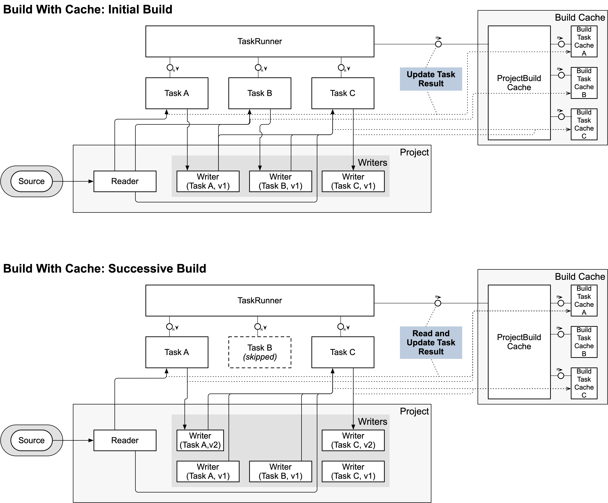

- Start Date: 2024-12-09
- RFC PR: [#1036](https://github.com/SAP/ui5-tooling/pull/1036)
- Issue: -
- Affected components <!-- Check affected components by writing an "X" into the brackets -->
	+ [x] [ui5-builder](https://github.com/UI5/cli/tree/main/packages/builder)
	+ [x] [ui5-server](https://github.com/UI5/cli/tree/main/packages/server)
	+ [x] [ui5-cli](https://github.com/UI5/cli/tree/main/packages/cli)
	+ [x] [ui5-fs](https://github.com/UI5/cli/tree/main/packages/fs)
	+ [x] [ui5-project](https://github.com/UI5/cli/tree/main/packages/project)
	+ [x] [ui5-logger](https://github.com/UI5/cli/tree/main/packages/logger)

# RFC 0017 Incremental Build

## Summary

This concept aims at adding incremental build support to UI5 CLI. It should be possible to execute a build where only a small set of modified resources is re-processed while the rest is reused from a previous build.

## Motivation

The current build process for UI5 projects can be rather slow. For a large project, like some of the framework internal libraries, a full build can take several minutes. On every build, usually all of the projects need to be processed by executing a series of build tasks. Often however, only few resources have actually changed in-between builds. By adding advanced caching functionality to the build process, UI5 CLI would become capable of performing incremental builds, detecting which resources changed and only processing those changes. Reusing previous build results whenever possible. This enhancement should speed up the build process for UI5 projects significantly.

It has also become increasingly common for UI5 projects to use [custom build tasks](https://sap.github.io/ui5-tooling/stable/pages/extensibility/CustomTasks/). Popular examples include the community-maintained custom tasks for TypeScript compilation ([`ui5-tooling-transpile`](https://github.com/ui5-community/ui5-ecosystem-showcase/tree/main/packages/ui5-tooling-transpile)), or for consuming third-party libraries ([`ui5-tooling-modules`](https://github.com/ui5-community/ui5-ecosystem-showcase/tree/main/packages/ui5-tooling-modules)).

These tasks can greatly enhance the development experience with UI5. However, when working on projects that depend on projects using such custom tasks, it can become cumbersome to set up a good development environment. In part, this is due to the current UI5 CLI-development server not executing build tasks, and instead relying on middleware (including [custom middleware](https://sap.github.io/ui5-tooling/stable/pages/extensibility/CustomServerMiddleware/)) to process resources during development. For this, only (custom-)middleware defined on the current root project is used. This means that the root project often also needs to configure custom middleware *for its dependencies*, if those need any.

By enhancing the UI5 CLI-server to **execute an incremental build** before starting the development server for a project, any custom tasks defined in dependencies are executed automatically, solving the above problem. The performance gain achieved through the incremental build feature, enables us to replace most middleware with their task counterparts while maintaining a similar or even improved development experience.

This greatly simplifies the configuration of UI5 projects, especially when working with multiple inter-dependent projects. It also simplifies the development of UI5 CLI extensions, as custom tasks can now be used in more scenarios without requiring custom middleware implementations.

## Detailed design

### Sequence Diagram


### Current Build

The current build process executes all build tasks for the required projects one by one. Tasks are reading and writing resources from and to a `workspace` entity, which is a representation of the virtual file system of `@ui5/fs` for the current project. A `workspace` currently consists of a single `reader` and a `writer`. While the reader is usually connected to the sources of the project, the writer is an in-memory object, collecting the output of the build tasks before it is finally written to the target output directory.

With this setup, a build task can always access the result of the previous tasks, as well as the project's sources, through a single interface.


### Incremental Build Cache

For the incremental build cache, a new entity `Build Task Cache` shall be created, managed by a new entity `Project Build Cache`. In addition, the current concept of the project-`workspace` shall be extended to allow for `stage writers`. These stages build upon each other. Essentially, instead of one writer being shared across all tasks, each task is assigned its own stage. And each task reads from the combined stages of the preceding tasks.


This shall enable the following workflow:

**1. Action: A project build is started**

*(see diagram below, "Initial Build")*

1. Task A, Task B and Task C are executed in sequence, writing their results into individual writer stages.
1. _Task outputs are written to a content-addressable store and "stage cache" metadata is serialized to disk._
1. _After the last task executed, the project's "index" is serialized to disk along with a mapping to the output file metadata. All created or modified resources are written to the content-addressable store._
1. Build finishes and the resources of all writer stages are combined with the source reader and written into the target output directory.

_The project has been built and a cache has been stored._

**2. Action: A source file is modified, a new build is started**

*(see diagram below, "Successive Build")*

1. _The cache metadata is read from disk, enabling the build to determine the relevant changes and access cached content from the content-addressable store._
	* Valid cached stages are imported into the `Project` as "stage readers"
1. The build determines which tasks need to be executed using the imported cache and information about the modified source files.
	* In this example, it is determined that Task A and Task C need to be executed since they requested the modified resource in their previous execution.
1. Task A is executed. The output is written into a **new writer** of the associated stage.
	* Since Task A communicated that it supports `differential builds`, the task is provided with a list of changed resources, allowing it to determine which resources need to processed again, skipping stale resources.
	* In this example, Task A decided to only process the changed resources and ignores the others.
	* **Note: Task A can't access the cached stage reader.** It can only access the combined resources of all previous writer stages, just like in a regular build.
1. _New task outputs are combined with the cached outputs and the new stage metadata is serialized to disk_
1. The `Project Build Cache` determines whether the resources produced in this latest execution of Task A are relevant for Task B. If yes, the content of those resources is compared to the cached content of the resources Task B has received during its last execution. In this example, the output of Task A is not relevant for Task B and it is skipped.
1. Task C is executed (assuming that relevant resources have changed) and has access to the full stage (cache reader and new writer) of Task A, as well as the cached stage of Task B. This allows it to access all resources produced in all previous executions of Task A and Task B.
	* Task C does not support `differential builds`. The output of Task C is written into a **new writer** of the associated stage.
1. _New task outputs are stored in the content-addressable store and stage metadata is serialized to disk_
1. The build finishes. The combined resources of all stages and the source reader are written to the target output directory.




#### Project Build Cache

The `Project Build Cache` is responsible for managing the build cache of a single project. It handles the (de-)serialization of the cache to- and from disk, as well as determining whether a new build of the project is required (e.g. due to the lack of an existing cache or based on source- or dependency file changes).

It also manages the individual `Build Task Cache` instances for each task in the build process, allowing them to track which resources have been read and written during their execution.

In order to detect changes in a project's sources, a [Hash Tree](#hash-tree) is used to efficiently store and compare metadata of all source files. This allows quick detection of changed source files since the last build. The root hash of this tree is referred to as the project's `source-index signature`. Together with the signatures of all relevant dependency-indices, a cache key can be generated to look up an existing result cache for the project's current state. If found, it can be used to skip the build of the project altogether.

Similarly, each task's input resources are tracked using two hash trees (one for project-internal resources and one for dependency resources). The root hashes of both trees can be combined to form a stage cache key.

See also: [Cache Creation](#cache-creation).

#### Build Task Cache

The `Build Task Cache` is responsible for managing the cache information for a single build task within a project. It keeps track of which resources have been read and written by the task during previous executions.

Later during a rebuild, it can use this information to determine whether the task needs to be re-executed based on changes to the relevant input resources.

The Project Build Cache uses this information to determine whether a changed resource _potentially_ affects a given task. This does not mean that the task must be re-executed right away, but only that it might need to be re-executed. The actual decision is deferred until the task is about to be executed. Only at that point, the task can compare the content of the relevant input resources with its cache, and determine whether (and which) relevant resources have changed.

All necessary metadata stored in the `Build Task Cache` is serialized to disk as part of the [Build Task Metadata](#build-task-metadata).

#### Project

The existing `Project` super-class shall be extended to support the new concept of `stage writers`.

Already before, it was responsible for creating the `workspace` for a build, which consisted of a single `reader` (providing access to the project's sources) and a `writer` (storing all resources that have been newly produced or changed by the build in memory).

Now, each `Project` instance shall feature multiple `stages`. One for each task in the build process. Each stage holds either either a `writer` or a `cached writer` (if the stage has been restored from cache). Cached-writers are read-only.

During the project build, and before executing a task, the `Project Build Cache` shall set the correct stage in the Project. E.g. before executing the `replaceCopyright` task, the Project's stage is set to `task/replaceCopyright`.

Whenever progressing to a new stage, the stage is initialized with an empty writer. The `Project Build Cache` can replace this writer with a `cached writer`, in case a previous execution of the task has been cached and the cache is still valid.

Once a `workspace` is requested from the `Project` instance, it will create one using a `reader` that combines the writers of all previous stages stages (as well as the project's sources), and the writer of the current stage.

Stages have an explicit order, defined during their initialization. Stages shall be named using the following schema: `<type>/<name>`, where `<type>` is the type of the stage (e.g. `task`) and `<name>` is the name of the entity creating the stage (e.g. the task name).


#### Project Builder

The `Project Builder` shall be enhanced to:

1. Before building a project, allow the `Project Build Cache` to prepare the build by importing any existing cache from disk (see [Cache Import](#cache-import)) and comparing it with the current source files to determine which files have changed since the last build.
2. If a cache can be used, skip the build of a project
3. After building a project, allow the `Project Build Cache` to serialize the updated cache to disk (see [Cache Creation](#cache-creation)).

#### Task Runner

The `Task Runner` shall be enhanced to:

1. Request the build signature of any tasks implementing the `determineBuildSignature` method at the beginning of the build process (see [Build Task API Changes](#build-task-api-changes)). These signatures are then incorporated into the overall build signature of the project (see [Cache Creation](#cache-creation)).
2. Before executing each task, allow the `Project Build Cache` to prepare the task execution and determine whether the task needs to be executed or can be skipped based due to valid cache data.
3. _[TODO: Revisit this idea] Before executing a task, call the `determineExpectedOutput` method if provided. This allows the task to specify which resources it expects to write during its execution. The `Project Build Cache` can then use this information to detect and remove stale output resources that were produced in a previous execution of the task, but are no longer produced in the current execution._
4. Execute the task, optionally providing it with a list of changed resource paths since the last execution. This can be used by tasks supporting `differential build`, to only process changed resources (see [Build Task API Changes](#build-task-api-changes) below).
5. After a task has been executed, allow the `Project Build Cache` to update the cache using information on which resources have been read during the task's execution as well as its output resources. _(to be discussed: also the set of resources expected to be written (as provided by the `determineExpectedOutput` method?)._
	* The resources read by a task are determined by providing the task with instances of the `workspace`- and `dependencies`-reader/writer that have been wrapped in ["Monitored Reader"](#monitored-reader) instances. They are responsible for observing which resources are being accessed during the task's execution.
	* The `Project Build Cache` will then:
		* Update the metadata in the respective `Build Task Cache` with the set of resources read by the task ("resource requests")
		* Compile a new "signature" for the task's input resources and store this, along with the project's current stage instance, in the in-memory Stage Cache of the `Project Build Cache` (mapping a stage signature to an earlier cached stage instance).
		* _Delete or tag resources that have become stale_
		* Using the set of changed resource paths, check which downstream tasks need to be potentially invalidated (see [Cache Invalidation](#cache-invalidation))

##### Build Task API Changes

Build tasks can now optionally support "differential builds" by implementing the following new features.

* **supportsDifferentialBuilds()**: Returns `true` if the task supports differential builds, i.e. if it can process only a subset of changed resources instead of all resources. If this method is not implemented, it is assumed that the task does not support differential builds.
	* If a task supports differential builds, it will be provided with a list of changed resource paths since its last execution.
* **async determineBuildSignature({log, options})**
	* `log`: A logger instance scoped to the task
	* `options`: Same as for the main task function. `{projectName, projectNamespace, configuration, taskName}`
	* Returns: `undefined` or an arbitrary string representing the build signature for the task. This can be used to incorporate task-specific configuration files (e.g. tsconfig.json for a TypeScript compilation task) into the build signature of the project, causing the cache to be invalidated if those files change. The string shouldn't be a hash value (the build signature hash is calculated later on). If `undefined` is returned, or if the method is not implemented, it is assumed that the task's cache remains valid until relevant input-resources change.
	* This method is called once at the beginning of every build. The return value used to calculate a unique signature for the task based on its configuration. This signature is then incorporated into the overall build signature of the project (see [Cache Creation](#cache-creation) below).
	* Might return a list of file paths that shall be watched for changes (when running in watch mode). On change, the build signature is recalculated and the cache invalidated if it has changed.
* **async determineExpectedOutput({workspace, dependencies, cacheUtil, log, options})**: _**TODO: revisit this concept**_
	* `workspace`: Reader to access resources of the project's `workspace` (read only)
	* `dependencies`: Reader to access resources of the project's dependencies
	* `cacheUtil`: Same as above
	* `log`: A logger instance scoped to the task
	* `options`: Same as for the main task function. `{projectName, projectNamespace, configuration, taskName}`
	* Returns: A set of resource paths which the task anticipates to write (output) in a clean run. That is, without cache. In case the task ends up writing fewer resources or resources outside of this set, an error will be produced. In case of a cache hit, the task may write fewer resources than declared here. If `undefined` is returned, or if the method is not implemented, it is assumed that the task's output is always the same as in the previous execution. Therefore, no stale output detection will be performed.
	* This method is called right before the task is being executed. It is used to detect stale output resources that were produced in a previous execution of the task, but are no longer produced in the current execution. Such stale resources must be removed from the build output to avoid inconsistencies.

These methods took some inspiration from the existing [`determineRequiredDependencies` method](https://github.com/UI5/cli/blob/main/rfcs/0012-UI5-Tooling-Extension-API-3.md#new-api-2) ([docs](https://ui5.github.io/cli/stable/pages/extensibility/CustomTasks/#required-dependencies)).

#### Monitored Reader

A `MonitoredReader` is a wrapper around a `Reader` or `Writer` instance that observes which resources are being accessed during its usage. It records the requested paths as well as glob patterns that have been used to request resources.

This information is used in the [`Resource Request Graph`](#resource-request-graph).

#### Resource Request Graph

A graph recording the request sets of a build task across multiple executions.

It optimizes storage of multiple related request sets by storing deltas rather than full copies of each unique request set. Each node stores only the requests added relative to its parent.

This is particularly efficient when request sets have significant overlap. The graph automatically finds the best parent for a new request set in order to minimize the delta size.

At runtime, each unique (materialized) request set references a [`Shared Hash Tree`](#shared-hash-tree) representing the resources currently matching the request set.

#### Hash Tree

By using hash trees, it is possible to efficiently store and compare metadata of a large number of resources. This is particularly useful for tracking changes in source files or task input resources.

A hash tree is a tree data structure where each leaf node represents a resource and contains its metadata (e.g. path, size, last modified time, integrity hash). Each non-leaf node contains a hash that is derived from the hashes of its child nodes. The root node's hash represents the overall state of all resources in the tree.

When a resource changes, only the hashes along the path from the changed leaf node to the root need to be updated. This makes it efficient to update the tree and compute a new root hash.


The integrity hash of a source file shall be calculated based on its raw content. A SHA256 hash should be used for this purpose. Internally, the hash shall be stored in Base64 format to reduce the size of stored metadata. A library like [ssri](https://github.com/npm/ssri) may be used for this purpose, allowing easy interoperability with [cacache](#cacache) (see below).

When comparing the stored metadata with a current source file, the following attributes should be considered before computing a resource's integrity hash:
* `lastModified`: Modification time
* `size`: File size
* `inode`: Inode number (to detect file replacements)

If **any** of these attributes differ, the file may be modified. Requiring the computation of the integrity hash to confirm a file change.

Each hash tree also contains an "index timestamp", representing the last time the index has been updated from disk. This allows quick invalidation if source files have a modification time later than this timestamp.

Additionally, this timestamp shall be used to protect against race conditions such as those described in [Racy Git](https://git-scm.com/docs/racy-git), where a file could be modified so quickly (and in parallel to the creation of the index) that its timestamp doesn't change. In such cases, the modification timestamp would be equal to the index timestamp. Therefore, if a file has a modification time equal to the index timestamp, its integrity must be compared to the stored integrity to determine whether it has changed.

#### Shared Hash Tree

A `Shared Hash Tree` is a specialized form of a hash tree that allows multiple entities (e.g. different request sets) to share common subtrees. This reduces redundancy and saves storage space when many request sets have overlapping resources.

Shared Hash Trees are managed by a `Tree Registry`. Changes made to any Shared Hash Tree are queued in the Tree Registry and applied in batch when requested. This ensures consistency across all trees and optimizes performance by minimizing redundant hash calculations.


### Cache Creation

The build cache shall be serialized onto disk in order to use it in successive UI5 CLI executions. This will be done using a **Content-Addressable Storage (CAS)** model, which separates file content from metadata and a **dedicated metadata storage**. The CAS ensures that each unique file content is stored only once on disk, greatly reducing disk space usage and improving I/O performance.

Each project build has its own global metadata cache. This allows for reuse of a project's cache across multiple consuming projects. For example, the `sap.ui.core` library could be built once and the build cache can then be reused in the build of multiple applications that reference the project. A "project build" is defined through its [`build signature`](#build-signature).

The cache consists of the following components:
1. A global CAS where all file contents are stored, identified by their content-integrity hash.
2. Metadata per project build (identified by its build signature), consisting of:
	* [Index Cache](#index-cache): Serialized [Hash Tree](#hash-tree) of all **source** files of the project, as well as a list of all build task names executed during the build.
	* Task Metadata: Stores all resource requests of a build task, as well as serialized [Shared Hash Trees](#shared-hash-tree) representing the input resources of the task during its last execution.
	* Stage Metadata: Contains the resource metadata for a given stage. The metadata can be used to access the resource content in the content-addressable store. This allows to restore the output of a task, or the final build result of a project (by combining multiple stages).
	* Result Metadata: Maps a set of stage metadata that produced a final build result for a given project state (represented by the project's source index signature and the signatures of relevant dependencies).


#### Differentiation with Pre-Built Projects

A project with an incremental build cache can be seen as similar to "pre-built projects" (as introduced in RFC 0011).

However, there are major differences in how those two types of project states are handled:

**1. Timing**

* For pre-built projects, the provided build manifest is taken into account immediately during the creation of the dependency graph and instantiation of the `Project` class (since it replaces the `ui5.yaml`).
* For projects with incremental build cache support, no build manifest exists. The presence and validity of a cache can only be validated at a later time during the build process. Potentially only after dependencies have already been processed.

**2. Content**

* Pre-built projects only contain information about the final build result (i.e. the resources produced by the build).
	* The original source files are not part of the pre-built project.
	* All required resources are included in the pre-built project itself.
* Projects with incremental build cache support contain detailed metadata about the build process itself, including information about source files, tasks, and intermediate build stages.

**3. Usage**

* Pre-built projects are primarily used to distribute an already built state of a project, allowing consumers to skip rebuilding the project altogether. They can not be built again. A prime example for this is the future distribution of pre-built UI5 framework libraries via npm packages.
* Projects with incremental build cache support are designed to improve the build time during a rebuild of the project. The potentially large cache is not intended to be distributed alongside the project, but rather stored locally on the developer's machine or build server.

#### Build Signature

The build signature is used to distinguish different builds of the same project. It is mainly calculated based on the **build configuration** of a project. But it also incorporates information that depends on the UI5 CLI version (specifically an internal `BUILD_SIG_VERSION` integer constant), as well as optional signatures provided by custom tasks.

This signature is used to easily tell whether an existing cache can be used in a given build execution or not. For example, a "jsdoc"-build leads to a different build signature than a regular project build. Therefore, two independent cache entries will be created on disk.

The signature is a simple hash (represented as a hexadecimal string, to allow usage in directory and file names).

A mechanism shall be created for custom tasks to provide a signature as well. This allows the incorporation of task-specific configuration files (e.g. tsconfig.json for a TypeScript compilation task) into the build signature (see [Build Task API Changes](#build-task-api-changes)).

### Index Cache

```jsonc
{
	"indexTimestamp": 1764688556165,
	"indexTree": { /* Serialized hash tree */ },
	"taskList": [ // <-- Task list, defining the order of executed tasks and whether they support differential builds or not (1 or 0)
		["replaceCopyright", 1],
		["minify", 1],
		["generateComponentPreload", 0],
	]
}
```

The index provides metadata for all **source** files of the project. This allows the UI5 CLI to quickly determine whether source files have changed since the last build. It's key is simply the current [build signature](#build-signature) of the project build.

The metadata is represented as a [`Hash Tree`](#hash-tree), making updates efficient and allowing the generation of a single "project-index signature" representing the current state of all indexed resources.

The index cache also contains a list of tasks executed during the build, along with information whether they support `differential builds`. This is used to efficiently de-serialize cached [Build Task Metadata](#build-task-metadata).

#### Index Signature

An index signature (e.g. the "source-index signature") is referring to the unique root hash of one of the (shared-) hash trees. It represents the current state of a given set of resources (e.g. all sources of a project, or the input resources of a build task). Any change to any of the resources will lead to a different index signature.

These signatures are used to quickly check whether a cache exists by using them as cache keys.

### Build Task Metadata

**Example 1**

```jsonc
{
	"requestSetGraph": {
		"nodes": [{
			"id": 1,
			"parent": null,
			"addedRequests": [
				"patterns:[\"/resources/**/*.js\",\"!**/*.support.js\"]"
			]
		}],
		"nextId": 2
	},
	"rootIndices": [{
		"nodeId": 1,
		"resourceIndex": { 
			"indexTimestamp": 1764688556165,
			"indexTree": { /* Serialized hash tree */ }
		}
	}],
	"deltaIndices": []
}
```

**Example 2 (with deltas)**

```jsonc
{
	"requestSetGraph": {
		"nodes": [{
			"id": 1,
			"parent": null,
			"addedRequests": [
				"patterns:[\"/resources/**/*.js\",\"!**/*.support.js\"]"
			]
		}, {
			"id": 2,
			"parent": 1,
			"addedRequests": [
				"path:/resources/project/namespace/Component.js"
			]
		}],
		"nextId": 2
	},
	"rootIndices": [{
		"nodeId": 1,
		"resourceIndex": { 
			"indexTimestamp": 1764688556165,
			"indexTree": { /* Serialized hash tree */ }
		}
	}],
	"deltaIndices": [{
		"nodeId": 2,
		"addedResourceIndex": [{
			"path": "/resources/project/namespace/Component.js",
			"lastModified": 1764688556165,
			"size": 1234,
			"inode": 5678,
			"integrity": "sha256-R70pB1+LgBnwvuxthr7afJv2eq8FBT3L4LO8tjloUX8="
		}]
	}]
}
```

Stores the resource request information of a build task, along with serialized [Shared Hash Trees](#shared-hash-tree) representing the input resources of the task during its last execution.

The resource requests are stored in a serialized [`Resource Request Graph`](#resource-request-graph). For Shared Hash Trees, only the root tree is serialized. The additions of the derived trees are stored as "delta indices". Later, this can be used to reconstruct (and correctly derive) all Shared Hash Trees in memory.

### Stage Metadata

```jsonc
	"resourceMetadata": {
		// Virtual paths written by the task during execution, mapped to their cache metadata
		"/resources/project/namespace/Component.js": {
			"lastModified": 176468853453,
			"size": 4567,
			"integrity": "sha256-EvQbHDId8MgpzlgZllZv3lKvbK/h0qDHRmzeU+bxPMo="
		}
	}
```

Stores the metadata of all resources for a given "stage" (i.e. all resources written by a single build task). This metadata can be used to access the resource content from the content-addressable store.

For build tasks, the stage metadata is keyed using the the signature of the project-index and the dependency-index that produced the output. Both signatures are combined using a `-` separator. I.e. `<project-index-signature>-<dependency-index-signature>`. If a task did not consume any project- or any dependency-resources, that index signature is replaced with an `X` placeholder.

The contained metadata represents all resources **written** by that task during its execution. It includes the `lastModified`, `size` and `integrity` of each resource. This information is required for determining whether subsequent tasks need to be re-executed.

### Result Metadata

```jsonc
{
	"stageSignatures": {
		"task/escapeNonAsciiCharacters": "614d99a15456009ffcaf88a2e22d4dfedc516eded4ebdcdcf3aeee9e724e6ec7-X",
		"task/replaceCopyright": "e1e95e8939eda1c44075578e0c434b82b747b56220a58cc86f6db2c808c1c1f8-X",
		"task/replaceVersion": "564593c13f783c6d27fb24739b63bd79115f719b4fa4e54a3ca7a0c47ac4c9f6-X",
		"task/replaceBuildtime": "d4f21ef86ef20170714457fbcbce6acaa7e2092d54be4f7298e404f30499d7ce-X",
		"task/generateLibraryManifest": "5b04940ceb72b0e739e291550129671b4d7a97a843cf04d7678d8f489344e944-X",
		"task/enhanceManifest": "cf1c319946bf577df0450cdb9662a5c216c231164ce3a814dea0a50291266eca-X",
		"task/generateLibraryPreload": "dea7afdd9c4bcfd0cb0aa905764046cdcae7e20c39261b0d8da11cb2a8acfd5a-X",
		"task/generateBundle": "9817778bd77caa6ed268e65d8ea2268251b607d34cefa3e1d3665bd5148c0af6-82a660a818563004b4ba5dbcfe49a57407eb096b31ac414b8e5fd32dc9cd5376",
		"task/buildThemes": "c027e3e5bcb1577c3d0d3c5004d3821a0c948903d6032be2c1508542719cf023-66198298279add82baab3a781dfbf1dde8e87605fb19d9c2982770c8f7a11f3c"
	}
}
```

Result metadata is stored by forming a key using the current source-index signature, combined with the signatures of the dependency-indices of all the project's stages. The dependency signatures are concatenated and a hash is calculated over the resulting string. The final key is then formed as `<source-index-signature>-<dependency-signature-hash>`.

The metadata then maps this key to the [Stage Metadata](#stage-metadata) of all stages that produced the final build result for this project state. This ultimately allows to recreate the full build output of the project by combining those stages with the current sources.

### Cache Directory Structure

A global `cas` directory stores all unique file contents from all builds, while project-specific directories contain only their lightweight metadata.

```
~/.ui5/buildCache/
├── cas/  <-- Global Content-Addressable Store (shared across all projects) - actual representation might differ
│   ├── c1c77edc5c689a471b12fe8ba79c51d1  (Content of one file)
│   ├── d41d8cd98f00b204e9899998ecf8427e  (Content of another file)
│   └── ... (all other unique file contents)
│
├── index/
├── stageMetadata/
├── taskMetadata/
└── resultMetadata/
```

A new `buildCache` directory shall be added to the ~/.ui5/ directory. The location of this directory can be configured using the [`UI5_DATA_DIR` environment variable](https://ui5.github.io/cli/stable/pages/Troubleshooting/#environment-variable-ui5_data_dir).

The `cas` directory contains files named by their content hash. Each file contains the raw content of a resource produced during a build. Ideally a library like [`cacache`](#cacache) should be used to manage the content-addressable store. In this case, the actual directory structure might differ from what is depicted above.

Instead of storing the index cache, stage caches and build task caches as separate files on disk, they may also be stored in a database such as LevelDB or SQLite. This might allow for faster access and reduces the number of files on disk.


#### cacache

The [`cacache`](https://github.com/npm/cacache) library is a well-established content-addressable cache implementation developed and used by npm itself. It provides efficient storage and retrieval of file contents based on their content hash, along with built-in mechanisms for cache integrity verification and garbage collection.

It allows to store and retrieve files using a unique key. Files can also be retrieved directly by their content hash ("digest").

In this concept, cacache will be used to store the content of resources produced during the build. The content shall be **compressed** to reduce disk space usage. The key for each resources is its integrity hash.

### Cache Import

Before building a project, UI5 CLI shall check for an existing index cache by calculating the [build signature](#build-signature) for the current build, and searching the [cache directory structure](#cache-directory-structure) for a matching index cache.

The cache is then used to:
1. Check the source files of the project against the de-serialized hash tree to determine which files have changed since the last build
2. Restore `Build Task Cache` instances using the respective [Build Task Metadata](#build-task-metadata) Cache
3. Provide the `Project` with readers for the cached `writer stages` (i.e. tasks outputs)
	* When the build process needs to access a cached resource, it can access them using those readers. Internally, resources are provided through first looking up their metadata in the corresponding [Stage Metadata](#stage-metadata) cache to find the corresponding resource content hash. Using this hash, the resource content can be read from the global `cas` store

This allows executing individual tasks and providing them with the results of all preceding tasks without the overhead of creating numerous file system readers or managing physical copies of files for each build stage.


### Cache Invalidation

The following diagram shows the process for determining whether a project needs to be (partially) rebuilt and if yes, which individual tasks need to be (re-)executed.

Note this important differentiation: A Build Task Cache can be *potentially* or *definitely* invalidated. It is *potentially* invalidated if the corresponding task read resources that have been modified since the last build. It is *definitely* invalidated if the content of those resources has actually changed. By only potentially invalidating a Build Task Cache the current process does not have to ensure that the resources actually changed at this point in time. Comparing the content of resources can be deferred until the task is actually executed. This can save time, especially since the resource in question might be modified again before the potentially invalidated task is executed.

If the task ends up being executed, it might produce new resources. After the execution has finished and the new resources have been written to the writer stage, it should be checked whether the content of those resources has actually changed right away. If not, they must not lead to the invalidation of any following tasks. If they have changed, the relevant Build Task Cache instances will be notified about the changed resources and might *potentially* invalidate themselves.

After a *project* has finished building, a list of all modified resource is compiled and passed to the `Project Build Cache` instances of all depending projects (i.e. projects that depend on the current project and therefore might use the modified resources).

### Concurrency

TODO

This can be achieved by creating a lock for the build signature. When starting the build, a shared or "read lock" should be acquired. This allows multiple builds of the same project to run concurrently, as long as they are only reading from the cache. Only when updating, i.e. writing new resources to the content-addressable store and updating the metadata cache, an exclusive or "write lock" should be acquired. This prevents other builds from reading or writing to the cache while it is being updated.

### Garbage Collection

A mechanism to free unused cache resources on disk is required. The cache can potentially grow very large over time, and consume a lot of disk space.

This should probably use some sort of LRU-cache, in combination with the garbage collection mechanism integrated in [cacache](#cacache), to remove cache entries dynamically. The same mechanism could also be applied to the npm artifacts already downloaded by UI5 CLI today.

To avoid slowing down core commands, the garbage collection check should run as a non-blocking process after a successful `ui5 build` or `ui5 serve` command completes. This process may check if for example configured thresholds (age or size) have been exceeded. If so, it proceeds with removing unused cache entries.

A dedicated command, such as `ui5 cache clean`, should be introduced in addition. This command allows users to manually trigger a cache purge, providing options to specify criteria such as maximum age or size for cache entries to be removed. Similarly, a command `ui5 cache verify` could be provided to check the integrity of the cache.

### Watch Mode

The build API should provide a "watch" mode that will re-trigger the build when a source file is modified. The watch mode shall select the projects to watch based on which projects have been requested to be built. If a [UI5 CLI workspace](https://sap.github.io/ui5-tooling/stable/pages/Workspace/) is used, this can be fine-tuned in the workspace configuration.

The watch mode shall be used by the server to automatically rebuild projects when source files are modified and serve the updated resources. See below.

#### Cache Invalidation

**It is to be decided** whether, besides watching relevant source files, the watch mode shall also watch configuration files relevant for the build signature (e.g. ui5.yaml, package.json, tsconfig.json, etc.). If any of those files change, a different cache would have to be used. This might be unexpected behavior to some users, where launching a development tool only reads the relevant configuration once and then keeps using it even when the underlying files change.

#### Error Handling

If a task execution fails in watch mode, the error shall be logged but the watch mode shall remain active in anticipation of further changes. The process shall not crash or stop. This shall be a configuration option.

If some tasks have executed successfully before the error occurred, their results shall be kept in the cache and used for subsequent builds. Only the failed task and any downstream tasks shall be re-executed on the next build.

### Server Integration

The UI5 CLI server shall integrate the incremental build as a means to pre-process projects before serving the build result. It shall use the watch mode to automatically rebuild the projects when source files are modified, so that always the latest resources are served.

Middleware like `serveThemes` (used for compiling LESS resources to CSS) would become obsolete with this, since the `buildThemes` task will be executed instead.

If any project (root or dependency) defines custom tasks, those tasks are executed in the server as well. This makes it possible to easily integrate projects with custom tasks as dependencies.

Since executing a full build requires more time than the on-the-fly processing of resources currently implemented in the UI5 CLI server, users shall be able to disable individual tasks that are not necessarily needed during development. This can be done using CLI parameters as well as ui5.yaml configuration.

While a build is running, the server shall pause responding to incoming requests for the duration of the build. This is necessary to ensure that the server does not serve outdated resources.

The server may implement "live-reload" functionality to inform client side code to refresh the page whenever changes have been detected and the build has finished.

#### Live Reload

The server may implement live-reload functionality to inform connected clients about changes in the build result. This can be achieved using WebSockets or Server-Sent Events (SSE).

This is an essential feature, since after saving an edited file, the user might not know when the build has finished and the changes are available in the browser. Although the server should also pause all incoming requests until the build has finished, an automatic refresh of the page improves the developer experience significantly.

For this purpose, a script is to be injected into the served HTML pages that establishes a connection to the server and listens for change notifications. Upon receiving a notification, the script should trigger a page reload to reflect the latest changes. The endpoint should be secured using a token-based mechanism to prevent unauthorized access.

## Integration in UI5 CLI

The following new arguments shall be added to the `ui5 build` and `ui5 serve` commands:

* `--cache-mode`: Disables the use of the build cache entirely. The project will be built from scratch without leveraging any cached results.
	* Possible modes:
		* Default: Use the cache if available
		* Force: Always use the cache. If it is incomplete or invalid, fail the build
		* Read-only: Do not create or update the cache but make use of any existing cache if available (useful for CI/CD)
		* Off: Do not use the cache at all
	* **To be discussed:** This clashes with the already existing [`--cache-mode` parameter](https://ui5.github.io/cli/stable/pages/CLI/#ui5-build). Should that one be renamed or repurposed?
* `--watch`: Enables watch mode, causing the build to be re-triggered whenever a source file or relevant configuration file changes.
	* This parameter is only relevant for the `ui5 build` command. The `ui5 serve` command shall always use the watch mode internally.

## How we teach this

This is a big change in the UI5 CLI architecture and especially impacts the way the UI5 CLI server works. By always building projects, developers might experience a slower startup time of the server. After modifying a file, it might also take longer until all processing is finished and the change is being served to the browser.

The incremental build hopefully mitigates this performance impact to some extend. The ability to disable individual tasks can further improve the performance again. However this needs to be taught to developers and sane defaults should be picked to make the experience as good as possible.

With the execution of tasks in the server, some (custom) middleware might become obsolete or even cause problems. This means that **projects might need to adapt their configuration**.

All of this should be communicated in the UI5 CLI documentation and in blog posts. A phase of pre-releases should be used to gather feedback from the community.

## Drawbacks

* For every file change, the server needs to execute a partial build. This can lead to a longer time between making a source file change and seeing the result in the browser.
	* This should be measured on different systems. The project size and the used tasks can have a big impact on the performance.
	* The ability to disable individual tasks for the server can help to mitigate this problem.
		* Would this create a distinction between tasks that are relevant for the production build only and those relevant to the server only?
* Projects might have to adapt their configurations
* Custom tasks might need to be adapted. Before they could only access the sources of a project. With this change, they will access the build result instead. Access to the sources is still possible but requires the use of a dedicated API
* UI5 CLI standard tasks need to be adapted to use the new cache API. Especially the bundling tasks currently have no concept for partially re-creating bundles. However, this is an essential requirement to achieve fast incremental builds.
* While the content-addressable cache is highly efficient at deduplication, the central cache can still grow very large over time. A robust [garbage collection](#garbage-collection) mechanism is critical for managing disk space.

## Alternatives

An alternative to using the incremental build in the UI5 CLI server would be to apply custom middleware of dependencies.

## Unresolved Questions and Bikeshedding

* ✅ How to distinguish projects with build cache from pre-built projects (with project manifest)
	* Check presence of "sourceMetadata" attribute. Only with "sourceMetadata", the cache can be used for incremental (re-)builds the project. Otherwise it is "only" a build *result* that can be used for building dependent projects.
* Cache related topics
	* Allow tasks to store additional information in the cache
* Some tasks might be relevant for the server only (e.g. code coverage), come up with a way to configure that
	* This will implicitly cause the creation of different caches for server and build. This might just be an acceptable and easy to understand trade-off.
* What if a task ceases to create a resource because of a change in another resource? The previously created version of the resource would still be used from the cache
* Measure performance in BAS. Find out whether this approach results in acceptable performance.
* Test with selected (community) custom tasks
