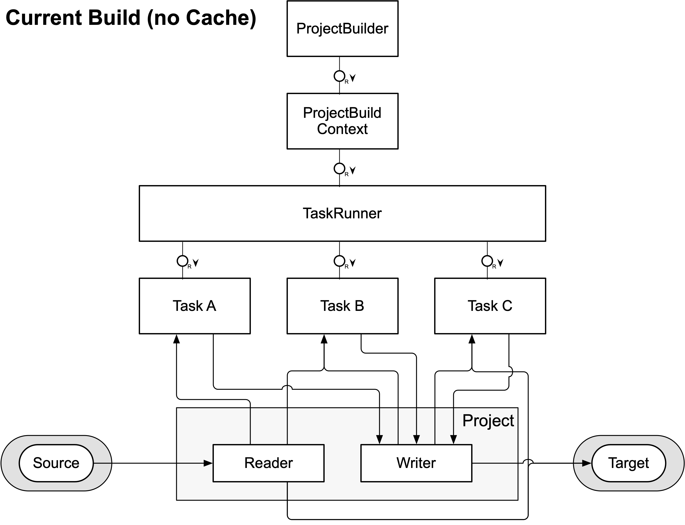
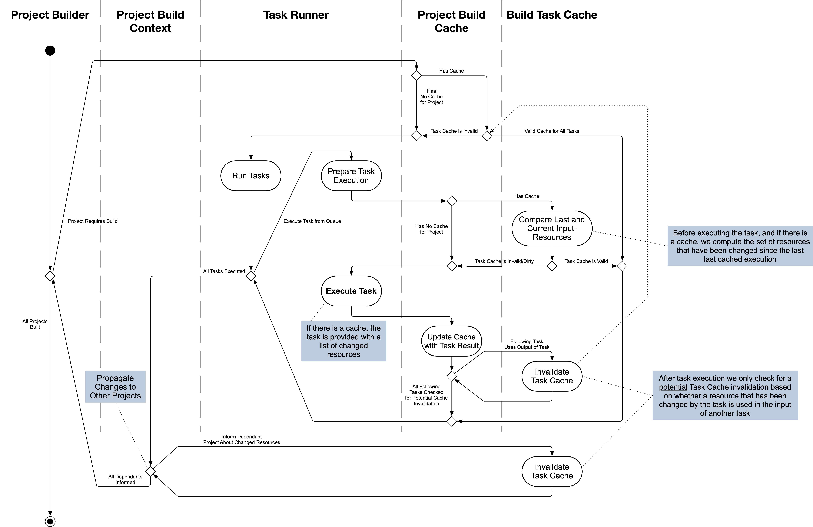

- Start Date: 2024-12-09
- RFC PR: [#1036](https://github.com/SAP/ui5-tooling/pull/1036)
- Issue: -
- Affected components <!-- Check affected components by writing an "X" into the brackets -->
	+ [x] [ui5-builder](https://github.com/SAP/ui5-builder)
	+ [x] [ui5-server](https://github.com/SAP/ui5-server)
	+ [x] [ui5-cli](https://github.com/SAP/ui5-cli)
	+ [x] [ui5-fs](https://github.com/SAP/ui5-fs)
	+ [x] [ui5-project](https://github.com/SAP/ui5-project)
	+ [x] [ui5-logger](https://github.com/SAP/ui5-logger)


# RFC 0017 Incremental Build

## Summary

This concept aims at adding incremental build support to UI5 CLI. It should be possible to execute a build where only a small set of modified resources is re-processed while the rest is reused from a previous build.

## Motivation

The current build process is slow, especially for large projects. This is because on every build all resources of a project need to be processed. However, this is often not necessary, since only few resources might have been changed between builds. An incremental build would detect those changes and only process resources where needed, reusing previous build results. This should speed up the build process significantly.

It has also become increasingly common for UI5 projects to use [custom build tasks](https://sap.github.io/ui5-tooling/stable/pages/extensibility/CustomTasks/). Examples include custom tasks for TypeScript compilation, or for consuming third-party libraries.

These tasks can greatly enhance the development experience with UI5. However, when working on projects that depend on projects using such custom tasks, it can become cumbersome to set up a good development environment. This is because the current UI5 CLI server does not execute custom tasks (or any tasks at all), and instead relies on [custom middleware](https://sap.github.io/ui5-tooling/stable/pages/extensibility/CustomServerMiddleware/) for things like the mentioned examples.

However, only custom middleware defined for the current root project is used by the server. This means that the root project often needs to configure custom middleware *for its dependencies*.

By enhancing the UI5 CLI server to execute build tasks before serving a project's resources, this problem can be solved. And by making use of an incremental build feature, the server can efficiently re-process resources when needed, hopefully preventing negative impacts on the server's performance.

## Detailed design

### Current Build

The current build process executes all build tasks for the required projects one by one. Tasks are reading and writing resources from- and to a `workspace` entity, which is a representation of the virtual file system of `@ui5/fs` for the current project. A `workspace` currently consists of a `reader` and a `writer`. The reader is usually connected to the sources of the project and the writer is an in-memory object, collecting the output of the build tasks before it is finally written to the target output directory.

This setup allows a build task to always access to the result of a previous task, which may have altered a source file or added additional resources.



### Incremental Build Cache

For the incremental build cache feature, a new entity `Build Task Cache` shall be created, which is managed by a `Project Build Cache`. In addition, the current concept of the project-`workspace` shall be extended to allow for `writer stages` (which can each have multiple `versions`). These stages build upon each other. Essentially, instead of one writer being shared across all tasks, each task is assigned it's own writer stage. And each task reads from the combined stages of the preceding tasks.

This shall enable the following workflow:

1. **Action:** Build is started
1. Task A, Task B and Task C are executed in sequence, writing their results into individual writer stages.
1. *Task outputs are written to a content-addressable store and the `build-manifest.json` metadata is serialized to disk.*
1. Build finishes and the resources of all writer stages and the source reader are combined and written into the target output directory.
    * Resources present in later writer stages (and higher versions) are preferred over competing resources with the same path.
1. **Action:** A source file is modified and a new build is triggered
1. *The `build-manifest.json` is read from disk, allowing the build to access cached content from the content-addressable store.*
1. The build determines which tasks need to be executed using the imported cache and information about the modified source file.
    * In this example, it is determined that Task A and Task C need to be executed since they requested the modified resource in their previous execution.
1. Task A is executed. The output is written into a new **version** (v2) of the associated writer stage.
    * The task is given access to a new `cache` parameter, allowing it to access cache related information, such as which resources have changed since the task's last execution.
    * Based on that, Task A may decide to only process the changed resources and ignore the others.
    * Task A can't access v1 of its writer stage. It can only access the combined resources of all previous writer stages.
1. The `Project Build Cache` determines whether the resources produced in this latest execution of Task A are relevant for Task B. If yes, the content of those resources is compared to the cached content of the resources Task B has received during its last execution. In this example, the output of Task A is not relevant for Task B and it is skipped.
1. Task C is called and has access to both versions (v1 and v2) of the writer stage of Task A. Allowing it to access all resources produced in all previous executions of Task A.
1. *Task outputs are written to the content-addressable store and the `build-manifest.json` is updated.*
1. The build finishes. The combined resources of all writer stages and the source reader are written to the target output directory.


#### Project Build Cache

The `Project Build Cache` is responsible for managing the build cache of a single project. It handles the import and export of the cache to and from disk, as well as determining which whether the project needs to be rebuilt.

#### Build Task Cache

The `Build Task Cache` is responsible for managing the cache of a single build task within a project. It tracks which resources were read and written by the task during its last execution, along with their metadata.

### Cache Creation

The build cache shall be serialized onto disk in order to use it in successive UI5 CLI executions. This will be done using a **Content-Addressable Store (CAS)** model, which separates file content from metadata. This ensures that each unique piece of content is stored only once on disk, greatly reducing disk space usage and improving I/O performance.

Every project has its own cache metadata. This allows for reuse of a project's cache across multiple consuming projects. For example, the `sap.ui.core` library could be built once and the build cache can then be reused in the build of multiple applications.

The cache consists of two main parts:
1. A global **object store (the CAS)** where all file contents are stored, named by a hash of their content.
2. A per-project `build-manifest.json` file which acts as a lightweight **metadata index**, mapping virtual file paths to their content hashes in the object store.

#### build-manifest.json

````jsonc
{
	"project": {
		"specVersion": "5.0",
		"type": "application",
		"metadata": {
			"name": "project.namespace"
		}
	},
	"buildManifest": {
		"manifestVersion": "1.0",
		"timestamp": "2025-11-24T13:43:24.612Z",
		"signature": "bb3a3262d893fcb9adf16bff63f", // <-- New "signature" attribute, uniquely identifying the build
		"versions": {
			"builderVersion": "5.0.0",
			"projectVersion": "5.0.0",
			"fsVersion": "5.0.0"
		},
		"buildConfig": {
			"selfContained": false,
			"cssVariables": false,
			"jsdoc": false,
			"createBuildManifest": false,
			"outputStyle": "Default",
			"includedTasks": [],
			"excludedTasks": []
		},
		"version": "1.0.0",
		"namespace": "project/namespace",
		"tags": {
			"/resources/project/namespace/Component-dbg.js": {
				"ui5:IsDebugVariant": true
			},
			"/resources/project/namespace/Component.js": {
				"ui5:HasDebugVariant": true
			}
		}
	},
	"cache": { // <-- New "cache" section containing incremental build metadata
		"index": {
			// Map of source paths to their fs-stat metadata and content hashes
			"/resources/project/namespace/Component.js": {
				"lastModified": 1764688556165,
				"size": 1234,
				"inode": 5678,
				"integrity": "sha256-R70pB1+LgBnwvuxthr7afJv2eq8FBT3L4LO8tjloUX8="
			}
		},
		"indexTimestamp": 1764688556165,
		"tasks": {
			"replaceCopyright": { // Task name
				"projectRequests": {
					// Resource paths and glob patterns requested from the project during task execution
					"pathsRead": [],
					"patterns": [
						"/**/*.{js,library,css,less,theme,html}"
					]
				},
				"dependencyRequests": {
					// Resource paths and glob patterns requested from dependencies during task execution
					"pathsRead": [],
					"patterns": []
				},
				"input": {
					// Virtual paths read by the task during execution, mapped to their cache metadata
					"/resources/project/namespace/Component.js": {
						"lastModified": 1764688556165,
						"size": 1234,
						"integrity": "sha256-R70pB1+LgBnwvuxthr7afJv2eq8FBT3L4LO8tjloUX8="
					}
				},
				"output": {
					// Virtual paths written by the task during execution, mapped to their cache metadata
					"/resources/project/namespace/Component.js": {
						"lastModified": 176468853453,
						"size": 4567,
						"integrity": "sha256-EvQbHDId8MgpzlgZllZv3lKvbK/h0qDHRmzeU+bxPMo="
					}
				}
			}
		}
	}
}
````

The concept of a `build-manifest.json` has already been explored in [RFC 0011 Reuse Build Results](https://github.com/SAP/ui5-tooling/pull/612) and found an implementation for consumption of pre-built UI5 framework libraries in [UI5 3.0](https://github.com/UI5/cli/pull/612).

This concept reuses and extends the `build-manifest.json` idea to also include incremental build cache information. In addition to a new `signature` attribute, added to the `buildManifest` section (which now defines version `1.0`), a new `cache` section is introduced, containing all relevant metadata for the incremental build cache.

##### Signature

The build signature is calculated based on the **build configuration and environment** of a project. It's purpose is to easily tell whether a cache can be reused for a project build or not.

The signature is a simple hash (represented as a hexadecimal string, to allow usage in file names), calculated from the following information:

* Project namespace and version
	* Different projects must produce different caches
* The versions of all UI5 CLI packages used to create the cache: `@ui5/project`, `@ui5/builder` and `@ui5/fs`
	* Different UI5 CLI versions must produce a new cache. Alternatively, we could introduce a dedicated "cache version" that is incremented whenever a breaking change to the cache format is introduced. This would allow reusing the cache across minor UI5 CLI updates
* The relevant build configuration (ui5.yaml + CLI parameters)
	* Changes in the build configuration must result in dedicated cache
	* Some configuration options might not be relevant for the build process (e.g. server configuration). Those could be excluded from the hash calculation to improve cache reusability
* The names and versions of all UI5 extensions in the dependency tree
	* Changes to custom tasks must invalidate the cache. Even changes to their npm dependencies might invalidate the cache. Therefore, a hash of the current project's lockfile (e.g. package-lock.json, yarn.lock or pnpm-lock.yaml - if present) should be included in the signature as well
* _**To be decided:** The names and versions of all UI5 projects in the dependency tree_
	* Changes in project dependencies might affect the build result of the current project. However, relying on resource-level cache invalidation might be sufficient to detect such changes

##### Index

The index provides metadata for all source files of the project. This allows the UI5 CLI to quickly determine whether source files have changed since the last build.

The integrity of a source file shall be calculated based on its raw content. A SHA256 hash should be used for this purpose. The hash should stored in Base64 format to reduce the size of the manifest file. A library like [ssri](https://github.com/npm/ssri) should be used for this purpose, allowing easy interoperability with [cacache](#cacache) (see below).

When comparing the stored metadata with the current metadata of a source file, the following attributes should be considered initially:
* `lastModified` - Modification time
* `size` - File size
* `inode` - Inode number (to detect file replacements)

If **any** of these attributes differ, the file is considered modified. If none of them differ, the file is considered unchanged.

The integrity is only used in special cases, such as when the modification time is equal to the index timestamp (see below).

##### Index Timestamp

The time the index has been created. This allows quick invalidation if source files have a modification time later than this timestamp.

It can also be used to protect against race conditions such as those described in [Racy Git](https://git-scm.com/docs/racy-git), where a file could be modified so quickly (and in parallel to the creation of the index) that its timestamp doesn't change. In such cases, the modification timestamp would be equal to the index timestamp. Therefore, if a file has a modification time equal to the index timestamp, its integrity must be compared to the stored integrity to determine whether it has changed.

##### Tasks

An object containing entries for each build task executed during the build process. Keys must be stored in the order of task execution.

For each task, the following information is stored:

* `projectRequests` and `dependencyRequests`: Resource paths and glob patterns that the task requested from the project and its dependencies during its execution. This information is required for determining whether the task needs to be re-executed in future builds, based on changes to the requested resources. The glob patterns are needed in particular to detect newly added resources that match the patterns.
* `inputs`: Metadata for all resources **read** by the task during its execution. This is tracked via the provided workspace and dependencies readers. The metadata includes the `lastModified`, `size` and `integrity` of each resource. Similar to the index. This information is required for determining whether the task needs to be re-executed in future builds, based on changes to the input resources.
* `outputs`: Metadata for all resources **written** by the task during its execution. This is tracked via the provided workspace writer. The metadata includes the `lastModified`, `size` and `integrity` of each resource. This information is required for determining whether subsequent tasks need to be re-executed.


#### Cache Directory Structure

The directory structure is flat and efficient. A global `cas` directory stores all unique file contents from all builds, while project-specific directories contain only their lightweight metadata.

```
~/.ui5/buildCache/
├── cas/  <-- Global Content-Addressable Store (shared across all projects) - actual representation might differ
│   ├── c1c77edc5c689a471b12fe8ba79c51d1  (Content of one file)
│   ├── d41d8cd98f00b204e9899998ecf8427e  (Content of another file)
│   └── ... (all other unique file contents)
│
└── buildManifests/
    ├── app-name
    │   ├── bb3a3262d893fcb9adf16bff63f.json
    │   └── gh3a4162d456fcbgrebsdf345df.json
    └── @openui5
        ├── sap.m
        │   ├── sfeg2g62d893fcb9adf16bfffex.json
        │   └── xy3a3262d893fc4gdfss6esfesw.json
        └── sap.ui.core
            └── fh3a3262d893fcb3adf16bff63f.json
```

A new `buildCache` directory shall be added to the ~/.ui5/ directory. The location of this directory can be configured using the [`UI5_DATA_DIR` environment variable](https://ui5.github.io/cli/stable/pages/Troubleshooting/#environment-variable-ui5_data_dir).

The `cas` directory contains files named by their content hash. Each file contains the raw content of a resource produced during a build. Ideally a library like [`cacache`](#cacache) should be used to manage the content-addressable store. In this case, the actual directory structure might differ from what is depicted above.

The `buildManifests` directory contains one build manifest file per project build cache. The directory structure is derived from the project's package name (Project ID). The files are named by the [build signature](#signature).


#### cacache

The [`cacache`](https://github.com/npm/cacache) library is a well-established content-addressable cache implementation developed and used by npm itself. It provides efficient storage and retrieval of file contents based on their content hash, along with built-in mechanisms for cache integrity verification and garbage collection.

It allows to store and retrieve files using a unique key. Files can also be retrieved directly by their content hash ("digest").

In this concept, cacache will be used to store the content of resources produced during the build. The key for each resources should follow this schema:

```
<build signature>|<task name>|<virtual resource path>
```

The [build signature](#signature) binds the entry to the current project build cache. The task name and resource path correspond to a task's **output** resource metadata as defined in the [`tasks`](#tasks) section of the `build-manifest.json`.

This naming schema should allow for easy retrieval of resources based on the metadata stored in the build manifest.

At the same time, this also enables the cacache-internal garbage collection to identify unused entries. If a task execution produces new content for a resource, the cacache entry will be updated to point to the new content hash. Eventually, the old content hash will no longer be referenced by any cache entry and can be cleaned up during [garbage collection](#garbage-collection).

### Cache Import

Before building a project, UI5 CLI shall check for an existing cache by calculating the [build signature](#signature) for the current build, and searching the [cache directory structure](#cache-directory-structure) for a matching build manifest.

If a build manifest is found it is imported by the `Project Build Cache`
1. Check the source files of the project against the `index` section of the build manifest to determine which files have changed since the last build
2. Create `Build Task Cache` instances using the metadata from the `tasks` section of the build manifest
3. Provide the `Project` with readers for the cached `writer stages` (i.e. tasks outputs)
	* When the build process needs to access a cached resource, it can access them using those readers. Internally, they will use the resource metadata from the build manifest to find the corresponding resource content hash, and then reads the file from the global `cas` store

This allows executing individual tasks and providing them with the results of all preceding tasks without the overhead of creating numerous file system readers or managing physical copies of files for each build stage.


### Cache Invalidation

The following diagram shows the process for determining whether a project needs to be (partially) rebuilt and if yes, which individual tasks need to be (re-)executed.

Note this important differentiation: A Build Task Cache can be *potentially* or *definitely* invalidated. It is *potentially* invalidated if the corresponding task read resources that have been modified since the last build. It is *definitely* invalidated if the content of those resources has actually changed. By only potentially invalidating a Build Task Cache the current process does not have to ensure that the resources actually changed at this point in time. Comparing the content of resources can be deferred until the task is actually executed. This can save time, especially since the resource in question might be modified again before the potentially invalidated task is executed.

If the task ends up being executed, it might produce new resources. After the execution has finished and the new resources have been written to the writer stage, it should be checked whether the content of those resources has actually changed right away. If not, they must not lead to the invalidation of any following tasks. If they have changed, the relevant Build Task Cache instances will be notified about the changed resources and might *potentially* invalidate themselves.

After a *project* has finished building, a list of all the modified resource is compiled and passed to the `Project Build Cache` instances of all depending projects (i.e. projects that depend on the current project and therefore might use the modified resources).



### Garbage Collection

A mechanism to free unused cache resources on disk is required. The cache can potentially grow very large over time, and consume a lot of disk space.

This should probably use some sort of LRU-cache, in combination with the garbage collection mechanism integrated in [cacache](#cacache), to remove cache entries dynamically. The same mechanism could also be applied to the npm artifacts already downloaded by UI5 CLI today.

To avoid slowing down core commands, the garbage collection check should run as a non-blocking process after a successful `ui5 build` or `ui5 serve` command completes. This process may check if for example configured thresholds (age or size) have been exceeded. If so, it proceeds with removing unused cache entries.

A dedicated command, such as `ui5 cache clean`, should be introduced in addition. This command allows users to manually trigger a cache purge, providing options to specify criteria such as maximum age or size for cache entries to be removed. Similarly, a command `ui5 cache verify` could be provided to check the integrity of the cache.

### Watch Mode

The build API should provide a "watch" mode that will re-trigger the build when a source file is modified. The watch mode shall select the projects to watch based on which projects have been requested to be built. If a [UI5 CLI workspace](https://sap.github.io/ui5-tooling/stable/pages/Workspace/) is used, this can be fine-tuned in the workspace configuration.

### Server Integration

The UI5 CLI server shall integrate the incremental build as a mean to pre-process projects before serving the build result. It shall use the watch mode to automatically rebuild the projects when source files are modified, so that always the latest resources are served.

Middleware like `serveThemes` (used for compiling LESS resources to CSS) would become obsolete with this, since the `buildThemes` task will be executed instead.

If any project (root or dependency) defines custom tasks, those tasks are executed in the server as well. This makes it possible to easily integrate projects with custom tasks as dependencies.

Since executing a full build requires more time than the on-the-fly processing of resources currently implemented in the UI5 CLI server, users shall be able to disable individual tasks that are not necessarily needed during development. This can be done using CLI parameters as well as ui5.yaml configuration.

While a build is running, the server shall pause responding to incoming requests for the duration of the build. This is necessary to ensure that the server does not serve outdated resources.

The server may implement "live-reload" functionality to inform client side code to refresh the page whenever changes have been detected and the build has finished.

## How we teach this

This is a big change in the UI5 CLI architecture and especially impacts the way the UI5 CLI server works. By always building projects, developers might experience a slower startup time of the server. After modifying a file, it might also take longer until all processing is finished and the change is being served to the browser.

The incremental build hopefully mitigates this performance impact to some extend. The ability to disable individual tasks can further improve the performance again. However this needs to be taught to developers and sane defaults should be picked to make the experience as good as possible.

With the execution of tasks in the server, some (custom) middleware might become obsolete or even cause problems. This means that **projects might need to adapt their configuration**.

All of this should be communicated in the UI5 CLI documentation and in blog posts. A phase of pre-releases should be used to gather feedback from the community.

## Drawbacks

* For every file change, the server needs to execute a partial build. This can lead to a longer time between making a source file change and seeing the result in the browser.
	* This should be measured on different systems. The project size and the used tasks can have a big impact on the performance.
	* The ability to disable individual tasks for the server can help to mitigate this problem.
		* Would this create a distinction between tasks that are relevant for the production build only and those relevant to the server only?
* Projects might have to adapt their configurations
* Custom tasks might need to be adapted. Before they could only access the sources of a project. With this change, they will access the build result instead. Access to the sources is still possible but requires the use of a dedicated API
* UI5 CLI standard tasks need to be adapted to use the new cache API. Especially the bundling tasks currently have no concept for partially re-creating bundles. However, this is an essential requirement to achieve fast incremental builds.
* While the content-addressable cache is highly efficient at deduplication, the central cache can still grow very large over time. A robust [garbage collection](#garbage-collection) mechanism is critical for managing disk space.

## Alternatives

An alternative to using the incremental build in the UI5 CLI server would be to apply custom middleware of dependencies.

## Unresolved Questions and Bikeshedding

* How to distinguish projects with build cache from pre-built projects (with project manifest)
	* Check presence of "sourceMetadata" attribute. Only with "sourceMetadata", the cache can be used for incremental (re-)builds the project. Otherwise it is "only" a build *result* that can be used for building dependent projects.
* Cache related topics
	* Allow tasks to store additional information in the cache
* Some tasks might be relevant for the server only (e.g. code coverage), come up with a way to configure that
	* This will implicitly cause the creation of different caches for server and build. This might just be an acceptable and easy to understand trade-off.
* What if a task ceases to create a resource because of a change in another resource? The previously created version of the resource would still be used from the cache
* Measure performance in BAS. Find out whether this approach results in acceptable performance.
* Test with selected (community) custom tasks