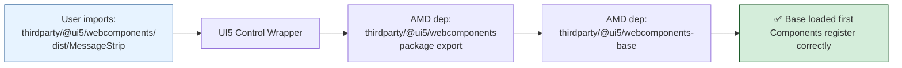

- Start Date: 2026-02-25
- RFC PR: -
- Issue: -
- Affected components
   + [X] [ui5-builder](../packages/builder)
   + [ ] [ui5-server](../packages/server)
   + [ ] [ui5-cli](../packages/cli)
   + [ ] [ui5-fs](../packages/fs)
   + [X] [ui5-project](../packages/project)
   + [ ] [ui5-logger](../packages/logger)

# RFC 0020 NPM Package Integration

## 1. Summary

Enable seamless integration of NPM packages (ESM, CJS, and UI5 Web Components) into UI5 applications and libraries by providing a built-in standard build task that automatically transforms packages from their native format to UI5's AMD module format using Rollup.js.

This RFC focuses on the implementation mechanics:

1. **Dependency Scanning** — Integrated into existing JSModuleAnalyzer infrastructure (no separate parsing phase)
2. **Rollup Configuration** — Plugin chain, bundling behavior, tree-shaking, and AMD transformation
3. **Build Task Integration** — Standard task registration and execution flow
4. **Module Resolution** — Support for npm, yarn, and pnpm workspaces
5. **Shared Dependencies** — Externals configuration and peer dependency handling
6. **Package Patching** — Pre-bundling patches for vulnerability fixes and bug workarounds via `git diff`/`git apply`

**Key Architectural Decision**: NPM dependency scanning is **integrated directly into the existing JSModuleAnalyzer** visitor pattern rather than implementing a separate scanning phase. This leverages the AST parsing that already occurs for UI5 dependency analysis, requiring only a small extension to the existing visitor logic.

---

## 2. Motivation

### 2.1 Current Limitations

UI5 applications face significant challenges when consuming NPM packages:

1. **Module Format Incompatibility** — UI5 uses AMD (`sap.ui.define`), while modern NPM packages use ESM (`import/export`) or CJS (`require/module.exports`)
2. **Manual Bundling Required** — Developers must manually configure Rollup or Webpack to transform packages
3. **No Standard Approach** — Each project implements custom solutions, leading to inconsistent implementations and maintenance burden
4. **Web Components Complexity** — Integrating `@ui5/webcomponents` requires intricate wrapper generation and metadata transformation
5. **Tooling Fragmentation** — Community solutions exist (e.g., `ui5-tooling-modules`) but lack standardization in UI5 core

### 2.2 Use Cases

1. **Utility Libraries** — Using `lodash`, `date-fns`, `validator.js` without manual bundling
2. **Complex Dependencies** — Handling packages with transitive dependencies (e.g., `axios`, `sinon`)
3. **UI5 Web Components** — Enabling libraries to bundle `@ui5/webcomponents` with proper UI5 control wrappers
4. **Security Updates** — Quick NPM dependency updates for security patches
5. **Modern Development** — Bridging UI5's AMD system and the modern JavaScript ecosystem

### 2.3 Expected Outcome

- **Out-of-the-Box Integration** — NPM packages work without configuration
- **Build-Time Transformation** — Automatic bundling during `ui5 build`
- **Dev-Time Support** — On-demand bundling during `ui5 serve` (deferred to [RFC 0017 Incremental Build](https://github.com/UI5/cli/blob/rfc-incremental-build/rfcs/0017-incremental-build.md))
- **Standard Compliance** — Output follows UI5's AMD module format and naming conventions
- **Web Component Support** — First-class `@ui5/webcomponents` integration with UI5 control wrappers
- **Performance Optimization** — Package independence enables deduplication and browser caching

---

## 3. Detailed Design

### 3.1 Architecture Overview

The solution consists of four phases working together:

- **UI5 Application Source** — The starting point is the developer's application code. Controllers reference NPM packages via AMD dependencies (e.g., `sap.ui.define(['thirdparty/chart.js', ...])`), and XML views reference them via xmlns declarations (e.g., `xmlns:webc="thirdparty.@ui5.webcomponents"`). These `thirdparty/*` references are the convention that triggers the NPM integration pipeline.

- **Phase 1: Integrated Dependency Analysis** — The existing `JSModuleAnalyzer` and `XMLTemplateAnalyzer` are extended to detect `thirdparty/*` patterns during their regular AST traversal. `espree.parse` walks the AST looking for `thirdparty/*` in AMD dependency arrays and ESM import statements, while `XMLTemplateAnalyzer` scans for `xmlns:thirdparty.*` declarations. `ResourceCollector` aggregates all detected NPM package names across all analyzed resources. **Key architectural decision**: This piggybacks on the AST parsing that already occurs for UI5 dependency analysis — no separate scanning phase is needed, eliminating duplicate parsing overhead. Output: a deduplicated set of NPM package names (e.g., `['chart.js', 'react', 'react-dom', '@ui5/webcomponents']`).

- **Transitive Dependency Consolidation** — Before Rollup runs, each scanned package's full transitive dependency tree is enumerated by walking `package.json` `dependencies` fields recursively. Any transitive dependency appearing in two or more trees must be externalized — bundled as its own standalone AMD module rather than being inlined into each consumer's bundle. This produces an externals map (which deps to exclude per package) and may add newly-discovered shared packages to the bundle set (see [Section 3.8.3](#383-externals-discovery-via-transitive-dependency-consolidation)).

- **Phase 2: Rollup Bundler** — Each package (from the augmented set) is fed to the Rollup build pipeline as an entry point, together with its externals list from Phase 1b. Rollup resolves entry points and discovers file-level dependencies automatically via `@rollup/plugin-node-resolve`. Externalized packages are excluded from inlining and their references are remapped via `paths` so that the UI5 module loader can resolve them at runtime (e.g., `'react'` -> `'thirdparty/react'`). The plugin transformation chain converts code through CJS -> ESM -> tree-shaken ESM -> AMD (`sap.ui.define`). Packages are bundled in topological order so that dependencies are available before dependents. Output: optimized AMD modules (e.g., `react.js` 19KB, `react-dom.js` 577KB with AMD dependency on `thirdparty/react`).

- **Phase 3: Output Writer** — Bundled AMD modules are written to `resources/thirdparty/*.js` in the workspace. When `addToNamespace: true` (the default for Fiori Launchpad compatibility), source file paths are rewritten to include the component namespace prefix. Output: final files ready for deployment (e.g., `chart.js` as a standalone module, `react.js` and `react-dom.js` with AMD inter-dependencies, `@ui5/webcomponents/` with generated UI5 control wrappers).

**Key Principles:**

1. **Scan source for direct refs only** — only extract top-level `thirdparty/*` package names from application code; discover shared transitive deps via `package.json` consolidation, then let Rollup handle file-level resolution
2. **One package = one AMD module** — enables browser caching and deduplication
3. **Externals for shared deps** — avoid duplicating common libraries (e.g., React)
4. **Build-time transformation** — all bundling during `ui5 build` or `ui5 serve`

---

### 3.2 Proof of Concept Validation

#### 3.2.1 PoC Structure

The PoC at `internal/npm-integration-poc/` validates all core claims with working implementations:

```
internal/npm-integration-poc/
├── scenarios/                     5 isolated test scenarios
│   ├── shared-config.js           Shared Rollup config + dual-bundling harness
│   ├── 01-esm-integration.js     nanoid (pure ESM)
│   ├── 02-cjs-integration.js     lodash (pure CJS)
│   ├── 03-webcomponents-*.js     @ui5/webcomponents (Custom Elements Manifest + wrappers)
│   ├── 04-complex-sinon.js       sinon (many internal deps)
│   └── 05-transitive-axios.js    axios (transitive dependency chains)
│
├── consolidated-app/              Full working UI5 application
│   ├── bundler-config.js          SCAN_RESULT mock + helper functions
│   ├── ui5-task-webc-standalone.js      Build task
│   ├── ui5-middleware-webc-standalone.js Dev middleware (on-demand)
│   └── webapp/                    App using chart.js, validator, React, WC
│
└── lib/                           Shared library code
    ├── plugins/                   rollup-plugin-ui5-amd-exports,
    │                              rollup-plugin-ui5-webcomponents
    ├── core/                      webcomponents-bundler, output-writer
    ├── templates/                 ui5-control-template, package-export-template
    └── utils/                     WebComponentMetadata, UI5MetadataTransformer,
                                   thirdparty-generator, path-resolver
```

#### 3.2.2 Validation Methodology

Every scenario runs **dual bundling**: the custom Rollup pipeline and `ui5-tooling-modules` execution, producing a side-by-side comparison of output size, build time, and format correctness. This ensures functional equivalence with the established community solution.

#### 3.2.3 Scenario Matrix

| Scenario | Package | Format | What It Validates |
|----------|---------|--------|-------------------|
| ESM Integration | `nanoid` | Pure ESM | ESM-only package -> clean AMD
| CJS Integration | `lodash` | Pure CJS | CJS -> ESM -> AMD via `commonjs` plugin |
| Web Components | `@ui5/webomponents` | ESM + Custom Elements Manifest | Metadata extraction, UI5 wrapper generation, tag 
| Complex Package | `sinon` | Mixed deps | Deep dependency trees, tree-shaking effe |
| Transitive Deps | `axios` | Transitive | Auto-resolution of transitive dependency chains |
| Consolidated App | chart.js, lidator, React ecosystem | Mixed | Externals, paths mapping, topological ordering, full pipeline |


### 3.3 Reusable Patterns from `ui5-tooling-modules`

The community package `ui5-tooling-modules` provides battle-tested patterns that inform this RFC's design. This section maps each reusable pattern to its RFC integration point.

| # | Pattern | Reuse Strategy |
|---|---------|----------------|
| 1 | Dependency scanning | **Redesign**: integrate into JSModuleAnalyzer's existing AST traversal instead of standalone regex scan. Same detection logic (`thirdparty/*` convention), different execution model (single-pass AST vs. multi-pass regex). |
| 2 | Module resolution | **Delegate**: let `@rollup/plugin-node-resolve` handle primary resolution. Adopt the `ERR_PACKAGE_PATH_NOT_EXPORTED` fallback and PNPM symlink handling as supplementary logic. |
| 3 | Rollup plugin ecosystem | **Adopt directly**: these plugins handle real-world edge cases discovered through production usage. Add to the core plugin chain alongside `nodeResolve`, `commonjs`, `nodePolyfills`, and `replace`. |
| 4 | Namespace management | Integrated strategy places NPM bundles under `/resources/{namespace}/thirdparty/`, enabling Fiori Launchpad deployment. |
| 5 | Dependency rewriting | **Adopt** JS + XML rewriting as post-bundling path normalization. When `addToNamespace: true`, all source file references to NPM packages must be rewritten to include the component namespace prefix. |
| 6 | Web Component registry | Align APIs and adopt Custom Elements Manifest resolution priority (internal -> public -> dist fallback). |

#### Key Differences from `ui5-tooling-modules`

| Aspect | ui5-tooling-modules | This RFC |
|--------|---------------------|----------|
| **Scanning** | Standalone regex scan (`scan()`) — reads all files separately | Integrated into JSModuleAnalyzer — piggybacks on existing AST parse |
| **Architecture** | Custom task/middleware extension (external dependency) | Standard built-in task in `taskRepository.js` |
| **Default namespace** | `addToNamespace: false` | `addToNamespace: true` (FLP-compatible) |
| **devDependencies** | Included via `legacyDependencyResolution` | Excluded by default; explicit `additionalDependencies` list |
| **Plugin chain** | 7 custom plugins + core plugins | Same plugins, integrated into standard build pipeline |

---

### 3.4 Dependency Scanning Strategy

#### 3.4.1 Design: Integrated into Existing AST Parsing

Rather than implementing a separate scanning phase, NPM dependency detection is integrated directly into the existing `JSModuleAnalyzer` visitor pattern. This piggybacks on the AST traversal that already occurs for UI5 dependency analysis:


* **Key insight**: Leverages existing espree AST parsing that already occurs for UI5 dependency analysis, requiring only pattern detection extensions to existing visitor logic.*

**Integration points** (extensions to existing classes):

| Class | Extension | Purpose |
|-------|-----------|---------|
| `ModuleInfo` | Add `npmDependencies` Set + `addNpmDependency()` method | Store detected NPM packages per module |
| `JSModuleAnalyzer` | Add `thirdparty/*` pattern detection in `visit()` cases for AMD deps and ESM imports | Detect NPM refs during existing AST walk |
| `XMLTemplateAnalyzer` | Add `thirdparty.*` xmlns pattern detection | Detect NPM refs in XML views |
| `ResourceCollector` | Add `_npmPackages` Set + `getNpmPackages()` aggregation | Collect NPM packages across all resources |

#### 3.4.2 The `thirdparty/*` Convention

The expected namespace convention for NPM packages in UI5 code:

```
UI5 AMD dependency             ->  NPM package name
─────────────────────────────     ──────────────────
'thirdparty/validator'         ->  'validator'
'thirdparty/chart.js'          ->  'chart.js'
'thirdparty/@ui5/webcomponents'->  '@ui5/webcomponents'

XML xmlns attribute            ->  NPM package name
─────────────────────────────     ──────────────────
"thirdparty.@ui5.webcomponents"->  '@ui5/webcomponents'
```

The transformation is **deterministic and algorithmic**: strip the `thirdparty/` prefix for JS, or convert dots to slashes for XML. No configuration mapping is needed.

#### 3.4.3 Edge Cases

| Edge Case | Description | Handling |
|-----------|-------------|----------|
| **Package names with `.js`** | e.g., `chart.js`, `easytimer.js` — could be confused with file extensions | Pattern extraction stops at the package name boundary; `.js` is part of the name, not a file extension |
| **Recursive scanning** | A controller imports another controller which imports an NPM package | ResourceCollector aggregates across all analyzed resources; the NPM set grows as files are processed |
| **devDependencies filtering** | Packages in `devDependencies` should not be bundled by default | Cross-reference detected packages against `dependencies` in `package.json`; warn if found only in `devDependencies` |
| **Wildcard ignore patterns** | Test files, spec files should not trigger bundling | Configurable scan include/exclude patterns (default: `webapp/**/*.{js,ts,xml}` excluding `test/**`) |
| **App-local modules** | Files that look like NPM packages but are local to the app | Only trigger on `thirdparty/*` prefix; app-local modules use relative or `sap/*` paths |

#### 3.4.4 Link with package.json

After scanning produces a list of NPM package names, each name is validated against the project's `package.json`:

As described in [3.4.1 (Integrated into Existing AST Parsing)](#341-design-integrated-into-existing-ast-parsing), each scanned NPM package is validated against the project's `package.json`: packages found in `dependencies` are queued for bundling ✅, packages only in `devDependencies` trigger a warning ⚠️ (should be moved to `dependencies`), and undeclared packages cause an error ❌ (prevents typos and ensures explicit dependency declaration).

This prevents accidental bundling of packages not declared as project dependencies and catches typos early.

#### 3.4.5 "Let Rollup Handle the Rest"

A critical design principle: the scanner only extracts **top-level NPM package names** from application source files. All further **file-level** dependency resolution — entry point discovery, internal module imports, file system traversal — is delegated entirely to Rollup and its `nodeResolve` plugin. This avoids reimplementing Node.js module resolution logic.

There is one exception: **externals discovery** runs before Rollup as a `package.json`-level analysis step. For each scanned package, the transitive dependency consolidation algorithm ([Section 3.8.3](#383-externals-discovery-via-transitive-dependency-consolidation)) enumerates transitive dependencies by walking `package.json` `dependencies` fields — it never reads source code. This step determines which packages should be external vs. inlined, producing the externals map that Rollup receives as configuration. Rollup then handles all file-level resolution within that constraint.

---

### 3.5 Rollup Configuration

#### 3.5.1 Bundling Behavior

Rollup's default behavior is to discover and inline ALL dependencies into a single output bundle. The RFC uses two mechanisms to control this:


#### 3.5.2 Plugin Chain

Each plugin transforms code at a specific stage. The order is critical — each depends on transformations from previous plugins.

**Plugin Summary Table:**

| Plugin | Purpose | Source |
|--------|---------|--------|
| `@rollup/plugin-node-resolve` | Resolve NPM package paths using package.json fields (exports -> browser -> module -> main) | Rollup ecosystem |
| `pnpm-resolve` | Follow PNPM symlinks to real file paths | ui5-tooling-modules |
| `skip-assets` | Skip CSS/image/font imports that Rollup cannot bundle | ui5-tooling-modules |
| `@rollup/plugin-commonjs` | Convert CJS (`require`/`module.exports`) to ESM for tree-shaking | Rollup ecosystem |
| `rollup-plugin-polyfill-node` | Browser polyfills for Node.js built-ins (`path`, `buffer`, `events`, `stream`, `util`) | Community plugin |
| `@rollup/plugin-replace` | Static replacement of `process.env.NODE_ENV` -> `"production"` enabling dead-code elimination | Rollup ecosystem |
| `dynamic-imports` | Preserve dynamic `import()` calls or convert to Rollup chunks | ui5-tooling-modules |
| `transform-top-level-this` | Normalize UMD `this` references to `undefined` (ES module semantics) | ui5-tooling-modules |
| `import-meta` | Transform `import.meta.url` to browser-compatible code | ui5-tooling-modules |
| `inject-esmodule` | Add `__esModule` flag for CJS/ESM default export interop | ui5-tooling-modules |
| Rollup AMD output | Built-in: `format: "amd"` with `amd.define: "sap.ui.define"` | Rollup core |
| `ui5-amd-exports` (custom) | Transform Rollup's `['exports']` dependency pattern to UI5-compatible `return exports` pattern | PoC custom plugin |

#### 3.5.3 The `ui5AmdExports` Transform

This plugin addresses a specific incompatibility between Rollup's AMD output and UI5's `sap.ui.define`:

```js
Rollup output:                              After ui5AmdExports:
sap.ui.define(['exports'], function(e) {    sap.ui.define([], function() {
  e.foo = 'bar';                              const exports = {};
});                                           exports.foo = 'bar';
                                              return exports;
                                            });
```

Rollup uses an `'exports'` dependency that UI5 does not recognize. The plugin removes it from the dependency array, declares `exports` as a local variable, and adds `return exports` at the end. This runs in Rollup's `renderChunk` hook using a simple string transformation.


#### 3.5.4 Tree-Shaking

Tree-shaking is dead-code elimination that removes unused exports from bundles. It works only with **static** module structures (ESM), which is why the `commonjs` plugin must convert CJS to ESM first.

```javascript
// Package exports 300+ functions
export function A() { /* implementation */ }
export function B() { /* implementation */ }
export function C() { /* implementation */ }
// ... 297 more exports

// Application imports only one function
import { A } from 'pkg';

// Rollup tree-shaking result:
// ✅ Bundle contains: A + its internal helpers only
// ❌ Eliminated: B, C, and 297 other unused functions
// 📦 Example: lodash-es 70KB -> 2KB (97% eliminated)
```

**When tree-shaking works well:** ESM packages with granular exports (e.g., `lodash-es`).

**When it's limited:** CJS packages where `require()` returns a dynamic object — the `commonjs` plugin attempts to detect named exports but may not achieve full elimination. Packages declaring `"sideEffects": false` in their package.json enable more aggressive elimination.

---

### 3.6 Build Task Integration

#### 3.6.1 Task Placement

The NPM bundling task integrates into the existing build pipeline as a standard task:


**Why after `generateFlexChangesBundle`?** The scanner needs all source resources to be resolved and available. **Why before `generateComponentPreload`?** The generated NPM bundles must be included in the Component-preload.js for production deployment.

#### 3.6.2 Task Interface

The task follows the standard UI5 builder task signature:

- Receives `workspace` (read/write resources), `taskUtil` (project metadata), and `options` (configuration from ui5.yaml)
- Reads NPM package list from ResourceCollector (populated during earlier analysis phases)
- Writes generated AMD bundles back to the workspace
- Reports bundled packages via logging

#### 3.6.3 Namespace Strategy: `addToNamespace`

The `addToNamespace` flag controls where generated NPM bundles are placed in the output and how source references are rewritten:

| | `addToNamespace: false` | `addToNamespace: true` (default) |
|---|---|---|
| **Bundle output path** | `/resources/thirdparty/lodash.js` | `/resources/my/app/namespace/thirdparty/lodash.js` |
| **AMD dependency in source** | `'thirdparty/lodash'` | `'my/app/namespace/thirdparty/lodash'` |
| **Scope** | Global — shared across all apps on the page | Per-app — scoped to the component namespace |
| **FLP-compatible** | No — collisions when multiple apps ship the same package | Yes — each app's resources are isolated |
| **Component-preload** | Thirdparty files excluded (different path root) | Thirdparty files included (same namespace root) |

**Why `addToNamespace: true` is the default:** Fiori Launchpad hosts multiple UI5 applications on the same page inside a shell. Each app's resources must live under its own component namespace to avoid collisions. If two apps both ship `thirdparty/lodash.js` at the global path, one overwrites the other — potentially with an incompatible version. With `addToNamespace: true`, each app gets its own copy at its own namespaced path. Apps that don't need FLP compatibility can opt out with `addToNamespace: false` to get shorter paths.

#### 3.6.4 Dependency Rewriting

When `addToNamespace: true`, source file references to NPM packages must be rewritten to include the component namespace prefix. The following types of rewriting occur:

| Type | Before | After | Files Affected |
|------|--------|-------|----------------|
| **JS imports** | `sap.ui.define(['thirdparty/lodash'], ...)` | `sap.ui.define(['my/app/namespace/thirdparty/lodash'], ...)` | `.js`, `.ts` |
| **XML namespaces** | `xmlns:webc="thirdparty.@ui5.webcomponents"` | `xmlns:webc="my.app.namespace.thirdparty.@ui5.webcomponents"` | `.xml` |

This rewriting runs as a post-bundling step, after all NPM bundles are generated and placed in the workspace.

#### 3.6.5 Architectural Decision: Integrated Scanning vs. AMD->ESM Transpilation

An alternative approach was considered: transpile all UI5 AMD source files to ESM format, then let Rollup discover NPM package imports automatically. This was **rejected** for the following reasons:

| Criterion | Integrated Scanning (chosen) | AMD->ESM Transpilation (rejected) |
|-----------|------------------------------|----------------------------------|
| **Parse passes** | 1 (existing AST walk) | 3+ (original parse + transpile + Rollup re-parse) |
| **Temporary files** | None | Must write transpiled ESM to disk, then discard |
| **Discovery benefit** | Direct extraction | **None** — Rollup still needs explicit entry points; it cannot discover which NPM packages the app uses |
| **XML views** | Pattern-match xmlns attributes directly | Additional transpilation from XML to JS -> ESM |
| **Implementation** | Small extension to existing infrastructure | New transpiler subsystem (AMD->ESM code generation, source maps, file management) |
| **Pattern logic** | `if (dep.startsWith('thirdparty/'))` | Identical `thirdparty/*` detection — same algorithm, more overhead |
| **Maintenance** | Extends well-tested JSModuleAnalyzer | New transformation layer to maintain |

**Key insight**: Both approaches use the **identical `thirdparty/*` convention** for NPM package detection. The only difference is execution model — direct extraction during AST traversal vs. code transformation followed by re-analysis. The transpilation approach adds multiple processing passes without eliminating the need for scanning.

---

### 3.7 Module Resolution & Workspaces

#### 3.7.1 Package Manager Support

Different package managers organize `node_modules` differently. Rollup's `nodeResolve` plugin handles most cases, with one critical configuration for PNPM:

| Manager | Hoisting Strategy | Symlinks | Rollup Config |
|---------|-------------------|----------|---------------|
| **npm** | Full hoisting to root `node_modules/` | No | Default — works automatically |
| **yarn** | Selective hoisting, `nohoist` support | No | Default — works automatically |
| **pnpm** | No hoisting; content-addressable store with symlinks | Yes | Requires `preserveSymlinks: false` (Rollup default) |

**Directory structure comparison:**

```
npm/yarn workspaces:                  pnpm workspaces:
project/                              project/
├─ node_modules/  <- hoisted           ├─ node_modules/
│  ├─ lodash/     (real files)        │  ├─ .pnpm/          <- real files in store
│  └─ react/      (real files)        │  │  ├─ lodash@4.17.21/node_modules/lodash/
├─ app1/                              │  │  └─ react@18.3.1/node_modules/react/
│  └─ node_modules/ (usually empty)   │  ├─ lodash -> .pnpm/lodash@.../  <- symlink
└─ app2/                              │  └─ react  -> .pnpm/react@.../   <- symlink
   └─ node_modules/ (usually empty)   └─ app1/
                                          └─ node_modules/ <- symlinks to root
```

For PNPM, `preserveSymlinks: false` (the Rollup default) ensures symlinks are followed to the real file paths in the `.pnpm/` store. The `pnpm-resolve` plugin from `ui5-tooling-modules` provides additional handling for edge cases like workspace package.json lookup through symlink chains.

#### 3.7.2 Resolution Priority

The `nodeResolve` plugin follows this priority when resolving a package:

The `nodeResolve` plugin follows this priority waterfall (see also the resolution cascade in [3.4.1](#341-design-integrated-into-existing-ast-parsing)): **exports** (highest priority, modern packages) -> **browser** (browser-specific overrides) -> **module** (ESM entry, preferred for tree-shaking) -> **main** (CJS entry, fallback) -> **index.js** (convention-based fallback). The exports field supports conditional resolution with `browser` > `import` > `require` > `default` priority.

With `browser: true` configured, the resolution prefers browser-specific builds. This is critical for packages like `axios` that provide separate browser and Node.js entry points.

#### 3.7.3 Advanced Edge Cases

These edge cases are handled based on `ui5-tooling-modules` production experience:

| Edge Case | Description | Solution |
|-----------|-------------|----------|
| **`ERR_PACKAGE_PATH_NOT_EXPORTED`** | Package `exports` field blocks a subpath import | Fall back to manual `node_modules` traversal with extension probing (`.js`, `.cjs`, `.mjs`) |
| **Wildcard exports** | `"./dist/*": "./dist/*.js"` in exports field | Pattern-match wildcards and substitute captured segments |
| **Case-sensitive paths** | macOS/Windows are case-insensitive but packages may assume case sensitivity | Validate file existence with case-sensitive comparison |
| **Workspace dependencies** | `"app2": "workspace:*"` — another UI5 app, not an NPM package | Filter workspace packages by checking root `package.json` workspaces list |
| **Conditional exports priority** | Browser vs. Node.js conditions in exports field | Use `browser` > `import` > `require` > `default` priority order |

---

### 3.8 Shared Dependencies

#### 3.8.1 Design Principle

**Core concept:** One NPM package = One AMD module file.

**Benefits:**

| Benefit | Description |
|---------|-------------|
| **Browser caching** | Each file cached independently; updating one package doesn't invalidate others |
| **Deduplication** | Shared dependencies (e.g., React) loaded once, referenced by multiple consumers |
| **Parallel loading** | HTTP/2 multiplexing loads multiple small files simultaneously |
| **Tree shaking** | Per-package optimization — unused exports eliminated per bundle |

#### 3.8.2 Shared Dependency Problem

When packages A and B both depend on C, bundling without externals duplicates C in both bundles:

| Approach | react-dom | react-colorful | react (shared) | Total Size | React Instances |
|----------|-----------|----------------|----------------|------------|-----------------|
| **WITHOUT externals** | 596 KB<br/>(includes React 19KB) | 33 KB<br/>(includes React 19KB) | — | **629 KB** | 2x ❌ Duplicated |
| **WITH externals** | 577 KB<br/>(references external) | 14 KB<br/>(references external) | 19 KB<br/>(loaded once) | **610 KB** | 1x ✅ Shared |
| **Savings** | -19 KB | -19 KB | +19 KB | **-19 KB** | Deduplication |

The externals + paths mechanism solves this: `react-dom` and `react-colorful` declare `react` as external, and their AMD output references `thirdparty/react` instead of inlining React's code.

#### 3.8.3 Externals Discovery via Transitive Dependency Consolidation

The scanner ([Section 3.4](#34-dependency-scanning-strategy)) only finds packages explicitly referenced in application source via the `thirdparty/*` convention. But how does the build know *which* transitive dependencies must be externalized? The answer comes from **enumerating and consolidating transitive dependency trees** — a pre-Rollup analysis step that runs between scanning and bundling.

**Step 1 — Enumerate**: For each scanned package, walk its `package.json` `dependencies` field recursively to build the full transitive dependency tree. This uses the same `node_modules` structure that Rollup would later traverse — but only reads `package.json` files, not source code.

Example with scanned set `{react-colorful, react-dom, chart.js}`:

| Scanned Package | Transitive Dependencies |
|-----------------|------------------------|
| `react-colorful` | `react`, `react-dom` |
| `react-dom` | `react`, `scheduler` |
| `chart.js` | *(none)* |

**Step 2 — Consolidate**: Build an inverted index — for each transitive dependency, record which scanned packages depend on it.

| Transitive Dep | Depended on by | Count |
|----------------|---------------|-------|
| `react` | `react-colorful`, `react-dom` | 2 |
| `react-dom` | `react-colorful` | 1 |
| `scheduler` | `react-dom` | 1 |

**Step 3 — Decide**: Any transitive dependency appearing in **two or more** scanned packages' trees must be externalized — bundled as its own separate AMD module rather than inlined into each consumer. Dependencies appearing in only one tree are safe to inline (Rollup handles them automatically).

| Transitive Dep | Count | Decision |
|----------------|-------|----------|
| `react` | 2 | **Externalize** — bundle as `thirdparty/react.js` |
| `react-dom` | 1 | Inline into `react-colorful`'s bundle (but `react-dom` is also a scanned package, so it gets its own bundle anyway) |
| `scheduler` | 1 | Inline into `react-dom`'s bundle |

The output is two data structures:

- **Externals map**: for each scanned package, the list of its transitive deps that must NOT be inlined. E.g., `{ "react-colorful": ["react"], "react-dom": ["react"], "chart.js": [] }`
- **Additional bundle set**: transitive deps not in the original scan set but identified as shared — these must be bundled as standalone AMD modules too (e.g., if `react` was not explicitly scanned but appears in two or more trees, it gets added to the bundle list)

This approach is more robust than relying solely on `peerDependencies` because:

- Not all shared dependencies declare peer dependencies (e.g., `scheduler` inside `react-dom`)
- It detects **actual sharing** based on the concrete dependency graph rather than declared intentions
- It works identically regardless of whether the shared dep is a peer dependency, a regular dependency, or both

**Relationship with "Let Rollup Handle the Rest" ([Section 3.4.5](#345-let-rollup-handle-the-rest))**: Rollup still handles all file-level resolution (entry points, internal imports, polyfills) during bundling. The consolidation step only determines *which packages* should be external vs. inlined — it reads `package.json` dependency metadata, not source code.

#### 3.8.4 Build Order Optimization

At **build time**, packages must be bundled in topological order (dependencies first) so that externals are resolved correctly:

```
  getBundleOrder() output:
  ──────────────────────────

  1. chart.js          <- no deps (independent)
  2. validator          <- no deps (independent)
  3. react              <- no deps (independent)
     ─── can be parallelized: [1, 2, 3] bundled simultaneously ───
  4. react-dom          <- after react
  5. react-colorful     <- after react, react-dom
```

Independent packages (no externals) can be bundled in parallel. Packages with externals must wait for their dependencies to be bundled first.

---

### 3.9 UI5 Web Components Integration

#### 3.9.1 Architecture

UI5 Web Components require special handling beyond standard NPM bundling. The integration consists of three layers, listed bottom-up from source to consumer:

- **`@ui5/webcomponents` NPM Package** (source) — The raw NPM package as published to the registry. Contains ESM source files (components, themes, i18n bundles), a `custom-elements.json` Custom Elements Manifest with machine-readable metadata for all components, and the Web Component class definitions. This layer is never shipped to the browser directly; it serves as input for both the Rollup bundler and the metadata transformer.

- **Native Web Component Bundle** (Rollup output) — The tree-shaken NPM package code wrapped in `sap.ui.define` via the standard Rollup pipeline described in [3.5 (Rollup Configuration)](#35-rollup-configuration). Each component's ESM source is bundled into an AMD module that includes custom element registration (`customElements.define`), Shadow DOM rendering logic, and theme/styling support. This is the runtime code that actually executes in the browser when a web component renders. The UI5 Control Wrapper declares an AMD dependency on this bundle to ensure it is loaded before the UI5 wrapper attempts to instantiate the native element.

- **UI5 Control Wrapper** (generated) — A generated UI5 control that extends `sap.ui.core.webc.WebComponent`. It bridges the native Web Component and the UI5 framework by providing: UI5 metadata (properties, aggregations, events) derived from the Custom Elements Manifest, a scoped custom element tag name (e.g., `ui5-message-strip-a3f2`) to prevent cross-application collisions, integration with UI5 data binding so that XML view bindings like `{/text}` propagate to the native element, and UI5 lifecycle hooks (`onAfterRendering`, etc.).

#### 3.9.2 Metadata Extraction & Transformation

The Custom Elements Manifest (`custom-elements.json`) provides component metadata. The transformation flow:

**Before: custom-elements.json**
```json
{
  "tagName": "ui5-message-strip",
  "members": [
    {
      "kind": "field",
      "name": "design",
      "type": "MessageStripDesign",
      "default": "Information"
    }
  ],
  "events": [
    { "name": "close" }
  ],
  "slots": [
    { "name": "" }
  ]
}
```

**After: UI5 Control Metadata**
```javascript
{
  properties: {
    design: {
      type: "string",
      defaultValue: "Information"
    }
  },
  aggregations: {
    content: {
      type: "sap.ui.core.Control",
      multiple: true
    }
  },
  events: {
    close: { parameters: {} }
  }
}
```


#### 3.9.3 Tag Name Scoping

**Problem:** Multiple applications on the same page (e.g., Fiori Launchpad) may use different versions of `@ui5/webcomponents`, causing Custom Element tag name collisions.

**Solution:** Generate a deterministic hash suffix per application:

**Tag scoping process**: app name + version (`"my.app@1.0.0"`) -> shake256 hash -> 4-byte hex (`"a3f2"`) -> scoped tag (`"ui5-message-strip-a3f2"` instead of `"ui5-message-strip"`).

Each application registers its web components with unique tag names, preventing cross-application conflicts.

#### 3.9.4 Generated Control Wrapper

The wrapper is a UI5 control that extends `sap.ui.core.webc.WebComponent`:

```js
  sap.ui.define([
    "thirdparty/@ui5/webcomponents/dist/MessageStrip-bundle",
    "sap/ui/core/webc/WebComponent"
  ], function(NativeBundle, WebComponent) {
    return WebComponent.extend("thirdparty.@ui5.webcomponents.dist.MessageStrip", {
      metadata: {
        tag: "ui5-message-strip-{scope}",
        properties: { /* transformed from Custom Elements Manifest */ },
        aggregations: { /* slots -> aggregations */ },
        events: { /* from Custom Elements Manifest events */ }
      }
    });
  });
```


#### 3.9.5 Package Exports & Dependency Chain

Package exports ensure the `@ui5/webcomponents-base` package (required at runtime) loads before any component:



*Web Component dependency chain. The dependency chain ensures @ui5/webcomponents-base loads before any web component. When a user imports a MessageStrip control, the UI5 wrapper declares a dependency on the package export module, which in turn depends on the base package. This guarantees correct loading order for web component registration.*

#### 3.9.6 Framework Version Compatibility (from `ui5-tooling-modules`)

Different UI5 framework versions require different workarounds for Web Components integration. These "monkey patches" are applied conditionally to the generated wrapper code:

| UI5 Version Range | Required Patches | Description |
|-------------------|-----------------|-------------|
| < 1.120.0 | ❌ Not supported | Web Components integration unavailable in framework |
| 1.120.0 – 1.127.x | 5 patches | CustomData, RenderAttributeProperties, RegisterAllEvents, MapValueState, MappingEvents |
| 1.128.0 – 1.139.x | 4 patches | CustomData, RegisterAllEvents, MapValueState, MappingEvents |
| 1.140.0 – 1.142.x | 3 patches | CustomData, RegisterAllEvents, MapValueState |
| 1.143.0+ | 1 patch | CustomData only |
| 1.144.0+ (future) | 0 patches | Full native support (goal) |

Each patch addresses a specific framework limitation (e.g., boolean attribute rendering, event parameter mapping, value state inconsistencies). As the framework evolves, patches are progressively removed. The patch set is sourced from `ui5-tooling-modules`'s production-tested `rollup-plugin-webcomponents.js`.

---

### 3.10 Package Patching

#### 3.10.1 Motivation

NPM packages sometimes contain bugs, security vulnerabilities, or incompatibilities that the upstream maintainer has not yet fixed — or cannot fix in a timely manner. In these cases, the consuming project must apply a targeted fix (patch) to the package source *before* Rollup bundles it. Without a patching mechanism, the only alternatives are forking the package or waiting for an upstream release.

#### 3.10.2 UI5 Web Components

The [UI5 Web Components repository](https://github.com/UI5/webcomponents/tree/main/.yarn/patches) already uses this pattern via Yarn's built-in `patch:` protocol. Patches live in `.yarn/patches/` as standard git diff files and are referenced directly in `package.json` dependency values:

```json
"vite-plugin-checker": "patch:vite-plugin-checker@npm%3A0.11.0#~/.yarn/patches/vite-plugin-checker-npm-0.11.0-8b4c9e71ff.patch"
```

Yarn applies these patches automatically during `yarn install`, modifying the package contents in `node_modules` before any build step runs. This approach works well within Yarn Berry workspaces but is **tied to Yarn's `patch:` protocol** and unavailable in npm or pnpm.

#### 3.10.3 Design: Package-Manager-Agnostic Patching with `git apply`

This RFC adopts a package-manager-agnostic approach using standard `git diff` / `git apply`:

- **Patch format** — Standard unified diff files produced by `git diff` (the same format Git uses natively). These are human-readable, reviewable in PRs, and universally understood by all version control tooling.

- **Patch location** — Patches are stored in a `patches/` directory at the project root (configurable via `ui5.yaml`). Each patch file is named `<package-name>@<version>.patch` (scoped packages use `--` instead of `/`, e.g., `@ui5--webcomponents-base@2.0.0.patch`).

- **Patch application** — During the `bundleNpmPackages` task (see [3.6.1 (Task Placement)](#361-task-placement)), before Rollup processes each package, the task checks for a matching patch file. If found, it applies the patch to a temporary copy of the package source using `git apply --directory=<temp>`. Rollup then bundles from this patched copy instead of the original `node_modules` source.

- **Patch creation workflow** — Developers create patches manually:
  1. Copy the target file from `node_modules/<package>/` to a working area
  2. Make the fix
  3. Generate the diff: `git diff --no-index node_modules/<package>/dist/file.js fixed/file.js > patches/<package>@<version>.patch`
  4. Commit the `.patch` file to version control

#### 3.10.4 Lifecycle

Patches are expected to be **temporary**. The recommended lifecycle:

1. **Discover** — A vulnerability or bug is identified in a dependency
2. **Patch** — Create a minimal `.patch` file with the fix
3. **Track** — Open an issue upstream (or verify one exists)
4. **Remove** — When the upstream package releases a fix and the project upgrades, delete the patch file. The build task warns on every build that patches are active, serving as a reminder

---

## 4. How We Teach This

### Terminology

| Term | Definition |
|------|------------|
| **NPM Module** | Third-party package from npm registry (ESM or CJS format) |
| **AMD Bundle** | Output format using `sap.ui.define` compatible with UI5 loader |
| **Externals** | Dependencies provided separately, not inlined into the bundle |
| **Tree Shaking** | Dead-code elimination removing unused exports |
| **Topological Sort** | Dependency ordering ensuring deps are bundled before dependents |
| **Custom Elements Manifest** | Machine-readable metadata specification for Web Components (`custom-elements.json`) |
| **Package Patch** | A `git diff` file applied to an NPM package before bundling to fix vulnerabilities or bugs without forking |

### Documentation Structure

1. **Getting Started Guide** — Enable in `ui5.yaml`, import packages normally, run `ui5 build`/`ui5 serve`
2. **Rollup Configuration Reference** — Plugin chain, externals, paths mapping, tree-shaking
3. **Advanced Usage** — Peer dependencies, React/Vue ecosystems, Web Components in XML views, workspace compatibility
4. **Troubleshooting** — Node.js API limitations, peer dependency warnings, bundle size optimization, module resolution errors
5. **Web Components Guide** — Using `@ui5/webcomponents` in libraries, generated wrappers, tag name scoping

---

## 5. Drawbacks

1. **Bundle Size Increase** — Each NPM package adds to application size
   - Mitigation: Tree shaking removes unused code; externals enable sharing

2. **Node.js API Limitations** — Packages using `fs`, `net`, `child_process` won't work in browser
   - Mitigation: Build-time detection and warning; `nodePolyfills` plugin for supportable APIs

3. **Build Time Overhead** — Scanning + bundling adds to build duration
   - Mitigation: Incremental builds (RFC 0017) will avoid rebundling unchanged packages

4. **Complexity** — External dependency management requires understanding
   - Mitigation: Auto-detection via transitive dependency consolidation ([Section 3.8.3](#383-externals-discovery-via-transitive-dependency-consolidation)); clear error messages

---

## 6. `ui5-tooling-modules` Features Not Covered by This PoC

The community package [`ui5-tooling-modules`](https://www.npmjs.com/package/ui5-tooling-modules) provides a broad set of features beyond core NPM bundling. This RFC's PoC intentionally focuses on the core architecture; the following features from `ui5-tooling-modules` are **not yet addressed** and represent future work or conscious exclusions.

### 6.1 TypeScript Definition (`.d.ts`) Generation

`ui5-tooling-modules` includes a `DTSSerializer` utility with Handlebars templates that generates TypeScript definition files for Web Component wrappers. This enables basic TypeScript support — developers get type checking and autocompletion for generated UI5 controls wrapping `@ui5/webcomponents`. The feature is experimental and disabled by default (`skipDtsGeneration: true`).

### 6.2 JSDoc Generation

`ui5-tooling-modules` includes a `JSDocSerializer` utility that generates JSDoc comments for Web Component wrappers, enabling API documentation generation (e.g., via `jsdoc` or the UI5 SDK documentation pipeline). It also handles JSDoc path rewriting when `addToNamespace` relocates modules. Experimental and disabled by default (`skipJSDoc: true`).

### 6.3 Source Map Support

`ui5-tooling-modules` offers configurable source map generation (`sourcemap: true | "inline" | "hidden"`). Known limitation: source maps break during path rewriting when `addToNamespace` is active.

### 6.4 Persistent Cache

`ui5-tooling-modules` provides a persistent cache (`.ui5-tooling-modules/` directory) that survives dev server restarts, using MD5-based keys on file modification times. Also offers `skipCache` for forced regeneration. **Status**: Not implemented. Caching strategy should align with RFC 0017 (Incremental Builds) rather than introducing an independent cache mechanism.

### 6.5 Code Splitting / Chunking

Static dynamic imports (e.g., `import("jspdf")`) are converted to separate Rollup chunks, loaded at runtime via `require`. This enables lazy-loading of heavy dependencies.

### 6.6 Asset Inclusion (`includeAssets`)

`ui5-tooling-modules` can copy raw assets (themes, i18n files, fonts, images) from NPM packages into the build output via glob patterns. This is particularly relevant for Web Components that load theme CSS and translation files at runtime. Marked experimental due to race conditions when WCs request assets immediately upon registration.

### 6.7 Import Instructions (`?url`, `?inline`)

The `rollup-plugin-instructions` in `ui5-tooling-modules` supports special import suffixes: `?url` resolves an import to a URL string (for images, fonts), and `?inline` inlines the content as a data URI.

### 6.8 Global Injection / Polyfills (`inject`)

`ui5-tooling-modules` supports an `inject` configuration aligned with `@rollup/plugin-inject` that injects global imports for polyfills or ponyfills. Useful for packages that assume globals like `Buffer` or `process` exist.

### 6.9 `prependPathMappings`

Injects `sap.ui.loader.config({ paths: ... })` directly into `Component.js` at build time. This is an alternative to runtime path registration for Fiori Launchpad environments where the loader configuration must be embedded in the component itself.

### 6.10 `skipTransform`

Allows skipping AMD transformation for specific modules (glob patterns). Useful for pre-bundled UMD or SystemJS modules that should be served as-is. Marked experimental.

### 6.11 `providedDependencies`

Excludes specific packages from build output while still serving them during development. For scenarios where a dependency is provided by the runtime environment (e.g., a shared library in FLP).

### 6.12 Dev Server File Watching

`ui5-tooling-modules` uses Chokidar-based file watching to detect source changes and trigger re-bundling during development. **Status**: Not implemented in this PoC. This will be handled by the incremental build feature (RFC 0017).

### 6.14 Minification

Separate minification of generated NPM bundles via `@rollup/plugin-terser`, independent of UI5's own minification step.

### 6.15 `sanitizeNpmPackageName`

Converts scoped package names to JSDoc-safe paths (removes `@`, replaces `-` with `_`). Required when generated modules need to appear in JSDoc or `.d.ts` output.


## 7. Limitations & Known Issues

Based on `ui5-tooling-modules` production experience, these limitations are inherent to the approach:

### 1. Dynamic Imports with Variables

Generic dynamic imports (e.g., `import(variableName)`) cannot be statically analyzed or bundled. Static dynamic imports (`import('./specific-module.js')`) work correctly. Use `keepDynamicImports: true` to preserve dynamic imports as ES modules, or refactor to static imports with conditional logic.

### 2. Source Maps

Path rewriting during namespace integration breaks source map mappings. Source maps are disabled by default (`sourcemap: false`). If enabled, expect inaccurate debugging information. Future work: source map path rewriting.

### 3. Web Components Asset Bundling

Race conditions can occur when Web Components immediately request assets (themes, i18n) upon registration but asset bundling may still be in progress. The `includeAssets` option is marked experimental. Workarounds: use `forceAllAssets: true` (bundles everything upfront) or load assets from CDN.

### 4. Package.json Exports Wildcards

Complex wildcard patterns in the `exports` field (e.g., `"./utils/*": "./esm/utils/*.js"`) may not resolve correctly in all edge cases. A manual resolution fallback exists but may not handle all patterns.

### 5. Packages Requiring Node.js APIs

Packages using `fs`, `net`, `child_process`, etc. cannot run in the browser even with polyfills. A build-time warning is emitted when such imports are detected. Use browser-specific builds (via `browser` field in package.json) or choose browser-compatible alternatives.

### 6. DevDependencies Default Exclusion

Packages found only in `devDependencies` are not bundled by default. If a package is imported in application code but listed under `devDependencies`, the build will emit an error. Move it to `dependencies` or add to `additionalDependencies` configuration.

---

## 8. References

### Official Documentation

1. **Rollup.js** — [Tutorial](https://rollupjs.org/tutorial/) · [Configuration](https://rollupjs.org/configuration-options/) · [Plugin Development](https://rollupjs.org/plugin-development/) · [Source](https://github.com/rollup/rollup)
2. **Rollup Plugins** — [@rollup/plugin-node-resolve](https://github.com/rollup/plugins/tree/master/packages/node-resolve) · [@rollup/plugin-commonjs](https://github.com/rollup/plugins/tree/master/packages/commonjs) · [@rollup/plugin-replace](https://github.com/rollup/plugins/tree/master/packages/replace) · [rollup-plugin-polyfill-node](https://github.com/nicolo-ribaudo/rollup-plugin-polyfill-node)
3. **Node.js** — [Module Resolution](https://nodejs.org/api/modules.html#all-together) · [Package.json Fields](https://nodejs.org/api/packages.html)
4. **Package Managers** — [npm workspaces](https://docs.npmjs.com/cli/v10/using-npm/workspaces) · [pnpm workspaces](https://pnpm.io/workspaces) · [yarn workspaces](https://classic.yarnpkg.com/lang/en/docs/workspaces/)

### Internal Documentation

1. **Proof of Concept** — `internal/npm-integration-poc/` — 5 scenarios + consolidated app with dual-bundling comparison against `ui5-tooling-modules`
2. **Community Package** — [ui5-tooling-modules](https://www.npmjs.com/package/ui5-tooling-modules) — battle-tested reference implementation
